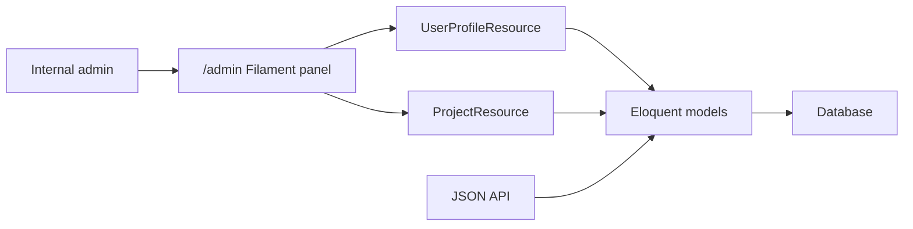

# Bonus - FilamentPHP Admin Panel Untuk Laravel API

## Matlamat Bonus

Peserta menambah FilamentPHP admin panel untuk mengurus data yang sama digunakan oleh API. Filament tidak menggantikan JSON API; ia memberi UI dalaman untuk admin mengurus user profiles dan projects.

## Pelan Kelas Bonus 6 Jam

| Masa | Fokus | Aktiviti |
| --- | --- | --- |
| 00:00-00:45 | Peranan admin panel | Bezakan API client dan internal admin |
| 00:45-01:30 | Install Filament | Install package dan panel |
| 01:30-02:15 | Admin access | Create admin user dan `canAccessPanel` |
| 02:15-03:30 | Resources | Generate `UserProfileResource` dan `ProjectResource` |
| 03:30-05:00 | Forms dan tables | Configure fields, columns, filters, actions |
| 05:00-06:00 | Lab | Manage records dalam Filament, verify output API |

## Objektif Pembelajaran

Peserta boleh:

- install FilamentPHP.
- create admin user.
- restrict panel access.
- generate Filament resources.
- configure forms dan tables.
- mengurus data yang sama digunakan oleh API.
- verify perubahan admin panel muncul dalam response API.

## Architecture



## Step 1 - Install FilamentPHP

```bash
composer require filament/filament:"^5.0"
php artisan filament:install --panels
```

Jika Windows PowerShell ada isu quote:

```bash
composer require filament/filament:"~5.0"
php artisan filament:install --panels
```

Run migration jika diperlukan:

```bash
php artisan migrate
```

## Step 2 - Create Filament Admin User

```bash
php artisan make:filament-user
```

Gunakan email contoh:

```text
admin@example.com
```

## Step 3 - Update User Model Untuk Panel Access

Dalam `app/Models/User.php`:

```php
use Filament\Models\Contracts\FilamentUser;
use Filament\Panel;

class User extends Authenticatable implements FilamentUser
{
    public function canAccessPanel(Panel $panel): bool
    {
        return str_ends_with($this->email, '@example.com');
    }
}
```

Untuk production, gunakan role/permission yang lebih jelas, bukan domain email semata-mata.

## Step 4 - Generate Filament Resources

```bash
php artisan make:filament-resource UserProfile --generate
php artisan make:filament-resource Project --generate
```

Filament akan menghasilkan folder seperti:

```text
app/Filament/Resources/UserProfiles/
app/Filament/Resources/Projects/
```

## Step 5 - UserProfile Form

Dalam resource form:

```php
use Filament\Forms\Components\TextInput;
use Filament\Forms\Components\Textarea;
use Filament\Forms\Components\Toggle;

public static function form(Schema $schema): Schema
{
    return $schema->components([
        TextInput::make('full_name')
            ->required()
            ->maxLength(255),

        TextInput::make('id_card_number')
            ->required()
            ->unique(ignoreRecord: true)
            ->maxLength(30),

        TextInput::make('phone')
            ->required()
            ->maxLength(30),

        TextInput::make('email')
            ->email()
            ->maxLength(255),

        Textarea::make('address')
            ->rows(3),

        Toggle::make('is_active')
            ->default(true),
    ]);
}
```

## Step 6 - UserProfile Table

```php
use Filament\Tables\Columns\IconColumn;
use Filament\Tables\Columns\TextColumn;

public static function table(Table $table): Table
{
    return $table
        ->columns([
            TextColumn::make('full_name')->searchable()->sortable(),
            TextColumn::make('id_card_number')->searchable(),
            TextColumn::make('phone')->searchable(),
            TextColumn::make('email')->searchable(),
            IconColumn::make('is_active')->boolean(),
            TextColumn::make('created_at')->dateTime()->sortable(),
        ])
        ->filters([
            //
        ])
        ->actions([
            Tables\Actions\EditAction::make(),
        ])
        ->bulkActions([
            Tables\Actions\DeleteBulkAction::make(),
        ]);
}
```

## Step 7 - Project Relationship

Pastikan model `Project` mempunyai relationship:

```php
public function userProfile(): BelongsTo
{
    return $this->belongsTo(UserProfile::class);
}
```

Dalam `ProjectResource`, gunakan select:

```php
Select::make('user_profile_id')
    ->relationship('userProfile', 'full_name')
    ->required()
    ->searchable()
    ->preload();
```

## Step 8 - Project Form Dan Table

Form:

```php
TextInput::make('name')
    ->required()
    ->maxLength(255),

Select::make('status')
    ->options([
        'active' => 'Active',
        'paused' => 'Paused',
        'completed' => 'Completed',
    ])
    ->default('active')
    ->required(),

DatePicker::make('started_at')
```

Table:

```php
TextColumn::make('name')->searchable()->sortable(),
TextColumn::make('userProfile.full_name')->label('User Profile')->searchable(),
TextColumn::make('status')->badge(),
TextColumn::make('started_at')->date(),
```

## Step 9 - Policies Untuk Admin Access

Generate policies:

```bash
php artisan make:policy UserProfilePolicy --model=UserProfile
php artisan make:policy ProjectPolicy --model=Project
```

Contoh policy ringkas:

```php
public function viewAny(User $user): bool
{
    return $user->canAccessPanel(Filament::getCurrentPanel());
}
```

Dalam production, lebih baik guna package permission seperti Spatie Laravel Permission.

## Step 10 - Verify API Dan Filament Berfungsi Bersama

1. Buka:

```text
http://127.0.0.1:8000/admin
```

2. Login sebagai Filament admin.
3. Create user profile.
4. Create project untuk user profile tersebut.
5. Call API:

```bash
curl http://127.0.0.1:8000/api/v1/users \
  -H "X-API-TOKEN: abc-training-frontend-token" \
  -H "Authorization: Bearer 1|your-token"
```

Data yang dibuat melalui Filament patut muncul dalam response API.

## Production Security Checklist

- Restrict panel access dengan role/permission.
- Jangan expose `/admin` kepada user tidak sah.
- Gunakan HTTPS.
- Audit activity admin jika data sensitif.
- Guna policy untuk kawal create/update/delete.
- Jangan beri semua user akses panel.

## Latihan Kelas

1. Install Filament.
2. Create admin user.
3. Generate `UserProfileResource`.
4. Generate `ProjectResource`.
5. Create record melalui `/admin`.
6. Verify record melalui API.

## Tugasan Akhir Bonus

Peserta perlu menyiapkan:

- Filament panel yang boleh login.
- `UserProfileResource`.
- `ProjectResource`.
- form validation asas.
- searchable/sortable table.
- panel access restriction.
- API verification selepas data dibuat melalui Filament.

## Rubrik Markah Bonus

| Area | Markah |
| --- | ---: |
| Install dan panel setup | 15 |
| Admin user dan access control | 20 |
| UserProfile resource | 25 |
| Project resource | 20 |
| Policy/security awareness | 10 |
| API verification | 10 |
| Jumlah | 100 |

## References

- FilamentPHP documentation.
- Laravel authorization documentation.
- Laravel Eloquent relationship documentation.
