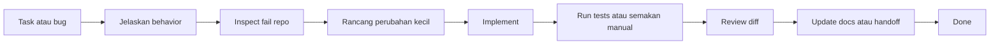

# Bonus - Get Shit Done (GSD) Dengan Prompt Claude Code

## Matlamat Bonus

Modul bonus ini mengajar peserta menggunakan workflow GSD bersama Claude Code atau coding assistant lain semasa membina ABC Company Profile API.

GSD bermaksud bergerak daripada kerja yang kabur kepada kerja yang siap dan disahkan:

1. Capture tugasan.
2. Jelaskan behavior yang dijangka.
3. Inspect kod sedia ada.
4. Rancang perubahan paling kecil yang berguna.
5. Implement.
6. Verify dengan tests atau semakan manual.
7. Dokumentasikan hasil.

Gunakan modul ini selepas Hari 5, atau sebagai sesi workflow ringkas sebelum projek akhir.

## Kedudukan Dalam Latihan

| Titik latihan | Bagaimana GSD membantu |
| --- | --- |
| Hari 1 | Minta Claude Code inspect setup projek dan terangkan route flow |
| Hari 2 | Tukar requirement CRUD kepada endpoint contract dan validation tests |
| Hari 3 | Review Sanctum, middleware, throttling, dan token handling |
| Hari 4 | Debug API errors, cache behavior, CORS, dan frontend error states |
| Hari 5 | Refactor controllers kepada services/resources dengan kawalan perubahan yang lebih selamat |
| Modul bonus | Jana test plan, Swagger checklist, nota review Filament, dan handoff docs |

## Objektif Pembelajaran

Selepas modul ini, peserta sepatutnya boleh:

- menulis prompt yang jelas untuk Claude Code.
- memberi context projek yang cukup tanpa mendedahkan secrets.
- meminta assistant inspect fail sebelum mengubah kod.
- meminta implementation plan sebelum perubahan berisiko.
- menggunakan prompt gaya TDD untuk kerja API.
- meminta verification steps dan failure analysis.
- review diff yang dijana AI sebelum menerima perubahan.
- menggunakan Claude Code sebagai pembantu tanpa menyerahkan kefahaman sepenuhnya.

## Architecture GSD



## Peraturan AI-Assisted Coding

Gunakan peraturan ini setiap kali Claude Code membantu projek Laravel API:

- Jangan paste `.env`, API keys, database passwords, production tokens, atau data customer private.
- Minta Claude Code baca fail berkaitan sebelum mencadangkan edit.
- Suruh ia ikut style projek sedia ada.
- Pastikan perubahan kecil dan spesifik.
- Minta ia tidak mengubah fail yang tidak berkaitan.
- Minta ia run atau cadangkan verification commands.
- Review setiap diff secara manual.
- Jangan terima kod yang anda tidak boleh terangkan.
- Gunakan tests untuk behavior yang tidak boleh regress.
- Pastikan jawapan akhir fokus kepada fail berubah, verification, dan risiko yang tinggal.

## Template Prompt

Gunakan struktur ini sebagai prompt default.

```text
Goal:
<Explain the specific outcome.>

Context:
<Explain the feature, bug, or training day.>

Relevant files:
<List files or ask Claude Code to find them.>

Constraints:
- Follow existing Laravel project patterns.
- Do not change unrelated files.
- Keep the change small.
- Do not expose secrets.
- Explain assumptions before editing.

Done criteria:
- <Behavior that must work.>
- <Expected API status codes or JSON shape.>
- <Tests or manual commands that must pass.>

Verification:
- Run or suggest the exact commands.
- If a command fails, explain the failure and fix only related issues.

Output:
- Summary of changes.
- Files changed.
- Verification result.
- Any remaining risks.
```

## Prompt 1 - Inspect Projek Laravel API

Gunakan sebelum meminta perubahan kod.

```text
You are helping with a Laravel API training project.

Please inspect the repository before suggesting changes.

Focus on:
- routes/api.php
- app/Http/Controllers/Api/V1
- app/Http/Requests
- app/Models
- app/Services
- app/Http/Resources
- tests/Feature if present

Summarize:
1. the current API route structure,
2. the main models and relationships,
3. the authentication and middleware setup,
4. the response format patterns,
5. any missing pieces that matter for a REST API.

Do not edit files yet.
```

## Prompt 2 - Tukar Requirement Kepada Plan Kecil

Gunakan apabila peserta menerima tugasan baru.

```text
I need to implement this Laravel API requirement:

<paste requirement>

Please inspect the relevant files and create a small implementation plan.

The plan must include:
- files that probably need changes,
- API contract: method, URL, request body, response JSON, status codes,
- validation rules,
- security/middleware impact,
- tests to add or update,
- request examples and expected JSON responses.

Do not edit files until the plan is clear.
```

## Prompt 3 - TDD Untuk Feature API Baru

Contoh feature: tambah filter `active` pada `GET /api/v1/users`.

```text
Use a TDD workflow for this Laravel API feature:

Feature:
GET /api/v1/users should support an optional active query parameter.

Expected behavior:
- ?active=1 returns only active user profiles.
- ?active=0 returns only inactive user profiles.
- no active parameter returns all profiles.
- response keeps the existing pagination/resource shape.

Instructions:
1. Inspect the current route, controller, service, model, resource, and feature tests.
2. Add or update the failing feature tests first.
3. Run the targeted test and show the failure.
4. Implement the smallest code change needed.
5. Run the targeted test again.
6. Refactor only if needed.

Constraints:
- Do not change unrelated endpoints.
- Preserve existing JSON response shape.
- Follow existing naming and style.
```

## Prompt 4 - Sync React Dengan API Laravel Terkini

Gunakan apabila backend API sudah berubah dan React client perlu diselaraskan dengan contract terbaru.

```text
The Laravel API backend has been updated. Please sync the React/Vite client with the latest backend contract.

Inspect backend first:
- routes/api.php
- app/Http/Controllers/Api/V1/AuthController.php
- app/Http/Controllers/Api/V1/UserProfileController.php
- app/Http/Resources if present
- recent curl examples, tests, or route:list output if present

Expected current API:
- Base URL uses VITE_API_BASE_URL.
- X-API-TOKEN uses VITE_FRONTEND_API_TOKEN and is sent on every API call when configured.
- POST /api/v1/auth/login returns data.access_token, data.expires_at, data.abilities, and data.user.
- Protected CRUD and logout send Authorization: Bearer <token>.
- GET /users and GET /users/{id} require profiles:read.
- POST /users requires profiles:create.
- PUT/PATCH /users/{id} requires profiles:update.
- DELETE /users/{id} requires profiles:delete.
- 401 means missing, invalid, expired, or revoked auth and should clear local auth state.
- 403 means missing ability and should show the backend message.
- 422 means validation errors and should show field errors.

Inspect React:
- src/api.js
- src/App.jsx
- src/App.css if needed
- .env.example
- package.json

Requirements:
- keep API URL and frontend token in Vite environment variables.
- reuse the existing apiRequest helper if present.
- keep request construction centralized in src/api.js.
- store access_token, expires_at, user, and optional abilities after login.
- store token and expires_at in localStorage only for this training lab.
- clear auth state before protected requests if expires_at has passed.
- support loading, empty, success, 401, 403, 404, 422, and general error states.
- support login, logout, list, search, show/detail, create, update, and delete.
- React may hide buttons based on abilities, but Laravel remains the source of truth.
- do not hard-code the bearer token.
- do not change backend files unless you first explain the mismatch and ask for approval.

Verification:
- run npm run build.
- explain browser test steps for login, list, create, update, delete, logout, expired token, and missing ability.
- summarize changed files and any env values required.
```

## Prompt 5 - Debug Request API Yang Gagal

Gunakan apabila request gagal daripada API client, Postman, atau React.

```text
I have a failing Laravel API request.

Request:
<paste method, URL, headers, and JSON body>

Response:
<paste status code and JSON response>

Expected behavior:
<explain what should happen>

Please debug systematically:
1. identify whether the failure is route, middleware, auth, validation, controller, service, model, database, CORS, or frontend state.
2. inspect the relevant files.
3. explain the most likely cause.
4. propose the smallest fix.
5. only edit files after explaining the fix.
6. provide the verification request, expected JSON response, or test command.

Do not change unrelated code.
```

## Prompt 6 - Security Review

Gunakan selepas Hari 3.

```text
Please review the Laravel API security setup.

Inspect:
- routes/api.php
- bootstrap/app.php
- app/Http/Middleware
- config/sanctum.php if relevant
- auth controller
- .env.example only, not .env

Check:
- protected routes use auth:sanctum.
- frontend client token middleware is applied where expected.
- throttling is applied to login and API route groups.
- unauthenticated requests return JSON.
- validation failures return JSON.
- secrets are not committed.
- debug settings are suitable for local training only.

Output:
- findings ordered by severity.
- file and line references where possible.
- suggested fixes.
- verification commands.

Do not edit files unless I explicitly ask.
```

## Prompt 7 - Refactor Dengan Service Layer

Gunakan pada Hari 5.

```text
I want to refactor the user profile API to use a service layer and API resources.

Please inspect the existing controller, requests, model, resource classes, and tests.

Refactor goal:
- controller handles HTTP orchestration only.
- form requests handle validation.
- service handles list, create, update, delete, search/filter, and cache invalidation.
- API resource controls the JSON shape.
- route model binding is used where appropriate.

Constraints:
- Keep endpoint URLs unchanged.
- Keep response status codes unchanged.
- Keep existing tests passing.
- Do not change unrelated features.

Before editing:
- show the proposed file-level plan.
- identify which tests should be run after the refactor.
```

## Prompt 8 - Jana Checklist Swagger/OpenAPI

Gunakan sebelum bonus Swagger.

```text
Please inspect the Laravel API routes and generate an OpenAPI checklist.

For each endpoint, list:
- method and path,
- required headers,
- request body schema,
- response schema,
- possible status codes,
- authentication requirement,
- validation error shape.

Include:
- auth login/logout,
- user profile list/create/show/update/delete,
- search and active filters,
- pagination metadata,
- X-API-TOKEN security scheme,
- bearer token security scheme.

Do not edit files. Produce a checklist that can be converted into Swagger annotations.
```

## Prompt 9 - Tulis Handoff Summary

Gunakan apabila lab atau projek akhir selesai.

```text
Please create a short handoff summary for the Laravel API work completed.

Include:
- what changed,
- files changed,
- API endpoints affected,
- database changes,
- validation rules,
- auth/security impact,
- React client impact,
- tests or manual checks run,
- known limitations,
- next recommended task.

Keep it concise and accurate. Do not invent tests or commands that were not run.
```

## Prompt 10 - Verification Akhir Sebelum Done

Gunakan sebelum menghantar projek akhir.

```text
Please verify whether this Laravel API project is ready for submission.

Check the final requirements:
- /api/v1 route versioning,
- user profile CRUD,
- request validation,
- Sanctum login/logout,
- frontend token middleware,
- throttling,
- pagination,
- search/filter,
- eager loading,
- caching and cache invalidation,
- JSON exception handling,
- route model binding,
- service layer,
- API resources,
- React client integration,
- TDD/Swagger/Filament bonus if implemented.

Run or recommend exact verification commands.

Output:
- pass/fail checklist,
- missing items,
- risky items,
- suggested next fixes in priority order.

Do not make changes until the checklist is reviewed.
```

## Template GSD Board

Gunakan checklist Markdown ini semasa lab.

```markdown
# GSD Board - Laravel API Task

## Task
- [ ] Requirement is clear
- [ ] Expected API contract is written
- [ ] Relevant files are identified

## Build
- [ ] Tests or manual checks are planned
- [ ] Small implementation plan is reviewed
- [ ] Code is changed only in relevant files

## Verify
- [ ] Tests pass
- [ ] Request memulangkan response JSON yang dijangka
- [ ] React client behavior works if affected
- [ ] Error cases checked

## Handoff
- [ ] Diff reviewed
- [ ] Docs updated if needed
- [ ] Summary written
```

## Lab Kelas

Minta peserta menggunakan prompt Claude Code untuk satu feature kecil:

Feature: Tambah sokongan filter `active` pada `GET /api/v1/users` dan expose dalam React client.

Langkah wajib:

1. Gunakan Prompt 2 untuk menghasilkan plan.
2. Gunakan Prompt 3 untuk menambah behavior backend dengan tests.
3. Gunakan Prompt 4 untuk update React client.
4. Gunakan Prompt 5 jika request gagal.
5. Gunakan Prompt 9 untuk handoff summary.
6. Review diff akhir secara manual.

## Rubrik Penilaian

| Area | Markah |
| --- | ---: |
| Requirement dan API contract jelas | 20 |
| Repo inspection digunakan sebelum edit | 15 |
| Prompt mempunyai constraints dan done criteria | 15 |
| Verification commands digunakan atau didokumentasi | 20 |
| Diff direview dan diterangkan | 15 |
| Handoff summary tepat | 15 |
| Jumlah | 100 |

## Nota Instructor

- Anggap Claude Code sebagai pair programmer, bukan autopilot.
- Wajibkan peserta menerangkan kod yang dijana sebelum menerimanya.
- Minta peserta bandingkan output AI dengan contoh latihan.
- Hentikan lab jika peserta paste secrets atau production data ke dalam prompt.
- Beri markah lebih untuk perubahan kecil yang verified, bukan edit besar tanpa review.
