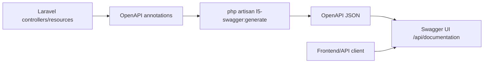

# Bonus - Dokumentasi Swagger Dan OpenAPI Untuk Laravel API

## Matlamat Bonus

Peserta belajar mendokumentasi API contract menggunakan Swagger/OpenAPI. Modul ini membantu client memahami endpoint, request body, response, dan security scheme tanpa membaca source code.

## Swagger vs OpenAPI

| Istilah | Maksud |
| --- | --- |
| OpenAPI | Specification standard untuk menerangkan API |
| Swagger UI | Interface browser untuk membaca dan mencuba OpenAPI spec |
| L5-Swagger | Laravel package untuk generate Swagger UI daripada annotations |

## Pelan Kelas Bonus 6 Jam

| Masa | Fokus | Aktiviti |
| --- | --- | --- |
| 00:00-00:45 | API contract | Terangkan kenapa dokumentasi API penting |
| 00:45-01:30 | Install tooling | Install L5-Swagger dan publish config |
| 01:30-02:30 | Global spec | Info, server, security schemes |
| 02:30-04:00 | Schemas | UserProfile, Project, auth response, error response |
| 04:00-05:15 | Endpoint docs | List, create, show, update, delete, login, logout |
| 05:15-06:00 | Lab | Generate docs dan test Swagger UI |

## Objektif Pembelajaran

Peserta boleh:

- install dan configure L5-Swagger.
- menerangkan OpenAPI schema.
- mendokumentasi security scheme.
- mendokumentasi endpoint Laravel API.
- generate Swagger UI.
- memastikan dokumentasi selari dengan behavior API.

## Recommended Tooling

```bash
composer require darkaonline/l5-swagger
php artisan vendor:publish --provider "L5Swagger\\L5SwaggerServiceProvider"
```

## Diagram Architecture



## Step 1 - Install L5-Swagger

```bash
composer require darkaonline/l5-swagger
php artisan vendor:publish --provider "L5Swagger\\L5SwaggerServiceProvider"
```

Tambah `.env`:

```dotenv
L5_SWAGGER_GENERATE_ALWAYS=true
L5_SWAGGER_CONST_HOST=http://127.0.0.1:8000
```

## Step 2 - Pastikan Scan Path Betul

Dalam `config/l5-swagger.php`, pastikan `annotations` scan folder `app`:

```php
'annotations' => [
    base_path('app'),
],
```

## Step 3 - Create Global OpenAPI Definition

Bina:

```text
app/OpenApi/OpenApiSpec.php
```

```php
namespace App\OpenApi;

use OpenApi\Attributes as OA;

#[OA\OpenApi(
    security: [
        ['bearerAuth' => []],
        ['frontendToken' => []],
    ]
)]
#[OA\Info(
    version: '1.0.0',
    title: 'ABC Company Profile API',
    description: 'Training API for building secure and maintainable Laravel APIs.'
)]
#[OA\Server(
    url: 'http://127.0.0.1:8000',
    description: 'Local development server'
)]
#[OA\SecurityScheme(
    securityScheme: 'bearerAuth',
    type: 'http',
    scheme: 'bearer',
    bearerFormat: 'Sanctum',
    description: 'Use the token returned from POST /api/v1/auth/login.'
)]
#[OA\SecurityScheme(
    securityScheme: 'frontendToken',
    type: 'apiKey',
    name: 'X-API-TOKEN',
    in: 'header',
    description: 'Frontend API token required by the Laravel middleware.'
)]
class OpenApiSpec
{
}
```

## Step 4 - Add Reusable Schemas

Bina:

```text
app/OpenApi/Schemas.php
```

Contoh schema:

```php
#[OA\Schema(
    schema: 'UserProfile',
    properties: [
        new OA\Property(property: 'id', type: 'integer', example: 1),
        new OA\Property(property: 'full_name', type: 'string', example: 'Ali Ahmad'),
        new OA\Property(property: 'id_card_number', type: 'string', example: '900101-14-1234'),
        new OA\Property(property: 'phone', type: 'string', example: '+60123456789'),
        new OA\Property(property: 'email', type: 'string', nullable: true, example: 'ali@example.com'),
        new OA\Property(property: 'is_active', type: 'boolean', example: true),
    ],
    type: 'object'
)]
```

Validation error schema:

```php
#[OA\Schema(
    schema: 'ValidationError',
    properties: [
        new OA\Property(property: 'message', type: 'string', example: 'The given data was invalid.'),
        new OA\Property(
            property: 'errors',
            type: 'object',
            additionalProperties: new OA\AdditionalProperties(type: 'array', items: new OA\Items(type: 'string'))
        ),
    ],
    type: 'object'
)]
```

## Step 5 - Document List Endpoint

Dalam controller:

```php
#[OA\Get(
    path: '/api/v1/users',
    summary: 'List user profiles',
    security: [
        ['bearerAuth' => []],
        ['frontendToken' => []],
    ],
    parameters: [
        new OA\Parameter(name: 'page', in: 'query', schema: new OA\Schema(type: 'integer')),
        new OA\Parameter(name: 'search', in: 'query', schema: new OA\Schema(type: 'string')),
        new OA\Parameter(name: 'active', in: 'query', schema: new OA\Schema(type: 'boolean')),
    ],
    responses: [
        new OA\Response(response: 200, description: 'User profiles retrieved successfully.'),
        new OA\Response(response: 401, description: 'Unauthenticated.'),
    ]
)]
public function index()
{
    // ...
}
```

## Step 6 - Document Create Endpoint

```php
#[OA\Post(
    path: '/api/v1/users',
    summary: 'Create user profile',
    requestBody: new OA\RequestBody(
        required: true,
        content: new OA\JsonContent(
            required: ['full_name', 'id_card_number', 'phone'],
            properties: [
                new OA\Property(property: 'full_name', type: 'string'),
                new OA\Property(property: 'id_card_number', type: 'string'),
                new OA\Property(property: 'phone', type: 'string'),
                new OA\Property(property: 'email', type: 'string', nullable: true),
                new OA\Property(property: 'address', type: 'string', nullable: true),
            ]
        )
    ),
    responses: [
        new OA\Response(response: 201, description: 'User profile created successfully.'),
        new OA\Response(response: 422, description: 'Validation error.'),
    ]
)]
public function store(StoreUserProfileRequest $request)
{
    // ...
}
```

## Step 7 - Document Show, Update, Delete

Gunakan pattern yang sama:

- `GET /api/v1/users/{user}` untuk show.
- `PATCH /api/v1/users/{user}` untuk update.
- `DELETE /api/v1/users/{user}` untuk delete.

Setiap endpoint perlu mempunyai:

- `path`.
- `summary`.
- `security`.
- `parameters` jika ada route/query parameter.
- `requestBody` jika ada body.
- `responses`.

## Step 8 - Document Login Dan Logout

Login tidak memerlukan bearer token, tetapi masih memerlukan frontend token.

```php
#[OA\Post(
    path: '/api/v1/auth/login',
    summary: 'Login and receive Sanctum token',
    security: [
        ['frontendToken' => []],
    ],
    requestBody: new OA\RequestBody(
        required: true,
        content: new OA\JsonContent(
            required: ['email', 'password'],
            properties: [
                new OA\Property(property: 'email', type: 'string', example: 'admin@example.com'),
                new OA\Property(property: 'password', type: 'string', example: 'password'),
            ]
        )
    ),
    responses: [
        new OA\Response(response: 200, description: 'Login successful.'),
        new OA\Response(response: 401, description: 'Invalid credentials.'),
    ]
)]
```

Logout memerlukan kedua-dua security layers:

```php
#[OA\Post(
    path: '/api/v1/auth/logout',
    summary: 'Logout current token',
    security: [
        ['bearerAuth' => []],
        ['frontendToken' => []],
    ],
    responses: [
        new OA\Response(response: 200, description: 'Logout successful.'),
    ]
)]
```

## Step 9 - Generate Swagger Documentation

```bash
php artisan l5-swagger:generate
```

Buka:

```text
http://127.0.0.1:8000/api/documentation
```

## Step 10 - Use Swagger UI Authorize

Dalam Swagger UI:

1. Klik `Authorize`.
2. Isi `frontendToken` dengan:

```text
abc-training-frontend-token
```

3. Login melalui endpoint `/api/v1/auth/login`.
4. Copy token.
5. Klik `Authorize` semula.
6. Isi bearer token.
7. Test protected endpoints.

## Optional - Validate Spec Dalam CI

Tambahkan test ringkas:

```php
it('generates openapi documentation', function () {
    $this->artisan('l5-swagger:generate')->assertSuccessful();

    $this->assertFileExists(storage_path('api-docs/api-docs.json'));
});
```

## Documentation Quality Checklist

- Semua endpoint penting didokumenkan.
- Request body selari dengan validation rules.
- Response status code betul.
- Security scheme jelas.
- Error response ada contoh.
- Query parameter seperti `search`, `active`, dan `page` didokumenkan.
- Dokumentasi digenerate semula selepas perubahan controller.

## Security Checklist

- Jangan letak real production token dalam contoh.
- Jangan expose credential sebenar dalam docs.
- Pastikan Swagger UI production dilindungi jika API private.
- Bezakan frontend token dan bearer token.

## Kesilapan Biasa

- Lupa run `php artisan l5-swagger:generate`.
- Scan path tidak include folder annotations.
- Request body tidak sama dengan validation sebenar.
- Security scheme tidak dipasang pada protected endpoints.
- Swagger UI boleh diakses public tanpa kawalan.

## Latihan Kelas

1. Generate Swagger docs.
2. Test login dalam Swagger UI.
3. Authorize bearer token.
4. Create user profile melalui Swagger UI.
5. Compare Swagger response dengan curl response.

## Tugasan Akhir Bonus

Dokumentasikan endpoint:

- list user profiles.
- create user profile.
- show user profile.
- update user profile.
- delete user profile.
- login.
- logout.

## Rubrik Markah Bonus

| Area | Markah |
| --- | ---: |
| Install dan config L5-Swagger | 10 |
| Global OpenAPI definition | 15 |
| Reusable schemas | 20 |
| Endpoint documentation | 35 |
| Security schemes | 10 |
| Swagger UI test flow | 10 |
| Jumlah | 100 |

## References

- OpenAPI Specification.
- Swagger UI.
- L5-Swagger documentation.
