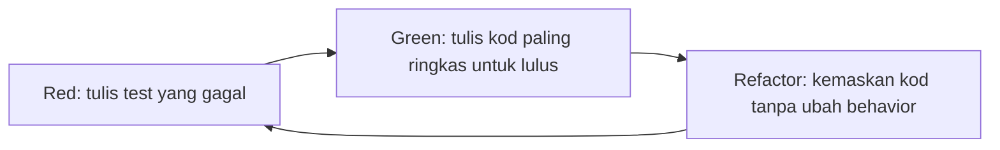

# Bonus - Test-Driven Development Untuk Laravel API

## Matlamat Bonus

Peserta belajar menggunakan TDD untuk membina dan melindungi behavior API. Modul ini menambah test suite kepada projek Hari 5.

TDD bukan sekadar menulis test selepas siap. Dalam modul ini peserta menulis expectation dahulu, lihat test gagal, kemudian implement kod sehingga test lulus.

## Pelan Kelas Bonus 6 Jam

| Masa | Fokus | Aktiviti |
| --- | --- | --- |
| 00:00-00:45 | Prinsip TDD | Red, Green, Refactor |
| 00:45-01:30 | Testing setup | `.env.testing`, database MySQL testing, factories |
| 01:30-02:30 | Auth tests | Login, wrong password, protected route |
| 02:30-03:45 | CRUD tests | Create, list, show, update, delete |
| 03:45-04:45 | Error tests | Validation, 404, frontend token |
| 04:45-06:00 | TDD feature baru | Active profile filter |

## Objektif Pembelajaran

Peserta boleh:

- configure testing environment.
- menggunakan Laravel feature tests.
- menggunakan factories.
- test authentication dan middleware.
- test CRUD behavior.
- test validation dan JSON error.
- menambah feature baru menggunakan red-green-refactor.

## Peraturan TDD



Jika test tidak pernah gagal, test itu belum membuktikan behavior yang anda mahu.

## Step 1 - Run Existing Test Suite

```bash
php artisan test
```

Jika ada error environment, clear config:

```bash
php artisan config:clear
```

## Step 2 - Configure Testing Environment

Create `.env.testing`:

```dotenv
APP_ENV=testing
APP_KEY=
APP_DEBUG=true
APP_URL=http://localhost

DB_CONNECTION=mysql
DB_HOST=127.0.0.1
DB_PORT=3306
DB_DATABASE=abc_api_testing
DB_USERNAME=root
DB_PASSWORD=

CACHE_STORE=array
SESSION_DRIVER=array
QUEUE_CONNECTION=sync

FRONTEND_API_TOKEN=abc-training-frontend-token
```

Generate key:

```bash
php artisan key:generate --env=testing
```

Bina database testing khusus:

```sql
CREATE DATABASE abc_api_testing CHARACTER SET utf8mb4 COLLATE utf8mb4_unicode_ci;
```

## Step 3 - Create Factories

```bash
php artisan make:factory UserProfileFactory --model=UserProfile
php artisan make:factory ProjectFactory --model=Project
```

`UserProfileFactory`:

```php
public function definition(): array
{
    return [
        'full_name' => fake()->name(),
        'id_card_number' => fake()->unique()->numerify('######-##-####'),
        'phone' => fake()->phoneNumber(),
        'email' => fake()->safeEmail(),
        'address' => fake()->address(),
        'is_active' => true,
    ];
}
```

`ProjectFactory`:

```php
public function definition(): array
{
    return [
        'user_profile_id' => UserProfile::factory(),
        'name' => fake()->words(3, true),
        'status' => 'active',
        'started_at' => now()->toDateString(),
    ];
}
```

## Step 4 - Create Feature Test Files

```bash
php artisan make:test Api/V1/UserProfileApiTest
php artisan make:test Api/V1/AuthApiTest
```

Base setup:

```php
use Illuminate\Foundation\Testing\RefreshDatabase;
use Laravel\Sanctum\Sanctum;

uses(RefreshDatabase::class);

function frontendHeaders(): array
{
    return ['X-API-TOKEN' => 'abc-training-frontend-token'];
}
```

## Step 5 - Test Frontend Token Required

Red test:

```php
it('requires frontend token', function () {
    $this->getJson('/api/v1/users')
        ->assertUnauthorized()
        ->assertJson([
            'message' => 'Unauthorized: Invalid frontend API token.',
        ]);
});
```

Jangkaan behavior red: test gagal jika middleware belum dipasang atau route belum dilindungi.

## Step 6 - Test Authenticated User Can Create Profile

```php
it('allows authenticated user to create a profile', function () {
    Sanctum::actingAs(User::factory()->create());

    $payload = [
        'full_name' => 'Siti Aminah',
        'id_card_number' => '910202-10-2222',
        'phone' => '+60198765432',
        'email' => 'siti@example.com',
    ];

    $this->withHeaders(frontendHeaders())
        ->postJson('/api/v1/users', $payload)
        ->assertCreated()
        ->assertJsonPath('data.full_name', 'Siti Aminah');

    $this->assertDatabaseHas('user_profiles', [
        'id_card_number' => '910202-10-2222',
    ]);
});
```

## Step 7 - Test Validation Errors

```php
it('returns validation errors', function () {
    Sanctum::actingAs(User::factory()->create());

    $this->withHeaders(frontendHeaders())
        ->postJson('/api/v1/users', ['full_name' => ''])
        ->assertUnprocessable()
        ->assertJsonValidationErrors(['full_name', 'id_card_number', 'phone']);
});
```

## Step 8 - Test List Endpoint

```php
it('lists user profiles', function () {
    Sanctum::actingAs(User::factory()->create());
    UserProfile::factory()->count(3)->create();

    $this->withHeaders(frontendHeaders())
        ->getJson('/api/v1/users')
        ->assertOk()
        ->assertJsonPath('meta.total', 3);
});
```

## Step 9 - Test Show, Update, Delete

Show:

```php
it('shows a user profile', function () {
    Sanctum::actingAs(User::factory()->create());
    $profile = UserProfile::factory()->create();

    $this->withHeaders(frontendHeaders())
        ->getJson("/api/v1/users/{$profile->id}")
        ->assertOk()
        ->assertJsonPath('data.id', $profile->id);
});
```

Update:

```php
it('updates a user profile', function () {
    Sanctum::actingAs(User::factory()->create());
    $profile = UserProfile::factory()->create();

    $this->withHeaders(frontendHeaders())
        ->patchJson("/api/v1/users/{$profile->id}", ['phone' => '+60111112222'])
        ->assertOk()
        ->assertJsonPath('data.phone', '+60111112222');
});
```

Delete:

```php
it('deletes a user profile', function () {
    Sanctum::actingAs(User::factory()->create());
    $profile = UserProfile::factory()->create();

    $this->withHeaders(frontendHeaders())
        ->deleteJson("/api/v1/users/{$profile->id}")
        ->assertNoContent();

    $this->assertDatabaseMissing('user_profiles', ['id' => $profile->id]);
});
```

## Step 10 - Test JSON 404 Response

```php
it('returns json not found response', function () {
    Sanctum::actingAs(User::factory()->create());

    $this->withHeaders(frontendHeaders())
        ->getJson('/api/v1/users/999999')
        ->assertNotFound()
        ->assertJson([
            'message' => 'Resource not found.',
        ]);
});
```

## Step 11 - Test Login API

```php
it('logs in with valid credentials', function () {
    User::factory()->create([
        'email' => 'admin@example.com',
        'password' => bcrypt('password'),
    ]);

    $this->withHeaders(frontendHeaders())
        ->postJson('/api/v1/auth/login', [
            'email' => 'admin@example.com',
            'password' => 'password',
        ])
        ->assertOk()
        ->assertJsonStructure(['message', 'token', 'token_type']);
});
```

Wrong password:

```php
it('rejects wrong password', function () {
    User::factory()->create([
        'email' => 'admin@example.com',
        'password' => bcrypt('password'),
    ]);

    $this->withHeaders(frontendHeaders())
        ->postJson('/api/v1/auth/login', [
            'email' => 'admin@example.com',
            'password' => 'wrong-password',
        ])
        ->assertUnauthorized();
});
```

## Step 12 - TDD Feature Baru: Active Profile Filter

Jangkaan behavior:

```text
GET /api/v1/users?active=1
GET /api/v1/users?active=0
```

### Red

```php
it('filters user profiles by active status', function () {
    Sanctum::actingAs(User::factory()->create());

    UserProfile::factory()->create(['is_active' => true]);
    UserProfile::factory()->create(['is_active' => false]);

    $this->withHeaders(frontendHeaders())
        ->getJson('/api/v1/users?active=1')
        ->assertOk()
        ->assertJsonPath('meta.total', 1);
});
```

### Green

Dalam service:

```php
->when($active !== null, function ($query) use ($active) {
    $query->where('is_active', (bool) $active);
})
```

### Refactor

Pastikan cache key memasukkan `active`:

```php
$cacheKey = "user_profiles.page.$page.search.$search.active.$active";
```

## Running Specific Tests

```bash
php artisan test
php artisan test --filter=UserProfileApiTest
php artisan test --filter=AuthApiTest
php artisan test --filter="filters user profiles by active status"
```

## Apa Yang Good API Tests Perlu Check

- status code.
- JSON structure.
- JSON value penting.
- database state.
- middleware behavior.
- authentication requirement.
- validation error.
- edge cases seperti 404.

## Tugasan Akhir Bonus

Peserta perlu menambah test untuk:

- profile search.
- logout.
- invalid frontend token.
- duplicate `id_card_number`.
- delete profile yang mempunyai projects.

## Rubrik Markah Bonus

| Area | Markah |
| --- | ---: |
| Testing environment | 10 |
| Auth tests | 20 |
| Middleware tests | 15 |
| CRUD tests | 30 |
| Validation dan error tests | 15 |
| TDD active filter | 10 |
| Jumlah | 100 |

## References

- Laravel testing documentation.
- Laravel Sanctum documentation.
- PHPUnit/Pest documentation.
