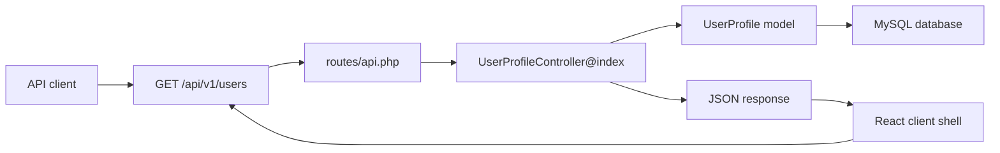

# Hari 1 - Asas Laravel API

## Matlamat Kelas

Peserta memahami asas Laravel API, menyediakan projek Laravel, mengaktifkan API routes, membina model dan migration pertama, menghasilkan endpoint JSON versioned pertama, dan menyediakan React/Vite client shell.

## Rujukan PDF

Hari ini merujuk kepada PDF halaman 4-8, buku halaman 1-5. Kandungan utama: setup Laravel, struktur MVC, request flow, dan `routes/api.php`.

## Konteks Projek

Projek latihan ialah **ABC Company Profile API**. Pada Hari 1, API hanya perlu memaparkan senarai user profile melalui:

```text
GET /api/v1/users
```

## Pelan Kelas 6 Jam

| Masa | Fokus | Aktiviti |
| --- | --- | --- |
| 00:00-00:45 | Pengenalan API | Terangkan REST, JSON, HTTP status, dan versioning |
| 00:45-01:30 | Setup Laravel | Create project, configure MySQL, install API scaffold |
| 01:30-02:15 | API routes | Aktifkan `routes/api.php` dan bina route pertama |
| 02:15-03:15 | Model dan migration | Bina `UserProfile` model dan table |
| 03:15-04:25 | Controller | Bina endpoint JSON pertama |
| 04:25-05:10 | Lab API | Seed data dan semak response JSON |
| 05:10-05:45 | React client shell | Create/inspect Vite app dan configure API `.env` values |
| 05:45-06:00 | Review | Recap peranan backend API dan browser client |

## Objektif Pembelajaran

Peserta boleh:

- setup projek Laravel.
- mengaktifkan API route file.
- menerangkan request flow asas Laravel API.
- membina model, migration, dan controller.
- memulangkan response JSON.
- menggunakan route prefix `/api/v1`.
- menerangkan bahawa React memanggil API melalui HTTP.
- configure React API base URL dan frontend token.

## Diagram Architecture



## Prasyarat

- PHP 8.2 atau lebih baru.
- Composer.
- MySQL 8.0 atau lebih baru.
- Terminal.
- Code editor.
- curl, Postman, atau Insomnia.

## Nota Penting Laravel

Laravel tidak sentiasa menghasilkan `routes/api.php` secara automatik. Jalankan:

```bash
php artisan install:api
```

Route di dalam `routes/api.php` sudah mempunyai prefix `/api`. Jika anda tulis:

```php
Route::get('/v1/users', ...);
```

URL penuh ialah:

```text
/api/v1/users
```

## Step 1 - Create Projek Laravel

```bash
composer create-project laravel/laravel abc-api
cd abc-api
php artisan install:api
php artisan serve
```

Semak app berjalan:

```bash
curl http://127.0.0.1:8000
```

## Step 2 - Configure MySQL Untuk Kelas

Bina database latihan:

```sql
CREATE DATABASE abc_api CHARACTER SET utf8mb4 COLLATE utf8mb4_unicode_ci;
```

Update `.env`:

```dotenv
DB_CONNECTION=mysql
DB_HOST=127.0.0.1
DB_PORT=3306
DB_DATABASE=abc_api
DB_USERNAME=root
DB_PASSWORD=
```

Jika user MySQL local bukan `root`, ubah `DB_USERNAME` dan `DB_PASSWORD` mengikut mesin anda.

Clear config:

```bash
php artisan config:clear
```

## Step 3 - Enable API Routes

Jika `routes/api.php` belum wujud:

```bash
php artisan install:api
```

Semak route:

```bash
php artisan route:list
```

## Step 4 - Fahami API Request Flow

Flow asas:

```text
Client -> routes/api.php -> Controller -> Model -> Database -> JSON
```

Peranan setiap layer:

| Layer | Peranan |
| --- | --- |
| Client | Hantar request HTTP |
| Route | Padankan URL kepada controller |
| Controller | Terima request dan susun response |
| Model | Bekerja dengan table database |
| Database | Simpan data |
| JSON | Format response API |

## Step 5 - Create Model Dan Migration

```bash
php artisan make:model UserProfile -m
```

Update migration:

```php
Schema::create('user_profiles', function (Blueprint $table) {
    $table->id();
    $table->string('full_name');
    $table->string('id_card_number')->unique();
    $table->string('phone');
    $table->string('email')->nullable();
    $table->text('address')->nullable();
    $table->boolean('is_active')->default(true);
    $table->timestamps();
});
```

Run migration:

```bash
php artisan migrate
```

## Step 6 - Configure Model

```php
namespace App\Models;

use Illuminate\Database\Eloquent\Model;

class UserProfile extends Model
{
    protected $fillable = [
        'full_name',
        'id_card_number',
        'phone',
        'email',
        'address',
        'is_active',
    ];
}
```

## Step 7 - Tambah Sample Data Dengan Tinker

```bash
php artisan tinker
```

Paste:

```php
App\Models\UserProfile::create([
    'full_name' => 'Ali Ahmad',
    'id_card_number' => '900101-14-1234',
    'phone' => '+60123456789',
    'email' => 'ali@example.com',
    'address' => 'Kuala Lumpur',
    'is_active' => true,
]);
```

## Step 8 - Create API Controller

```bash
php artisan make:controller Api/V1/UserProfileController
```

Controller:

```php
namespace App\Http\Controllers\Api\V1;

use App\Http\Controllers\Controller;
use App\Models\UserProfile;

class UserProfileController extends Controller
{
    public function index()
    {
        return response()->json([
            'message' => 'User profiles retrieved successfully.',
            'data' => UserProfile::query()->latest()->get(),
        ]);
    }
}
```

## Step 9 - Register Versioned API Route

Dalam `routes/api.php`:

```php
use App\Http\Controllers\Api\V1\UserProfileController;
use Illuminate\Support\Facades\Route;

Route::prefix('v1')->group(function () {
    Route::get('/users', [UserProfileController::class, 'index']);
});
```

## Step 10 - Test Endpoint

```bash
php artisan serve
curl http://127.0.0.1:8000/api/v1/users
```

Jangkaan bentuk response:

```json
{
  "message": "User profiles retrieved successfully.",
  "data": [
    {
      "id": 1,
      "full_name": "Ali Ahmad",
      "phone": "+60123456789"
    }
  ]
}
```

## Step 11 - Sediakan React Client Shell

Peserta meminta client side seperti React, jadi latihan 5 hari kini memasukkan React secara berperingkat. Pada Hari 1, fokus hanya kepada setup client dan sempadan sistem:

```text
React browser client -> HTTP request -> Laravel API -> JSON response
```

Create Vite React app:

```bash
npm create vite@latest abc-api-client -- --template react
cd abc-api-client
npm install
```

Salin starter client daripada:

```text
examples/react-client-api-consumer
```

Create `.env.local`:

```dotenv
VITE_API_BASE_URL=http://127.0.0.1:8000/api/v1
VITE_FRONTEND_API_TOKEN=abc-training-frontend-token
```

Point pengajaran:

- Laravel berjalan pada `http://127.0.0.1:8000`.
- React biasanya berjalan pada `http://localhost:5173`.
- Browser client bercakap dengan Laravel menggunakan HTTP, JSON, dan headers.
- Jika browser block request, semak CORS Laravel.

## Prompt GSD Claude Code

Gunakan prompt ini jika peserta mahu Claude Code membantu tutorial Hari 1. Prompt ini memastikan assistant inspect, plan, implement, dan verify dengan disiplin.

```text
Goal:
Help me complete Day 1 of the Laravel API tutorial.

Context:
I am building the ABC Company Profile API in Laravel. Today I need a fresh API project, MySQL setup, api routes enabled, a UserProfile model and migration, a versioned GET /api/v1/users endpoint, and a basic React/Vite client shell.

Relevant files:
- routes/api.php
- database/migrations
- app/Models/UserProfile.php
- app/Http/Controllers/Api/V1/UserProfileController.php
- examples/day-1-laravel-api-foundations
- examples/react-client-api-consumer

Constraints:
- Inspect the repo before suggesting edits.
- Do not change unrelated files.
- Keep the route versioned under /api/v1.
- Do not hard-code secrets or local machine paths.
- Explain assumptions before editing.

Done criteria:
- php artisan route:list --path=api shows GET /api/v1/users.
- php artisan migrate runs successfully.
- GET /api/v1/users returns JSON.
- React has VITE_API_BASE_URL configured for the Laravel API.

Verification:
- Run or suggest php artisan route:list --path=api.
- Provide the request and expected JSON response for GET /api/v1/users.
- Explain any failure before fixing it.
```

## Latihan Kelas

1. Tambah dua lagi user profile melalui Tinker.
2. Test endpoint semula.
3. Tukar susunan data kepada `oldest()`.
4. Tambah route health check:

```php
Route::get('/health', fn () => response()->json(['message' => 'ABC API is healthy.']));
```

## Kesilapan Biasa

- Menulis `/api/v1/users` di dalam `routes/api.php`; sepatutnya `/v1/users`.
- Lupa run `php artisan migrate`.
- Lupa set `$fillable` pada model.
- Menggunakan nama database, username, atau password MySQL yang salah.
- Tidak clear config selepas edit `.env`.

## Soalan Review Hari 1

- Apakah fungsi `routes/api.php`?
- Kenapa API perlu versioning?
- Apakah beza controller dan model?
- Kenapa kita pulangkan JSON?
- Apakah URL sebenar jika route ditulis sebagai `/v1/users` dalam `routes/api.php`?
- Kenapa React perlu call API melalui HTTP dan bukan import kod Laravel?

## Kerja Rumah

Tambah field `department` dalam `user_profiles`:

1. Create migration baru.
2. Update model `$fillable`.
3. Tambah sample data.
4. Pastikan response JSON memaparkan `department`.
5. Pastikan `.env.local` React mempunyai API base URL yang betul.
