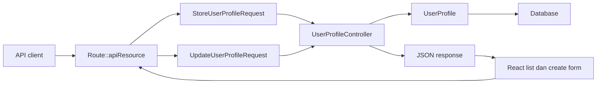

# Hari 2 - RESTful Routes, CRUD, Dan Validation

## Matlamat Kelas

Peserta menukar endpoint Hari 1 menjadi RESTful API penuh dengan CRUD, form request validation, HTTP status code yang betul, dan React form yang memanggil CRUD endpoints.

## Rujukan PDF

Hari ini merujuk kepada PDF halaman 9-12, buku halaman 6-9. Kandungan utama: REST methods, route prefixes, versioning, `Route::apiResource`, named routes, dan nota route caching.

## Pelan Kelas 6 Jam

| Masa | Fokus | Aktiviti |
| --- | --- | --- |
| 00:00-00:20 | Recap Hari 1 | Semak project structure dan endpoint pertama |
| 00:20-00:45 | Checkpoint Laragon/XAMPP | Semak MySQL, database, Laravel URL, dan React API base URL |
| 00:45-01:20 | REST pattern | Terangkan GET, POST, PATCH, DELETE |
| 01:20-02:00 | Resource route | Ganti manual route dengan `apiResource` |
| 02:00-02:15 | Rehat | Rehat pendek |
| 02:15-03:30 | Store endpoint | Tambah form request validation dan create record |
| 03:30-04:30 | Show dan update endpoint | Cari record dan update profile details |
| 04:30-05:00 | Delete endpoint | Delete record dan pulangkan `204 No Content` |
| 05:00-05:35 | React CRUD form | Connect React list dan create form kepada REST API |
| 05:35-06:00 | Lab | Semak request dan response JSON CRUD dengan API client dan React |

## Objektif Pembelajaran

Peserta boleh:

- menerangkan RESTful resource.
- menggunakan `Route::apiResource`.
- membina form request validation.
- memulangkan status code yang sesuai.
- configure Hari 2 dengan konsisten untuk pengguna Laragon atau XAMPP.
- menggunakan AI prompt sebagai checkpoint semasa setup, routes, validation, controller, API testing, dan React integration.
- test CRUD dengan menyemak request dan response JSON.
- membina React list screen dan create form yang call REST API.
- memaparkan validation errors daripada Laravel.

## Setup Local Untuk Pengguna Laragon Dan XAMPP

Kebanyakan peserta menggunakan Laragon atau XAMPP untuk PHP dan MySQL local. Untuk kelas ini, gunakan Laragon/XAMPP sebagai service MySQL. Contoh request API dalam tutorial masih perlu menggunakan satu API base URL yang konsisten sepanjang Hari 2.

Baseline yang dicadangkan:

| Item | Value |
| --- | --- |
| Laravel API base URL | `http://127.0.0.1:8000/api/v1` |
| Command server Laravel | `php artisan serve` |
| Database engine | MySQL daripada Laragon atau XAMPP |
| Nama database | `abc_api` |
| React API env | `VITE_API_BASE_URL=http://127.0.0.1:8000/api/v1` |

Baseline ini mengurangkan kekeliruan antara Laravel built-in server, virtual host Laragon, folder `htdocs` XAMPP, dan Vite server React.

### Checklist Laragon

| Semakan | Apa Perlu Dibuat |
| --- | --- |
| Start services | Buka Laragon dan klik `Start All` |
| Create database | Guna menu database Laragon, HeidiSQL, Adminer, atau phpMyAdmin untuk create `abc_api` |
| Port MySQL | Biasanya `3306` |
| Username MySQL | Biasanya `root` |
| Password MySQL | Biasanya kosong kecuali machine sudah diubah |
| Optional local host | Laragon mungkin expose app sebagai `http://abc-api.test` |

Jika anda menggunakan virtual host Laragon dan bukan `php artisan serve`, pastikan semua client guna base URL yang sama:

```text
http://abc-api.test/api/v1
```

Ini bermaksud API client, browser test, dan React `.env` semuanya perlu menunjuk kepada URL Laragon yang sama.

### Checklist XAMPP

| Semakan | Apa Perlu Dibuat |
| --- | --- |
| Start services | Buka XAMPP Control Panel dan start `Apache` serta `MySQL` |
| Create database | Pergi ke `http://localhost/phpmyadmin` dan create `abc_api` |
| Port MySQL | Biasanya `3306`; sesetengah machine guna `3307` jika MySQL lain sudah berjalan |
| Username MySQL | Biasanya `root` |
| Password MySQL | Biasanya kosong untuk default local install |
| Laravel URL | Untuk training ini, lebih mudah guna `php artisan serve` berbanding panggil `/public` melalui `htdocs` |

Jika XAMPP MySQL menggunakan port `3307`, ubah `DB_PORT=3307` dalam `.env`.

### Baseline `.env` Hari 2

Gunakan database block ini sebelum menjalankan CRUD lab:

```env
DB_CONNECTION=mysql
DB_HOST=127.0.0.1
DB_PORT=3306
DB_DATABASE=abc_api
DB_USERNAME=root
DB_PASSWORD=
```

Selepas edit `.env`, jalankan:

```bash
php artisan config:clear
php artisan migrate
php artisan route:list --path=api/v1/users
php artisan serve
```

Peraturan setup yang paling penting:

Jangan campur URL. Jika Laravel berjalan di `http://127.0.0.1:8000`, React perlu call `http://127.0.0.1:8000/api/v1`. Jika Laravel berjalan di `http://abc-api.test`, React perlu call `http://abc-api.test/api/v1`.

### Mode Existing Project

Sebahagian peserta akan menggunakan projek Laravel sedia ada, bukan folder contoh yang disediakan. Dalam situasi itu, AI prompt mesti bermula dengan mapping struktur projek semasa sebelum minta perubahan kod.

Gunakan rule ini untuk setiap AI prompt:

- Beritahu AI sama ada peserta guna projek tutorial `abc-api` atau existing Laravel project.
- Jika existing project, paste `php artisan route:list --path=api`, nama model berkaitan, nama controller, migration/table, dan route prefix semasa.
- Minta AI kekalkan namespace, middleware, authentication, policies, naming style, dan database conventions yang sudah ada.
- Jangan minta AI overwrite struktur existing project semata-mata untuk ikut tutorial.
- Minta AI map matlamat tutorial Hari 2 kepada resource existing yang paling dekat, kemudian cadangkan perubahan paling kecil.

### Pilihan Konteks MCP

Jika peserta menggunakan Claude Code, Codex, atau AI tool lain yang ada akses MCP, gunakan MCP sebagai lapisan context-gathering sebelum minta edit.

Konteks MCP yang berguna untuk Hari 2:

| Konteks MCP | Kegunaan |
| --- | --- |
| Filesystem/project tools | Baca `routes/api.php`, controllers, requests, models, migrations, dan fail React |
| Terminal/shell tools | Run `php artisan route:list --path=api`, `php artisan migrate:status`, atau targeted tests |
| Browser tools | Semak React form, paparan validation, dan API calls dalam browser |
| Git tools | Semak local changes sebelum patch existing project |
| Database/schema tools, jika ada | Sahkan table names, columns, indexes, dan unique constraints |

Rule keselamatan MCP:

- Gunakan MCP untuk inspect sebelum edit.
- Jangan dedahkan `.env` secrets, API tokens, production data, atau customer records.
- Utamakan MCP tools yang read-only dahulu.
- Minta AI terangkan fail atau command yang sudah diinspect.
- Untuk existing project, minta AI kekalkan architecture semasa kecuali trainer approve perubahan.

### AI Prompt Checkpoint - Setup Local

Gunakan prompt ini sebelum menulis kod CRUD:

```text
I am preparing Day 2 of a Laravel API training project.

Please check my local setup before I build CRUD.

Project mode:
- [Prepared tutorial project / Existing Laravel project]

MCP context available:
- [none / filesystem / terminal / browser / git / database schema / other]

My setup:
- Local stack: [Laragon or XAMPP]
- Laravel API URL: [example: http://127.0.0.1:8000/api/v1]
- React VITE_API_BASE_URL: [paste value]
- DB_HOST: [paste value]
- DB_PORT: [paste value]
- DB_DATABASE: [paste value]
- DB_USERNAME: [paste value]

If this is an existing project:
- Existing API route prefix: [example: /api, /api/v1, /api/admin]
- Existing resource to use for the lab: [example: users, customers, members]
- Existing model/controller if known: [paste names]

Task:
Identify any mismatch that could break php artisan migrate, curl/API client requests, or React API calls.

Rules:
- Do not change code yet.
- Do not ask for database passwords.
- Do not assume the project uses the tutorial file names.
- Preserve existing project conventions and identify equivalent files first.
- If MCP tools are available, inspect the project and summarize what you checked before suggesting edits.
- Give me a short checklist of what to fix first.
```

## RESTful API Pattern

| Method | URI | Action | Status |
| --- | --- | --- | --- |
| GET | `/api/v1/users` | `index` | 200 |
| POST | `/api/v1/users` | `store` | 201 |
| GET | `/api/v1/users/{id}` | `show` | 200 atau 404 |
| PATCH | `/api/v1/users/{id}` | `update` | 200 atau 422 |
| DELETE | `/api/v1/users/{id}` | `destroy` | 204 |

## Diagram Architecture



## Step 1 - Ganti Route Manual Dengan API Resource Route

Dalam `routes/api.php`:

```php
use App\Http\Controllers\Api\V1\UserProfileController;
use Illuminate\Support\Facades\Route;

Route::prefix('v1')->group(function () {
    Route::apiResource('users', UserProfileController::class);
});
```

Semak route:

```bash
php artisan route:list --path=api/v1/users
```

Expected actions:

```text
index
store
show
update
destroy
```

### AI Prompt Checkpoint - Resource Routes

Gunakan prompt ini selepas edit `routes/api.php`:

```text
Review my Laravel API route file for Day 2.

Goal:
I need RESTful CRUD routes for the Day 2 resource. In the prepared tutorial this is /api/v1/users using Route::apiResource. In an existing project, first map the tutorial goal to the current resource name and route prefix.

Project mode:
- [Prepared tutorial project / Existing Laravel project]

MCP context available:
- [none / filesystem / terminal / git]

Existing project context if applicable:
- Current route prefix: [paste]
- Current resource URI: [paste]
- Controller used by this resource: [paste]
- Output of php artisan route:list --path=api: [paste relevant lines]

Code to review:
[paste routes/api.php]

Please check:
- the collection URI maps to index and store.
- the member URI maps to show, update, and destroy.
- create and edit web routes are not generated.
- route grouping keeps API versioning clear.
- existing middleware, route names, and prefixes are not accidentally removed.

Return:
- any issue found,
- the expected route-list output for my actual route prefix,
- one corrected routes/api.php example only if my code is wrong,
- which files or route-list output you used as evidence,
- no rewrite of unrelated routes.
```

## Step 2 - Create Form Request Classes

```bash
php artisan make:request StoreUserProfileRequest
php artisan make:request UpdateUserProfileRequest
```

`StoreUserProfileRequest`:

```php
public function authorize(): bool
{
    return true;
}

public function rules(): array
{
    return [
        'full_name' => ['required', 'string', 'max:255'],
        'phone' => ['required', 'string', 'max:30'],
        'id_card_number' => ['required', 'string', 'max:50', 'unique:user_profiles,id_card_number'],
        'address' => ['nullable', 'string', 'max:1000'],
        'is_active' => ['sometimes', 'boolean'],
    ];
}
```

`UpdateUserProfileRequest`:

```php
use Illuminate\Validation\Rule;

public function authorize(): bool
{
    return true;
}

public function rules(): array
{
    $profileId = $this->route('user');

    return [
        'full_name' => ['sometimes', 'required', 'string', 'max:255'],
        'phone' => ['sometimes', 'required', 'string', 'max:30'],
        'id_card_number' => [
            'sometimes',
            'required',
            'string',
            'max:50',
            Rule::unique('user_profiles', 'id_card_number')->ignore($profileId),
        ],
        'address' => ['nullable', 'string', 'max:1000'],
        'is_active' => ['sometimes', 'boolean'],
    ];
}
```

Nota trainer:

- `required` bermaksud field mesti dihantar.
- `sometimes` bermaksud validate hanya jika field itu dihantar.
- `unique` menghalang duplicate `id_card_number`.
- `ignore($profileId)` membenarkan record semasa mengekalkan `id_card_number` sendiri semasa update.

### AI Prompt Checkpoint - Validation Rules

Gunakan prompt ini selepas create kedua-dua FormRequest:

```text
Review my Laravel FormRequest validation for Day 2.

Project mode:
- [Prepared tutorial project / Existing Laravel project]

MCP context available:
- [none / filesystem / terminal / database schema / git]

Files:
- StoreUserProfileRequest.php
- UpdateUserProfileRequest.php

Code to review:
[paste both files]

Existing project context if applicable:
- Current table columns or migration: [paste relevant columns]
- Current model fillable/casts: [paste relevant model section]
- Existing validation style used elsewhere: [paste example if any]

Please check:
- create requires full_name, phone, and id_card_number.
- update uses sometimes for partial PATCH requests.
- id_card_number is unique on create.
- update ignores the current user profile ID when checking uniqueness.
- nullable fields are safe and have reasonable max lengths.
- authorize() returns true for this training lab.
- if my existing project uses different field names, map the tutorial validation intent to my existing columns instead of renaming my schema.

Return:
- validation issues,
- corrected rules if needed,
- one invalid JSON payload I can use to confirm a 422 response.
- which migration/model/request files you used as evidence.
```

## Step 3 - Build Controller CRUD

```php
<?php

namespace App\Http\Controllers\Api\V1;

use App\Http\Controllers\Controller;
use App\Http\Requests\StoreUserProfileRequest;
use App\Http\Requests\UpdateUserProfileRequest;
use App\Models\UserProfile;
use Illuminate\Http\JsonResponse;

class UserProfileController extends Controller
{
    public function index(): JsonResponse
    {
        $profiles = UserProfile::query()
            ->latest()
            ->paginate(15);

        return response()->json([
            'message' => 'User profiles retrieved successfully.',
            'data' => $profiles,
        ]);
    }

    public function store(StoreUserProfileRequest $request): JsonResponse
    {
        $profile = UserProfile::create($request->validated());

        return response()->json([
            'message' => 'User profile created successfully.',
            'data' => $profile,
        ], 201);
    }

    public function show(string $id): JsonResponse
    {
        $profile = UserProfile::findOrFail($id);

        return response()->json([
            'message' => 'User profile retrieved successfully.',
            'data' => $profile,
        ]);
    }

    public function update(UpdateUserProfileRequest $request, string $id): JsonResponse
    {
        $profile = UserProfile::findOrFail($id);
        $profile->update($request->validated());

        return response()->json([
            'message' => 'User profile updated successfully.',
            'data' => $profile,
        ]);
    }

    public function destroy(string $id): JsonResponse
    {
        $profile = UserProfile::findOrFail($id);
        $profile->delete();

        return response()->json(null, 204);
    }
}
```

Kenapa guna `findOrFail` hari ini?

Pada Hari 5, kita akan tukar kepada route model binding. Untuk Hari 2, peserta perlu nampak flow asas: ambil ID daripada URL, cari record, dan pulangkan `404` jika record tidak wujud.

### AI Prompt Checkpoint - Controller Review

Gunakan prompt ini selepas implement CRUD controller:

```text
Review my Day 2 Laravel API controller.

Goal:
The controller must implement index, store, show, update, and destroy for the Day 2 resource. In the prepared tutorial this is /api/v1/users. In an existing project, use the current resource URI, model, and controller names.

Project mode:
- [Prepared tutorial project / Existing Laravel project]

MCP context available:
- [none / filesystem / terminal / git]

Existing project context if applicable:
- Resource URI: [paste]
- Controller class: [paste]
- Model class: [paste]
- Existing response format used in this project: [paste one example]

Code to review:
[paste UserProfileController.php]

Please check:
- index returns a JSON list.
- store uses $request->validated() and returns 201.
- show uses findOrFail and returns JSON.
- update uses $request->validated().
- destroy returns 204 No Content.
- no unrelated authentication, service layer, or route model binding changes were introduced.
- existing middleware, policies, resources, services, and response format are preserved unless I explicitly ask to change them.

Return:
- bugs or missing status codes,
- any risky Laravel behavior,
- corrected code only for the broken methods.
- which controller/request/model files you inspected.
```

## Step 4 - Test Create Endpoint

```bash
curl -X POST http://127.0.0.1:8000/api/v1/users \
  -H "Accept: application/json" \
  -H "Content-Type: application/json" \
  -d '{
    "full_name": "Siti Aminah",
    "id_card_number": "910202-10-2222",
    "phone": "+60198765432",
    "address": "Shah Alam"
  }'
```

Jangkaan status:

```text
201 Created
```

Jangkaan JSON response:

```json
{
  "message": "User profile created successfully.",
  "data": {
    "id": 1,
    "full_name": "Siti Aminah",
    "id_card_number": "910202-10-2222",
    "phone": "+60198765432",
    "address": "Shah Alam",
    "is_active": true
  }
}
```

## Step 5 - Test Validation Error

```bash
curl -X POST http://127.0.0.1:8000/api/v1/users \
  -H "Accept: application/json" \
  -H "Content-Type: application/json" \
  -d '{"full_name": ""}'
```

Jangkaan status:

```text
422 Unprocessable Content
```

Jangkaan JSON response:

```json
{
  "message": "The given data was invalid.",
  "errors": {
    "full_name": [
      "The full name field is required."
    ],
    "phone": [
      "The phone field is required."
    ],
    "id_card_number": [
      "The id card number field is required."
    ]
  }
}
```

Laravel memulangkan validation errors sebagai JSON kerana request menghantar header:

```text
Accept: application/json
```

## Step 6 - Test Show, Update, Delete

```bash
curl http://127.0.0.1:8000/api/v1/users/1 \
  -H "Accept: application/json"

curl -X PATCH http://127.0.0.1:8000/api/v1/users/1 \
  -H "Accept: application/json" \
  -H "Content-Type: application/json" \
  -d '{"phone": "+60111112222"}'

curl -X DELETE http://127.0.0.1:8000/api/v1/users/1 \
  -H "Accept: application/json"
```

Jangkaan status untuk show:

```text
200 OK
```

Jangkaan JSON response untuk show:

```json
{
  "message": "User profile retrieved successfully.",
  "data": {
    "id": 1,
    "full_name": "Siti Aminah",
    "phone": "+60198765432"
  }
}
```

Jangkaan status untuk update:

```text
200 OK
```

Jangkaan JSON response untuk update:

```json
{
  "message": "User profile updated successfully.",
  "data": {
    "id": 1,
    "phone": "+60111112222"
  }
}
```

Jangkaan status untuk delete:

```text
204 No Content
```

Jangkaan response untuk delete:

```text
204 No Content, body kosong
```

### AI Prompt Checkpoint - API Response Review

Gunakan prompt ini selepas test create, validation error, show, update, dan delete:

```text
Review my Day 2 API test results.

Expected behavior:
- POST collection endpoint returns 201 JSON.
- invalid POST returns 422 JSON with errors.
- GET member endpoint returns 200 JSON or 404 JSON.
- PATCH member endpoint returns 200 JSON.
- DELETE member endpoint returns 204 with an empty body.

Project mode:
- [Prepared tutorial project / Existing Laravel project]

MCP context available:
- [none / terminal / browser / filesystem / database schema]

Actual endpoints used:
- Collection endpoint: [paste]
- Member endpoint: [paste]

My results:
[paste each request URL, status code, and response JSON]

Please identify:
- which endpoint is wrong,
- whether the issue is route, validation, controller, model fillable, database, or request headers,
- the next command or file I should check.
- if MCP browser or terminal tools are available, what you would inspect next.
```

## Step 7 - Connect React Kepada CRUD Endpoints

Gunakan folder contoh React:

```text
examples/react-client-api-consumer
```

Untuk Hari 2, fokus kepada browser actions ini:

- load user profiles dengan `GET /api/v1/users`.
- submit create form dengan `POST /api/v1/users`.
- paparkan validation messages daripada response `422`.

Contoh call daripada React:

```js
apiRequest('/users', {
  method: 'POST',
  body: {
    full_name: 'Nur Iman',
    id_card_number: '920202-08-4567',
    phone: '+60112223333',
    address: 'Shah Alam',
  },
});
```

Point pengajaran:

React form tidak menentukan validation rules. Laravel validate request dan memulangkan JSON errors. React memaparkan errors itu kepada user.

### AI Prompt Checkpoint - React Integration

Gunakan prompt ini selepas sambung React list dan create form untuk Hari 2:

```text
Review my React client integration for Day 2.

Goal:
React should call the Laravel REST API to list records and create a record for the Day 2 resource.

Context:
- Laravel API base URL: [paste URL]
- VITE_API_BASE_URL: [paste value]
- Project mode: [Prepared tutorial project / Existing Laravel project]
- MCP context available: [none / filesystem / browser / terminal / git]
- Tutorial endpoints: GET /users and POST /users
- Actual endpoints in this project if different: [paste]

Code to review:
[paste src/api.js and the relevant App.jsx form/list code]

Please check:
- React uses the same API base URL as Laravel.
- POST sends JSON and handles 201.
- validation errors from 422 are displayed near the correct fields.
- the form does not hard-code Laravel validation rules beyond basic UI hints.
- no Laravel controllers, models, or PHP files are imported into React.
- if this is an existing project, React follows the existing endpoint names and response shape instead of forcing the tutorial /users shape.

Return:
- integration issues,
- corrected JavaScript only where needed,
- one manual browser test checklist.
- if browser MCP is available, one browser verification flow.
```

## Prompt GSD Claude Code

Gunakan prompt ini jika peserta mahu Claude Code membantu tutorial Hari 2 untuk CRUD dan validation.

```text
Goal:
Help me complete Day 2 of the Laravel API tutorial.

Context:
I have a Day 1 Laravel API endpoint. Today I need RESTful CRUD routes, form request validation, correct HTTP status codes, expected JSON response checks, and React create/list calls. Some students use the prepared tutorial project, while others use an existing Laravel project. Most participants use Laragon or XAMPP, so verify the MySQL service, `.env` database settings, and one consistent API base URL before editing CRUD code.

Project mode:
- [Prepared tutorial project / Existing Laravel project]

MCP context available:
- [none / filesystem / terminal / browser / git / database schema / other]

If this is an existing Laravel project:
- First inspect and summarize the current API routes, model, controller, migration/table, middleware, auth, response format, and naming conventions.
- Map the Day 2 tutorial resource to the closest existing resource.
- Do not rename existing domain concepts just to match the tutorial.
- Preserve current namespaces, middleware, policies, route names, services, API resources, tests, and database conventions unless I explicitly approve a change.

Relevant files:
- Tutorial example files: examples/day-2-restful-routes-validation and examples/react-client-api-consumer.
- Existing project files, if different: [paste route/controller/model/request/resource/test paths].
- Route-list output: [paste php artisan route:list --path=api relevant lines].
- Current table columns or migration: [paste relevant columns].
- Current React API helper/component files: [paste paths].

Constraints:
- Inspect the current files before editing.
- If MCP tools are available, use them to inspect files, route-list output, browser behavior, git status, or schema before proposing patches.
- Preserve the existing route versioning or prefix; for the prepared tutorial project, use /api/v1.
- Use Route::apiResource unless the existing project has a better local pattern.
- Keep validation in FormRequest classes.
- Do not change unrelated endpoints.
- Keep the API base URL consistent between Laravel, curl/API client, and React.
- For existing projects, propose minimal patches that fit the current architecture instead of copying the tutorial structure blindly.

Done criteria:
- GET, POST, GET by ID, PATCH, and DELETE work for the selected Day 2 resource endpoint.
- POST returns 201.
- DELETE returns 204.
- invalid input returns 422 JSON with errors.
- React can create and list records through the same API contract.

Verification:
- Run or suggest php artisan route:list --path=api.
- Provide request examples and expected JSON responses for create, validation error, show, update, and delete.
- If tests exist, run or suggest the targeted API feature tests.
- If this is an existing project, explain what existing conventions were preserved.
- State which MCP context, files, or command outputs were used.
```

## Panduan HTTP Status Code

| Status | Maksud | Bila digunakan |
| --- | --- | --- |
| 200 | OK | Data berjaya dipulangkan atau update berjaya |
| 201 | Created | Rekod baru berjaya dibuat |
| 204 | No Content | Delete berjaya tanpa body response |
| 404 | Not Found | Rekod tidak wujud |
| 422 | Validation Error | Input tidak sah |

## Latihan Kelas

1. Create user profile baru.
2. List semua profile.
3. Show satu profile.
4. Update phone number.
5. Cuba create tanpa `phone`.
6. Delete profile.
7. Ulang create/list dalam React.

## Kesilapan Biasa

- Lupa set `authorize()` kepada `true`.
- Guna `required` untuk semua field update; sepatutnya `sometimes`.
- Tidak ignore rekod semasa untuk unique validation update.
- Pulangkan status `200` untuk create; sepatutnya `201`.
- Pulangkan body untuk delete; lebih sesuai `204`.
- MySQL Laragon/XAMPP belum berjalan sebelum `php artisan migrate`.
- `.env` menggunakan port MySQL yang salah, terutama jika XAMPP ditukar kepada `3307`.
- React menunjuk kepada `localhost:8000` tetapi Laravel sebenarnya dibuka melalui `abc-api.test`.

## Soalan Review Hari 2

- Apakah beza `POST` dan `PATCH`?
- Kenapa kita guna form request?
- Bila guna status `422`?
- Apakah fungsi `Route::apiResource`?
- Kenapa delete biasanya memulangkan `204`?
- Apa yang React perlu buat apabila Laravel memulangkan validation errors?

## Kerja Rumah

Tambah field `position` dalam user profile dan update:

1. migration.
2. model `$fillable`.
3. store validation.
4. update validation.
5. curl create dan update.
6. update React form supaya menghantar field `position`.
