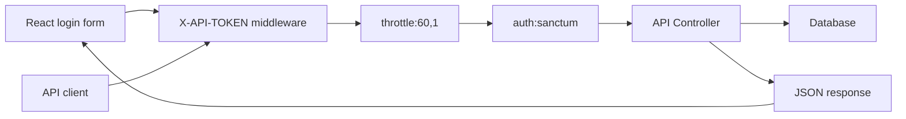

# Hari 3 - API Security Dengan Sanctum, Middleware, Token, Dan Throttling

## Matlamat Kelas

Peserta melindungi API menggunakan Laravel Sanctum, custom frontend token middleware, throttling, dan memanggil protected routes daripada React.

## Rujukan PDF

Hari ini merujuk kepada PDF halaman 11-13, buku halaman 8-10. Kandungan utama: `auth:sanctum`, middleware registration, throttling, frontend `X-API-TOKEN`, dan API security checklist.

## Pelan Kelas 6 Jam

| Masa | Fokus | Aktiviti |
| --- | --- | --- |
| 00:00-00:45 | Security layers | Terangkan auth token, frontend token, throttling |
| 00:45-01:30 | Sanctum | Confirm install dan prepare user model |
| 01:30-02:30 | Auth controller | Bina login dan logout endpoint |
| 02:30-03:30 | Middleware | Bina `VerifyFrontendToken` |
| 03:30-04:30 | Route protection | Apply `frontend.token`, `auth:sanctum`, dan `throttle` |
| 04:30-05:15 | React auth flow | Login dari React, simpan token, call protected routes |
| 05:15-06:00 | Lab | Test login, protected route, logout, dan invalid-token JSON response dengan API client dan React |

## Objektif Pembelajaran

Peserta boleh:

- menggunakan Laravel Sanctum untuk token authentication.
- membina login/logout API.
- membina middleware untuk `X-API-TOKEN`.
- apply middleware pada route group.
- test request yang protected.
- memahami perbezaan frontend token dan bearer token.
- menyimpan Sanctum bearer token dalam React client semasa lab local.
- menghantar `X-API-TOKEN` dan `Authorization: Bearer ...` daripada React.

## Security Layers Untuk API Ini

| Layer | Tujuan |
| --- | --- |
| `X-API-TOKEN` | Pastikan request datang daripada frontend/client yang dibenarkan |
| `throttle:60,1` | Hadkan jumlah request setiap minit |
| `auth:sanctum` | Pastikan user authenticated |
| Validation | Lindungi data input |
| HTTPS production | Lindungi token semasa transmission |

## Diagram Architecture



## Step 1 - Confirm Sanctum Installed

Jika Hari 1 menggunakan:

```bash
php artisan install:api
```

Sanctum biasanya sudah tersedia. Semak:

```bash
composer show laravel/sanctum
```

Pastikan migration dijalankan:

```bash
php artisan migrate
```

## Step 2 - Create Test User

Pastikan model `User` menggunakan `HasApiTokens`:

```php
use Laravel\Sanctum\HasApiTokens;

class User extends Authenticatable
{
    use HasApiTokens, HasFactory, Notifiable;
}
```

Create user:

```bash
php artisan tinker
```

```php
App\Models\User::create([
    'name' => 'Admin User',
    'email' => 'admin@example.com',
    'password' => bcrypt('password'),
]);
```

## Step 3 - Create Auth Controller

```bash
php artisan make:controller Api/V1/AuthController
```

```php
namespace App\Http\Controllers\Api\V1;

use App\Http\Controllers\Controller;
use Illuminate\Http\Request;
use Illuminate\Support\Facades\Auth;

class AuthController extends Controller
{
    public function login(Request $request)
    {
        $credentials = $request->validate([
            'email' => ['required', 'email'],
            'password' => ['required', 'string'],
        ]);

        if (! Auth::attempt($credentials)) {
            return response()->json([
                'message' => 'Invalid credentials.',
            ], 401);
        }

        $user = $request->user();
        $token = $user->createToken('api-token')->plainTextToken;

        return response()->json([
            'message' => 'Login successful.',
            'token' => $token,
            'token_type' => 'Bearer',
        ]);
    }

    public function logout(Request $request)
    {
        $request->user()->currentAccessToken()->delete();

        return response()->json([
            'message' => 'Logout successful.',
        ]);
    }
}
```

## Step 4 - Add Auth Routes

```php
use App\Http\Controllers\Api\V1\AuthController;
use App\Http\Controllers\Api\V1\UserProfileController;
use Illuminate\Support\Facades\Route;

Route::prefix('v1')->group(function () {
    Route::post('/auth/login', [AuthController::class, 'login']);

    Route::middleware('auth:sanctum')->group(function () {
        Route::post('/auth/logout', [AuthController::class, 'logout']);
        Route::apiResource('users', UserProfileController::class);
    });
});
```

## Step 5 - Test Login

```bash
curl -X POST http://127.0.0.1:8000/api/v1/auth/login \
  -H "Content-Type: application/json" \
  -d '{"email":"admin@example.com","password":"password"}'
```

Jangkaan JSON response:

```json
{
  "message": "Login successful.",
  "data": {
    "token_type": "Bearer",
    "access_token": "1|example-token-value",
    "user": {
      "id": 1,
      "name": "Training Admin",
      "email": "admin@example.com"
    }
  }
}
```

Simpan token yang dipulangkan.

## Step 6 - Test Protected Route

Tanpa token:

```bash
curl http://127.0.0.1:8000/api/v1/users
```

Jangkaan JSON response:

```json
{
  "message": "Unauthenticated."
}
```

Dengan token:

```bash
curl http://127.0.0.1:8000/api/v1/users \
  -H "Authorization: Bearer 1|your-token"
```

Jangkaan JSON response:

```json
{
  "message": "User profiles retrieved successfully.",
  "data": [
    {
      "id": 1,
      "full_name": "Ali Ahmad"
    }
  ]
}
```

## Step 7 - Create Frontend Token Middleware

```bash
php artisan make:middleware VerifyFrontendToken
```

```php
namespace App\Http\Middleware;

use Closure;
use Illuminate\Http\Request;

class VerifyFrontendToken
{
    public function handle(Request $request, Closure $next)
    {
        $expectedToken = config('services.frontend.api_token');

        if (! $expectedToken || $request->header('X-API-TOKEN') !== $expectedToken) {
            return response()->json([
                'message' => 'Unauthorized: Invalid frontend API token.',
            ], 401);
        }

        return $next($request);
    }
}
```

## Step 8 - Add Frontend Token Config

Dalam `.env`:

```dotenv
FRONTEND_API_TOKEN=abc-training-frontend-token
```

Dalam `config/services.php`:

```php
'frontend' => [
    'api_token' => env('FRONTEND_API_TOKEN'),
],
```

Clear config:

```bash
php artisan config:clear
```

## Step 9 - Register Middleware Alias

Dalam `bootstrap/app.php`:

```php
use App\Http\Middleware\VerifyFrontendToken;
use Illuminate\Foundation\Configuration\Middleware;

->withMiddleware(function (Middleware $middleware): void {
    $middleware->alias([
        'frontend.token' => VerifyFrontendToken::class,
    ]);
})
```

## Step 10 - Apply Middleware

```php
Route::prefix('v1')
    ->middleware(['frontend.token', 'throttle:60,1'])
    ->group(function () {
        Route::post('/auth/login', [AuthController::class, 'login']);

        Route::middleware('auth:sanctum')->group(function () {
            Route::post('/auth/logout', [AuthController::class, 'logout']);
            Route::apiResource('users', UserProfileController::class);
        });
    });
```

## Step 11 - Test Dengan Dua Token

Login:

```bash
curl -X POST http://127.0.0.1:8000/api/v1/auth/login \
  -H "X-API-TOKEN: abc-training-frontend-token" \
  -H "Content-Type: application/json" \
  -d '{"email":"admin@example.com","password":"password"}'
```

Jangkaan JSON response:

```json
{
  "message": "Login successful.",
  "data": {
    "token_type": "Bearer",
    "access_token": "1|example-token-value"
  }
}
```

Protected route:

```bash
curl http://127.0.0.1:8000/api/v1/users \
  -H "X-API-TOKEN: abc-training-frontend-token" \
  -H "Authorization: Bearer 1|your-token"
```

Jangkaan JSON response:

```json
{
  "message": "User profiles retrieved successfully.",
  "data": [
    {
      "id": 1,
      "full_name": "Ali Ahmad"
    }
  ]
}
```

Logout:

```bash
curl -X POST http://127.0.0.1:8000/api/v1/auth/logout \
  -H "X-API-TOKEN: abc-training-frontend-token" \
  -H "Authorization: Bearer 1|your-token"
```

Jangkaan JSON response:

```json
{
  "message": "Logout successful."
}
```

## Step 12 - Test Security Flow Yang Sama Dalam React

Gunakan:

```text
examples/react-client-api-consumer
```

Untuk Hari 3, fokus kepada:

```text
src/api.js
src/App.jsx
```

API helper sentiasa menghantar frontend token:

```js
'X-API-TOKEN': FRONTEND_API_TOKEN
```

Protected requests juga menghantar Sanctum token:

```js
Authorization: `Bearer ${token}`
```

Flow login React:

1. submit email dan password ke `POST /api/v1/auth/login`.
2. simpan token dalam state dan `localStorage` untuk lab kelas.
3. call `GET /api/v1/users` dengan kedua-dua header.
4. call logout dan clear token.

Point pengajaran:

`localStorage` sesuai untuk demo kelas kecil, tetapi token storage production perlu keputusan security berdasarkan threat model app.

## Prompt GSD Claude Code

Gunakan prompt ini jika peserta mahu Claude Code membantu tutorial Hari 3 untuk security.

```text
Goal:
Help me complete Day 3 of the Laravel API tutorial.

Context:
The API already has user profile CRUD. Today I need Laravel Sanctum login/logout, protected routes, frontend X-API-TOKEN middleware, throttling, expected security JSON responses, and the same login/list/logout flow in React.

Relevant files:
- routes/api.php
- bootstrap/app.php
- app/Http/Controllers/Api/V1/AuthController.php
- app/Http/Middleware/VerifyFrontendToken.php
- app/Models/User.php
- config/services.php
- config/sanctum.php if relevant
- examples/day-3-api-security
- examples/react-client-api-consumer/src/api.js
- examples/react-client-api-consumer/src/App.jsx

Constraints:
- Inspect security-related files before editing.
- Do not read or print .env secrets.
- Read frontend token through config, not env() inside runtime code.
- Do not put auth:sanctum on the login route.
- Keep protected profile routes behind both frontend token and bearer token checks.
- Do not weaken existing validation or route versioning.

Done criteria:
- POST /api/v1/auth/login returns a Sanctum bearer token.
- protected /api/v1/users rejects requests without Authorization: Bearer token.
- requests without X-API-TOKEN return JSON 401.
- throttling is applied to login and protected API routes.
- React can login, store token for the lab, call protected routes, and logout.

Verification:
- Provide request examples and expected JSON responses for login, missing frontend token, missing bearer token, protected list, and logout.
- Run or suggest php artisan route:list --path=api.
- If tests exist, run or suggest auth and middleware tests.
```

## Security Checklist

- Jangan hard-code token production dalam source code.
- Simpan secret dalam `.env`.
- Gunakan HTTPS di production.
- Gunakan token expiry atau rotation policy.
- Jangan expose token dalam log.
- Rate limit endpoint penting.
- Pastikan `APP_DEBUG=false` di production.

## Latihan Kelas

1. Login tanpa `X-API-TOKEN` dan lihat status `401`.
2. Login dengan token frontend yang betul.
3. Call protected route tanpa bearer token.
4. Call protected route dengan kedua-dua token.
5. Ulang login, list, dan logout daripada React.
6. Logout dan cuba guna token lama.

## Kesilapan Biasa

- Lupa `HasApiTokens` pada model `User`.
- Lupa migrate table Sanctum.
- Salah nama header `X-API-TOKEN`.
- Lupa `php artisan config:clear` selepas edit `.env`.
- Overwrite `bootstrap/app.php` tanpa merge perubahan sedia ada.

## Soalan Review Hari 3

- Apakah beza `X-API-TOKEN` dan bearer token?
- Kenapa login route masih perlukan frontend token?
- Apa fungsi `throttle:60,1`?
- Bagaimana Sanctum menyimpan token?
- Apa risiko jika `APP_DEBUG=true` di production?
- Apakah dua header yang React perlukan untuk protected routes?

## Kerja Rumah

Tambah endpoint:

```text
GET /api/v1/auth/me
```

Endpoint perlu memulangkan maklumat user authenticated dan hanya boleh diakses dengan kedua-dua token.

Kemudian tambah panel kecil dalam React yang call endpoint ini dan memaparkan nama serta email user yang login.
