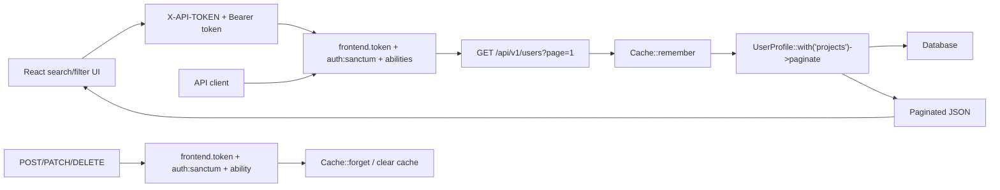

# Hari 4 - Performance, Caching, Query Optimization, Dan Exception Handling

## Matlamat Kelas

Peserta meningkatkan performance API dengan pagination, eager loading, caching, centralized JSON exception handling, dan React loading/search/error states.

## Rujukan PDF

Hari ini merujuk kepada PDF halaman 14-18, buku halaman 11-15. Kandungan utama: Redis caching, `Cache::remember`, eager loading, route/config cache, centralized exception handling, dan pagination.

## Pelan Kelas 6 Jam

| Masa | Fokus | Aktiviti |
| --- | --- | --- |
| 00:00-00:45 | Performance principle | Payload, query count, cache, dan error format |
| 00:45-01:30 | Pagination | Pastikan list endpoint tidak memulangkan semua data |
| 01:30-02:30 | Relationship | Tambah `Project` model untuk contoh eager loading |
| 02:30-03:30 | Cache | Tambah `Cache::remember` dan cache key |
| 03:30-04:20 | Exception handling | Setup JSON exception response Laravel |
| 04:20-05:05 | React API UX | Tambah search/filter, loading state, dan JSON error display |
| 05:05-06:00 | Lab | Test cache, 404 errors, route/config cache, dan React error states |

## Objektif Pembelajaran

Peserta boleh:

- menggunakan pagination untuk list endpoint.
- membina relationship Eloquent.
- menggunakan eager loading untuk elak N+1 queries.
- menambah cache pada endpoint list.
- clear cache selepas write operation.
- standardize JSON error response.
- mengekalkan frontend token, Sanctum auth, token expiry, dan ability checks Hari 3 semasa menambah performance Hari 4.
- menghantar search/filter query string daripada React.
- memaparkan pagination total, loading state, dan API errors dalam browser.

## Performance Principles

| Prinsip | Maksud |
| --- | --- |
| Paginate | Jangan pulangkan semua rekod sekaligus |
| Eager load | Kurangkan query berulang untuk relationship |
| Cache reads | Simpan response untuk query yang kerap |
| Invalidate writes | Clear cache selepas create, update, delete |
| Consistent errors | Semua error API perlu JSON yang boleh dijangka |

## Security Carry-Forward Daripada Hari 3

Hari 4 menambah performance dan exception handling selepas security Hari 3. Jangan salin semula `Route::apiResource('users', ...)` yang public atau hanya bearer-token tanpa ability.

Route state akhir Hari 4 masih:

- group `/api/v1` memerlukan `frontend.token` dan throttling.
- `POST /auth/login` memerlukan `X-API-TOKEN` tetapi belum memerlukan bearer token.
- `POST /auth/logout` memerlukan `auth:sanctum`.
- semua CRUD `/users` memerlukan `auth:sanctum` dan ability yang sepadan.

```php
Route::apiResource('users', UserProfileController::class)
    ->middlewareFor(['index', 'show'], 'abilities:profiles:read')
    ->middlewareFor('store', 'abilities:profiles:create')
    ->middlewareFor('update', 'abilities:profiles:update')
    ->middlewareFor('destroy', 'abilities:profiles:delete');
```

JSON exception handling Hari 4 perlu menambah konsistensi `404` dan `422` tanpa membuang response `403` missing ability daripada Hari 3.

## Diagram Architecture



## Step 1 - Confirm Pagination

Dalam `index()`, gunakan pagination. Jika projek anda sudah ada `UserProfileResource`, return resource collection secara terus supaya metadata pagination kekal pada top-level response:

Jika resource belum wujud, cipta dahulu:

```bash
php artisan make:resource UserProfileResource
```

```php
use App\Http\Resources\UserProfileResource;
use Illuminate\Http\Resources\Json\AnonymousResourceCollection;
```

```php
public function index(): AnonymousResourceCollection
{
    $profiles = UserProfile::query()
        ->latest()
        ->paginate(15);

    return UserProfileResource::collection($profiles)
        ->additional([
            'message' => 'User profiles retrieved successfully.',
        ]);
}
```

Jangan wrap collection seperti ini:

```php
return response()->json([
    'message' => 'User profiles retrieved successfully.',
    'data' => UserProfileResource::collection($profiles),
]);
```

Cara itu akan menjadikan response bersarang di dalam `data` dan menyukarkan React membaca metadata pagination. Bentuk response list yang dijangka ialah `message`, `data`, `links`, dan `meta` pada top-level.

Test:

```bash
curl "http://127.0.0.1:8000/api/v1/users?page=1" \
  -H "Accept: application/json" \
  -H "X-API-TOKEN: abc-training-frontend-token" \
  -H "Authorization: Bearer PASTE_TOKEN_HERE"
```

## Step 2 - Tambah Project Model

```bash
php artisan make:model Project -m
```

Migration:

```php
Schema::create('projects', function (Blueprint $table) {
    $table->id();
    $table->foreignId('user_profile_id')->constrained()->cascadeOnDelete();
    $table->string('name');
    $table->string('status')->default('active');
    $table->date('started_at')->nullable();
    $table->timestamps();
});
```

Run:

```bash
php artisan migrate
```

## Step 3 - Define Relationship

Dalam `UserProfile`:

```php
use Illuminate\Database\Eloquent\Relations\HasMany;

public function projects(): HasMany
{
    return $this->hasMany(Project::class);
}
```

Dalam `Project`:

```php
use Illuminate\Database\Eloquent\Relations\BelongsTo;

public function userProfile(): BelongsTo
{
    return $this->belongsTo(UserProfile::class);
}
```

## Step 4 - Seed Sample Projects

```bash
php artisan tinker
```

```php
$profile = App\Models\UserProfile::first();

$profile->projects()->create([
    'name' => 'Company Website',
    'status' => 'active',
    'started_at' => now()->toDateString(),
]);
```

## Step 5 - Avoid N+1 Dengan Eager Loading

Tanpa eager loading:

```php
UserProfile::query()->paginate(15);
```

Dengan eager loading:

```php
UserProfile::query()
    ->with('projects')
    ->latest()
    ->paginate(15);
```

Gunakan eager loading apabila response perlu memaparkan relationship.

## Step 6 - Tambah Cache Pada Index Endpoint

```php
use App\Http\Resources\UserProfileResource;
use Illuminate\Http\Resources\Json\AnonymousResourceCollection;
use Illuminate\Support\Facades\Cache;

public function index(): AnonymousResourceCollection
{
    $page = request()->integer('page', 1);
    $search = (string) request()->query('search', '');
    $cacheKey = "user_profiles.index.page.{$page}.search.".md5($search);

    $profiles = Cache::remember($cacheKey, now()->addMinutes(10), function () use ($search) {
        return UserProfile::query()
            ->with('projects')
            ->when($search !== '', function ($query) use ($search) {
                $query->where('full_name', 'like', "%{$search}%")
                    ->orWhere('phone', 'like', "%{$search}%")
                    ->orWhere('id_card_number', 'like', "%{$search}%");
            })
            ->latest()
            ->paginate(15);
    });

    return UserProfileResource::collection($profiles)
        ->additional([
            'message' => 'User profiles retrieved successfully.',
        ]);
}
```

Cache key mesti memasukkan page dan search supaya result filter tidak bercampur.

## Step 7 - Clear Cache Selepas Write

Untuk kelas, gunakan helper ringkas:

```php
private function clearUserProfileCache(): void
{
    Cache::flush();
}
```

Panggil selepas create, update, dan delete:

```php
$profile = UserProfile::create($request->validated());
$this->clearUserProfileCache();
```

Nota production: elakkan `Cache::flush()` jika cache digunakan oleh banyak module. Guna cache tags atau key strategy yang lebih spesifik jika driver menyokong.

## Step 8 - Configure Redis Cache

Jika guna Redis:

```bash
composer require predis/predis
```

`.env`:

```dotenv
CACHE_STORE=redis
REDIS_CLIENT=predis
REDIS_HOST=127.0.0.1
REDIS_PORT=6379
```

Clear config:

```bash
php artisan config:clear
```

## Step 9 - Production Optimization Commands

```bash
php artisan config:cache
php artisan route:cache
php artisan view:cache
```

Semasa development, clear jika perubahan tidak muncul:

```bash
php artisan optimize:clear
```

## Step 10 - JSON Exception Handling Laravel

Dalam `bootstrap/app.php`:

```php
use App\Http\Middleware\VerifyFrontendToken;
use Illuminate\Auth\Access\AuthorizationException;
use Illuminate\Database\Eloquent\ModelNotFoundException;
use Illuminate\Foundation\Application;
use Illuminate\Foundation\Configuration\Exceptions;
use Illuminate\Foundation\Configuration\Middleware;
use Illuminate\Http\Request;
use Illuminate\Validation\ValidationException;
use Laravel\Sanctum\Http\Middleware\CheckAbilities;
use Laravel\Sanctum\Http\Middleware\CheckForAnyAbility;
use Symfony\Component\HttpKernel\Exception\AccessDeniedHttpException;
use Symfony\Component\HttpKernel\Exception\NotFoundHttpException;

return Application::configure(basePath: dirname(__DIR__))
    ->withRouting(
        web: __DIR__.'/../routes/web.php',
        api: __DIR__.'/../routes/api.php',
        commands: __DIR__.'/../routes/console.php',
        health: '/up',
    )
    ->withMiddleware(function (Middleware $middleware): void {
        $middleware->alias([
            'abilities' => CheckAbilities::class,
            'ability' => CheckForAnyAbility::class,
            'frontend.token' => VerifyFrontendToken::class,
        ]);
    })
    ->withExceptions(function (Exceptions $exceptions): void {
        $exceptions->shouldRenderJsonWhen(function (Request $request, Throwable $e) {
            return $request->is('api/*') || $request->expectsJson();
        });

        $exceptions->render(function (AuthorizationException $e, Request $request) {
            if ($request->is('api/*')) {
                return response()->json([
                    'message' => $e->getMessage(),
                ], 403);
            }
        });

        $exceptions->render(function (AccessDeniedHttpException $e, Request $request) {
            if ($request->is('api/*')) {
                return response()->json([
                    'message' => $e->getMessage(),
                ], 403);
            }
        });

        $exceptions->render(function (ModelNotFoundException $e, Request $request) {
            if ($request->is('api/*')) {
                return response()->json([
                    'message' => 'Resource not found.',
                ], 404);
            }
        });

        $exceptions->render(function (NotFoundHttpException $e, Request $request) {
            if ($request->is('api/*')) {
                return response()->json([
                    'message' => 'Resource not found.',
                ], 404);
            }
        });

        $exceptions->render(function (ValidationException $e, Request $request) {
            if ($request->is('api/*')) {
                return response()->json([
                    'message' => 'The given data was invalid.',
                    'errors' => $e->errors(),
                ], 422);
            }
        });
    })->create();
```

## Step 11 - Test JSON Error

404:

```bash
curl http://127.0.0.1:8000/api/v1/users/999999 \
  -H "Accept: application/json" \
  -H "X-API-TOKEN: abc-training-frontend-token" \
  -H "Authorization: Bearer PASTE_TOKEN_HERE"
```

Jangkaan:

```json
{
  "message": "Resource not found."
}
```

Validation:

```bash
curl -X POST http://127.0.0.1:8000/api/v1/users \
  -H "Accept: application/json" \
  -H "X-API-TOKEN: abc-training-frontend-token" \
  -H "Authorization: Bearer PASTE_TOKEN_HERE" \
  -H "Content-Type: application/json" \
  -d '{"full_name": ""}'
```

Jangkaan:

```json
{
  "message": "The given data was invalid.",
  "errors": {
    "full_name": ["The full name field is required."]
  }
}
```

## Step 12 - Paparkan API State Dalam React

Gunakan:

```text
examples/react-client-api-consumer
```

Untuk Hari 4, fokus kepada UI behavior ini:

- paparkan `Loading...` semasa request sedang berjalan.
- hantar `search` dan `active` query string daripada filter controls.
- paparkan pagination total daripada metadata response API.
- paparkan error `401` jika token tiada atau expired.
- paparkan error `403` jika token tiada ability yang diperlukan.
- paparkan detail validation `422` apabila create gagal.

Contoh query call:

```js
apiRequest('/users', {
  token,
  query: {
    page: 1,
    search,
    active,
  },
});
```

Point pengajaran:

Pilihan performance backend memberi kesan kepada UX frontend. Pagination, cache, dan JSON error yang konsisten menjadikan UI React lebih mudah dibina dan debug.

## Prompt GSD Claude Code

Gunakan prompt ini jika peserta mahu Claude Code membantu tutorial Hari 4 untuk performance dan error handling.

```text
Goal:
Help me complete Day 4 of the Laravel API tutorial.

Context:
The API has CRUD and Day 3 security. Today I need pagination, Project relationship examples, eager loading, caching with safe cache keys, cache invalidation after writes, Laravel JSON exception handling, and React loading/search/filter/error states without removing frontend token, bearer token, token expiry, or Sanctum ability checks.

Relevant files:
- routes/api.php
- bootstrap/app.php
- app/Http/Controllers/Api/V1/UserProfileController.php
- app/Models/UserProfile.php
- app/Models/Project.php
- database/migrations
- config/cache.php
- examples/day-4-performance-exception-handling
- examples/react-client-api-consumer/src/api.js
- examples/react-client-api-consumer/src/App.jsx

Constraints:
- Inspect current controller/model/cache/error code before editing.
- Do not remove authentication, frontend token middleware, token expiry handling, or Sanctum ability middleware.
- Cache list responses with keys that include page/search/filter values.
- Clear stale cache after create, update, and delete.
- Do not expose raw exception messages in API JSON.
- Jika menggunakan `UserProfileResource`, return `UserProfileResource::collection($profiles)->additional(...)` supaya metadata pagination kekal pada top-level. Jangan letak resource collection di bawah `data`.

Done criteria:
- GET /api/v1/users is paginated and returns `message`, `data`, `links`, and `meta` at the top level.
- projects are eager-loaded without N+1 queries.
- repeated list calls can use cache.
- write operations clear stale list cache.
- 404 and validation failures return predictable JSON.
- missing ability returns JSON 403.
- React can show loading, search/filter results, and useful 401/403/422/404 messages.

Verification:
- Provide request examples and expected JSON responses for paginated list, search/filter list, 404, and validation error.
- Run or suggest php artisan optimize:clear after config/cache changes.
- If tests exist, run or suggest feature tests for list filters and JSON errors.
```

## Latihan Kelas

1. Tambah project kepada profile.
2. Test endpoint list dengan eager loading.
3. Call endpoint dua kali dan bincang cache.
4. Update profile dan pastikan cache clear.
5. Test 404 JSON response.
6. Test validation JSON response.
7. Test missing ability dan confirm JSON `403`.
8. Confirm React memaparkan loading, search/filter results, dan error messages.

## Kesilapan Biasa

- Cache key tidak mengambil kira `page` atau filter.
- Lupa clear cache selepas update/delete.
- Guna `Cache::flush()` dalam production tanpa kawalan.
- Return HTML error page untuk API.
- Tidak eager load relationship yang dipaparkan.
- Menggantikan protected route group Hari 3 dengan route Hari 4 yang public atau bearer-only.

## Soalan Review Hari 4

- Kenapa list endpoint perlu pagination?
- Apa itu N+1 query?
- Bila cache perlu di-clear?
- Kenapa JSON error response penting untuk API client?
- Apakah beza `route:cache` dan `config:cache`?
- Kenapa React client mendapat manfaat daripada bentuk JSON error yang konsisten?
- Kenapa Hari 4 mesti kekalkan ability middleware Hari 3 semasa menambah cache dan exception handling?

## Kerja Rumah

Tambah filter search:

```text
GET /api/v1/users?search=ali
```

Pastikan:

- query menggunakan `where`.
- cache key memasukkan nilai `search`.
- pagination masih berfungsi.
- React search input menghantar query string yang sama.
