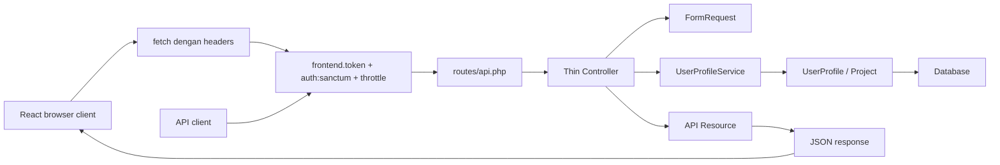

# Hari 5 - Service Layer, Route Model Binding, API Resources, Dan Projek Akhir

## Matlamat Kelas

Peserta refactor API supaya lebih maintainable menggunakan route model binding, service layer, API resources, dan React client yang consume final API contract. Hari ini menyiapkan projek akhir.

## Rujukan PDF

Hari ini merujuk kepada PDF halaman 16-18, buku halaman 13-15. Kandungan utama: service layer pattern, route model binding, API resources/serialization, dan optimization summary.

## Pelan Kelas 6 Jam

| Masa | Fokus | Aktiviti |
| --- | --- | --- |
| 00:00-00:45 | Architecture review | Terangkan layer responsibility |
| 00:45-01:30 | Route model binding | Refactor `show`, `update`, `destroy` |
| 01:30-02:30 | API resources | Control bentuk JSON response |
| 02:30-03:45 | Service layer | Pindahkan business logic ke service |
| 03:45-04:35 | Final CRUD test | Test end-to-end flow |
| 04:35-05:25 | React final integration | Connect login, list, search/filter, create, dan errors kepada final API |
| 05:25-06:00 | Review projek akhir | Rubrik, checklist, dan presentation peserta |

## Objektif Pembelajaran

Peserta boleh:

- menggunakan route model binding.
- membina API resources.
- memisahkan controller logic dan business logic.
- membina service class.
- menerangkan architecture akhir API.
- menilai projek akhir menggunakan rubrik.
- menerangkan flow penuh browser-to-API.
- verify React client consume final API contract dengan betul.

## Target Architecture

```text
Client
  -> React fetch
  -> Middleware
  -> Routes
  -> Controller
  -> Form Request
  -> Service
  -> Model
  -> Database
  -> API Resource
  -> JSON
```

## Diagram Architecture



## Step 1 - Gunakan Route Model Binding

Laravel boleh inject model terus berdasarkan route parameter.

Sebelum:

```php
public function show(string $id)
{
    $profile = UserProfile::findOrFail($id);
}
```

Selepas:

```php
public function show(UserProfile $user)
{
    return response()->json([
        'message' => 'User profile retrieved successfully.',
        'data' => $user,
    ]);
}
```

Jika route ialah:

```php
Route::apiResource('users', UserProfileController::class);
```

Parameter method perlu bernama `$user` kerana route parameter ialah `{user}`.

## Step 2 - Create API Resource

```bash
php artisan make:resource UserProfileResource
php artisan make:resource ProjectResource
```

`ProjectResource`:

```php
namespace App\Http\Resources;

use Illuminate\Http\Request;
use Illuminate\Http\Resources\Json\JsonResource;

class ProjectResource extends JsonResource
{
    public function toArray(Request $request): array
    {
        return [
            'id' => $this->id,
            'name' => $this->name,
            'status' => $this->status,
            'started_at' => $this->started_at,
        ];
    }
}
```

`UserProfileResource`:

```php
namespace App\Http\Resources;

use Illuminate\Http\Request;
use Illuminate\Http\Resources\Json\JsonResource;

class UserProfileResource extends JsonResource
{
    public function toArray(Request $request): array
    {
        return [
            'id' => $this->id,
            'full_name' => $this->full_name,
            'id_card_number' => $this->id_card_number,
            'phone' => $this->phone,
            'email' => $this->email,
            'address' => $this->address,
            'is_active' => $this->is_active,
            'projects' => ProjectResource::collection($this->whenLoaded('projects')),
            'created_at' => $this->created_at?->toISOString(),
            'updated_at' => $this->updated_at?->toISOString(),
        ];
    }
}
```

## Step 3 - Create Service Class

Bina file:

```text
app/Services/UserProfileService.php
```

```php
namespace App\Services;

use App\Models\UserProfile;
use Illuminate\Contracts\Pagination\LengthAwarePaginator;
use Illuminate\Support\Facades\Cache;

class UserProfileService
{
    public function paginate(array $filters = []): LengthAwarePaginator
    {
        $page = request('page', 1);
        $search = $filters['search'] ?? null;
        $active = $filters['active'] ?? null;
        $cacheKey = "user_profiles.page.$page.search.$search.active.$active";

        return Cache::remember($cacheKey, now()->addMinutes(10), function () use ($search, $active) {
            return UserProfile::query()
                ->with('projects')
                ->when($search, function ($query, $search) {
                    $query->where('full_name', 'like', "%{$search}%");
                })
                ->when($active !== null, function ($query) use ($active) {
                    $query->where('is_active', (bool) $active);
                })
                ->latest()
                ->paginate(10);
        });
    }

    public function create(array $data): UserProfile
    {
        $profile = UserProfile::create($data);
        $this->clearCache();

        return $profile;
    }

    public function update(UserProfile $profile, array $data): UserProfile
    {
        $profile->update($data);
        $this->clearCache();

        return $profile->refresh();
    }

    public function delete(UserProfile $profile): void
    {
        $profile->delete();
        $this->clearCache();
    }

    private function clearCache(): void
    {
        Cache::flush();
    }
}
```

## Step 4 - Refactor Controller

```php
use App\Http\Resources\UserProfileResource;
use App\Models\UserProfile;
use App\Services\UserProfileService;

class UserProfileController extends Controller
{
    public function __construct(private UserProfileService $service)
    {
    }

    public function index()
    {
        $profiles = $this->service->paginate(request()->only(['search', 'active']));

        return UserProfileResource::collection($profiles)
            ->additional(['message' => 'User profiles retrieved successfully.']);
    }

    public function store(StoreUserProfileRequest $request)
    {
        $profile = $this->service->create($request->validated());

        return (new UserProfileResource($profile))
            ->additional(['message' => 'User profile created successfully.'])
            ->response()
            ->setStatusCode(201);
    }

    public function show(UserProfile $user)
    {
        $user->load('projects');

        return (new UserProfileResource($user))
            ->additional(['message' => 'User profile retrieved successfully.']);
    }

    public function update(UpdateUserProfileRequest $request, UserProfile $user)
    {
        $profile = $this->service->update($user, $request->validated());

        return (new UserProfileResource($profile))
            ->additional(['message' => 'User profile updated successfully.']);
    }

    public function destroy(UserProfile $user)
    {
        $this->service->delete($user);

        return response()->noContent();
    }
}
```

## Step 5 - Fix Update Request Route Parameter

Dalam `UpdateUserProfileRequest`, route parameter sekarang ialah model `$user`:

```php
$profile = $this->route('user');

Rule::unique('user_profiles', 'id_card_number')->ignore($profile?->id)
```

## Step 6 - Test Final CRUD Flow

Login:

```bash
curl -X POST http://127.0.0.1:8000/api/v1/auth/login \
  -H "X-API-TOKEN: abc-training-frontend-token" \
  -H "Content-Type: application/json" \
  -d '{"email":"admin@example.com","password":"password"}'
```

Jangkaan JSON response:

```json
{
  "message": "Login successful.",
  "data": {
    "token_type": "Bearer",
    "access_token": "1|example-token-value"
  }
}
```

List:

```bash
curl "http://127.0.0.1:8000/api/v1/users?search=ali&active=1" \
  -H "X-API-TOKEN: abc-training-frontend-token" \
  -H "Authorization: Bearer 1|your-token"
```

Jangkaan JSON response:

```json
{
  "message": "User profiles retrieved successfully.",
  "data": [
    {
      "id": 1,
      "full_name": "Ali Ahmad",
      "projects": []
    }
  ],
  "meta": {
    "current_page": 1,
    "total": 1
  }
}
```

Create:

```bash
curl -X POST http://127.0.0.1:8000/api/v1/users \
  -H "X-API-TOKEN: abc-training-frontend-token" \
  -H "Authorization: Bearer 1|your-token" \
  -H "Content-Type: application/json" \
  -d '{
    "full_name": "Farah Hassan",
    "id_card_number": "920303-10-3333",
    "phone": "+60133334444",
    "email": "farah@example.com"
  }'
```

Jangkaan JSON response:

```json
{
  "message": "User profile created successfully.",
  "data": {
    "id": 2,
    "full_name": "Farah Hassan",
    "id_card_number": "920303-10-3333",
    "phone": "+60133334444",
    "email": "farah@example.com"
  }
}
```

Update:

```bash
curl -X PATCH http://127.0.0.1:8000/api/v1/users/1 \
  -H "X-API-TOKEN: abc-training-frontend-token" \
  -H "Authorization: Bearer 1|your-token" \
  -H "Content-Type: application/json" \
  -d '{"is_active": false}'
```

Jangkaan JSON response:

```json
{
  "message": "User profile updated successfully.",
  "data": {
    "id": 1,
    "is_active": false
  }
}
```

Delete:

```bash
curl -X DELETE http://127.0.0.1:8000/api/v1/users/1 \
  -H "X-API-TOKEN: abc-training-frontend-token" \
  -H "Authorization: Bearer 1|your-token"
```

Jangkaan response:

```text
204 No Content, body kosong
```

## Step 7 - Verify Final API Daripada React

Gunakan:

```text
examples/react-client-api-consumer
```

Final React client mesti menunjukkan:

- login melalui `POST /api/v1/auth/login`.
- menyimpan dan clear Sanctum token semasa lab local.
- list profiles melalui `GET /api/v1/users`.
- filter menggunakan `search` dan `active`.
- create profile melalui `POST /api/v1/users`.
- paparkan loading, success, `401`, dan `422` states.

Checklist integrasi akhir:

| Client action | API endpoint | Headers diperlukan |
| --- | --- | --- |
| Login | `POST /api/v1/auth/login` | `X-API-TOKEN` |
| List profiles | `GET /api/v1/users` | `X-API-TOKEN`, `Authorization` |
| Create profile | `POST /api/v1/users` | `X-API-TOKEN`, `Authorization` |
| Logout | `POST /api/v1/auth/logout` | `X-API-TOKEN`, `Authorization` |

Point pengajaran:

Architecture akhir bukan hanya folder backend. Ia ialah contract penuh antara browser dan Laravel: URL, method, headers, body, status code, dan bentuk JSON.

## Prompt GSD Claude Code

Gunakan prompt ini jika peserta mahu Claude Code membantu refactor Hari 5 dan verification projek akhir.

```text
Goal:
Help me complete Day 5 of the Laravel API tutorial and verify the final project.

Context:
The API has CRUD, validation, security, pagination, cache, and JSON errors. Today I need route model binding, API resources, a service layer, a clean controller, final React integration, and final project verification.

Relevant files:
- routes/api.php
- bootstrap/app.php
- app/Http/Controllers/Api/V1/UserProfileController.php
- app/Http/Requests/StoreUserProfileRequest.php
- app/Http/Requests/UpdateUserProfileRequest.php
- app/Http/Resources/UserProfileResource.php
- app/Http/Resources/ProjectResource.php
- app/Services/UserProfileService.php
- app/Models/UserProfile.php
- app/Models/Project.php
- examples/day-5-service-layer-final-project
- examples/react-client-api-consumer/src/api.js
- examples/react-client-api-consumer/src/App.jsx

Constraints:
- Inspect existing files before planning edits.
- Keep endpoint URLs and status codes unchanged.
- Keep validation in FormRequest classes.
- Keep business workflow in the service class.
- Keep JSON shape controlled by API resources.
- Do not edit unrelated files.
- Do not accept the refactor unless verification still passes.

Done criteria:
- route model binding works for show/update/delete.
- controller is thin and delegates business logic.
- service handles list, create, update, delete, search/filter, and cache invalidation.
- API resources control the final JSON response.
- React can login, list, search/filter, create, handle errors, and logout.
- final project checklist is pass/fail reviewed.

Verification:
- Run or suggest php artisan route:list --path=api.
- Provide request examples and expected JSON responses for login, list, create, show, update, delete, and logout.
- If tests exist, run the API feature test suite.
- Produce a concise handoff summary with changed files, verification, and remaining risks.
```

## Keperluan Projek Akhir

Projek akhir perlu mempunyai:

- API route prefix `/api/v1`.
- CRUD user profile.
- form request validation.
- Sanctum login dan logout.
- frontend token middleware.
- throttling.
- pagination.
- search dan active filter.
- eager loading project.
- caching.
- clear cache selepas write.
- JSON exception handling.
- route model binding.
- service layer.
- API resources.
- React/Vite client.
- React API environment variables.
- React login, list, search/filter, create, loading, dan error states.

## Rubrik Markah Projek Akhir

| Area | Markah |
| --- | ---: |
| Setup projek dan migration | 10 |
| RESTful CRUD dan validation | 20 |
| Security: Sanctum, middleware, throttling | 20 |
| Performance dan exception handling | 15 |
| Service layer dan resources | 15 |
| React client consume API dengan betul | 10 |
| Code clarity dan consistency | 10 |
| Jumlah | 100 |

## Instructor Review Checklist

- Endpoint memulangkan response JSON yang dijangka.
- Response JSON konsisten.
- Validation error memulangkan `422`.
- Protected route reject request tanpa token.
- Cache tidak memulangkan data lama selepas write.
- Controller tidak terlalu sarat dengan business logic.
- Service class mempunyai method yang jelas.
- API resource mengawal output.
- React client boleh login, list, filter, create, dan logout.
- React memaparkan loading serta error `401` dan `422`.

## Kesilapan Biasa

- Nama parameter route model binding tidak sama dengan route.
- Business logic masih terlalu banyak dalam controller.
- Cache key tidak memasukkan filter.
- API resource tidak digunakan pada semua response.
- `Cache::flush()` digunakan tanpa bincang risiko production.

## Soalan Review Hari 5

- Apa manfaat route model binding?
- Kenapa service layer membantu maintenance?
- Apa fungsi API resource?
- Layer mana patut mengandungi validation?
- Bagaimana anda menerangkan architecture akhir kepada client?
- Apakah contract yang React perlu tahu untuk call Laravel API?

## Topik Seterusnya

Selepas projek akhir, peserta boleh sambung kepada:

- TDD untuk API.
- Swagger/OpenAPI documentation.
- FilamentPHP admin panel.
- queue dan background jobs.
- CI/CD deployment.
- API monitoring dan logging.
