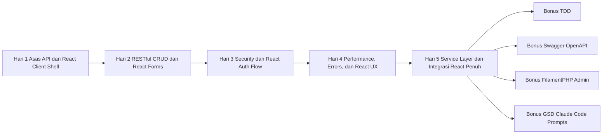
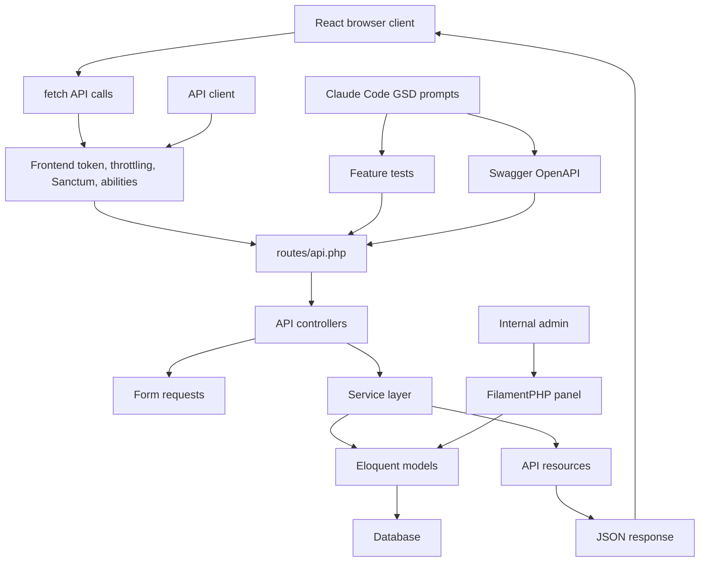

# Gambaran Keseluruhan Latihan Laravel API

## Ringkasan Program

Ini ialah program latihan Laravel API selama 5 hari secara praktikal, berdasarkan konsep daripada `Building Better APIs with Laravel`. Latihan ini mengajar peserta membina API Laravel yang selamat, mudah diselenggara, mempunyai dokumentasi, sesuai untuk amalan production, dan boleh digunakan oleh browser client.

Projek utama ialah **ABC Company Profile API**. Peserta membina API yang sama sepanjang 5 hari, bermula dengan endpoint JSON ringkas dan berakhir dengan API berstruktur yang mempunyai authentication, validation, throttling, caching, exception handling, route model binding, service classes, API resources, dan React/Vite client yang memanggil REST API.

## Pemetaan Sumber PDF

Kursus 5 hari ini berdasarkan PDF asal, tetapi bahan latihan dikembangkan menjadi projek kelas yang lebih lengkap dengan kod, lab, contoh, dan topik bonus.

Nombor halaman di bawah merujuk kepada halaman fizikal PDF yang dipaparkan oleh PDF viewer. Nombor halaman buku bercetak disertakan jika berguna.

| Bahagian latihan | Halaman PDF berkaitan | Kandungan PDF digunakan | Pengembangan dalam kursus |
| --- | --- | --- | --- |
| Hari 1 - Asas Laravel API | PDF halaman 4-8, buku halaman 1-5 | Gambaran Laravel API, setup Laravel, struktur MVC, request flow, setup `routes/api.php` | Setup projek penuh, workflow MySQL, model pertama, migration, controller, endpoint JSON |
| Hari 2 - RESTful Routes, CRUD, dan Validation | PDF halaman 9-12, buku halaman 6-9 | REST methods, route prefixes, versioning, `Route::apiResource`, named routes, nota route cache | Controller CRUD penuh, form request validation, status code, dan lab response JSON |
| Hari 3 - Keselamatan API | PDF halaman 11-13, buku halaman 8-10 | `auth:sanctum`, middleware registration, throttling, frontend `X-API-TOKEN`, checklist keselamatan API | Flow login/logout Sanctum lengkap, ujian token expiry, token abilities, middleware alias |
| Hari 4 - Performance dan Exception Handling | PDF halaman 14-18, buku halaman 11-15 | Redis caching, `Cache::remember`, eager loading, route/config cache, centralized exception handling, pagination | Contoh relationship projek, cache key, clear cache selepas write, JSON exception response |
| Hari 5 - Service Layer dan Projek Akhir | PDF halaman 16-18, buku halaman 13-15 | service layer pattern, route model binding, API resources/serialization, ringkasan optimization | Service class lengkap, API resources, architecture akhir, refactor route model binding |
| Integrasi React client sepanjang Hari 1-5 | Tidak dibincang terus dalam PDF | Tidak diliputi | Ditambah selepas permintaan peserta supaya mereka boleh memanggil REST API daripada browser UI |
| Bonus - TDD | Tidak dibincang terus dalam PDF | Tidak diliputi | Ditambah sebagai amalan lanjutan untuk feature testing API |
| Bonus - Swagger/OpenAPI | PDF halaman 12 menyebut dokumentasi routes secara ringkas; halaman 19-20 menyenaraikan learning resources | Dokumentasi route disebut secara ringkas sahaja | Ditambah workflow dokumentasi OpenAPI/Swagger penuh |
| Bonus - FilamentPHP | Tidak dibincang terus dalam PDF | Tidak diliputi | Ditambah sebagai admin panel untuk mengurus data API |
| Bonus - GSD Claude Code Prompts | Tidak dibincang terus dalam PDF | Tidak diliputi | Ditambah sebagai modul workflow AI-assisted untuk planning, implementation, testing, review, dan dokumentasi perubahan API |

## Tempoh

| Item | Butiran |
| --- | --- |
| Latihan teras | 5 hari |
| Tempoh kelas harian | 6 jam |
| Jumlah jam teras | 30 jam |
| Modul bonus | TDD, Swagger/OpenAPI, FilamentPHP, GSD Claude Code prompts |
| Sasaran peserta | Developer Laravel/PHP tahap junior hingga intermediate |

## Objektif Kursus

Selepas tamat latihan, peserta sepatutnya boleh:

- Setup projek Laravel API.
- Menerangkan lifecycle request Laravel API.
- Membina route RESTful API yang mempunyai versioning.
- Membina model, migration, controller, dan form request.
- Membina endpoint CRUD dengan HTTP method dan status code yang betul.
- Validate request API dan memulangkan error validation dalam JSON.
- Melindungi API menggunakan Laravel Sanctum.
- Enforce named Sanctum token abilities untuk action read dan write.
- Menambah custom middleware untuk frontend API token.
- Menggunakan throttling untuk mengurangkan penyalahgunaan API.
- Menggunakan pagination, eager loading, dan caching untuk performance.
- Mengkonfigurasi centralized JSON exception handling dalam Laravel.
- Menggunakan route model binding untuk controller yang lebih kemas.
- Memindahkan business logic ke service classes.
- Menggunakan API resources untuk mengawal bentuk response JSON.
- Membina React/Vite client kecil untuk API.
- Memanggil endpoint public dan protected daripada React menggunakan `fetch`.
- Menghantar `X-API-TOKEN` dan Sanctum bearer token daripada browser client.
- Mengendalikan loading, validation errors, authentication errors, pagination, search, dan create form dalam React.
- Memahami peranan TDD, Swagger/OpenAPI, FilamentPHP, dan prompt GSD Claude Code dalam workflow Laravel API.

## Hasil Yang Diharapkan

Selepas latihan 5 hari, peserta boleh membina API yang mempunyai:

- route versioning `/api/v1`.
- endpoint CRUD untuk user profile.
- request validation.
- response JSON yang konsisten.
- login dan logout Sanctum.
- named Sanctum token abilities untuk CRUD action yang protected.
- route yang dilindungi authentication.
- middleware frontend token `X-API-TOKEN`.
- rate limiting.
- list response dengan pagination.
- list response yang boleh dicari.
- relationship project dengan eager loading.
- endpoint list yang dicache.
- clear cache selepas create, update, dan delete.
- centralized JSON exception response.
- route model binding.
- service layer architecture.
- format response API resource.
- setup React client dengan Vite.
- flow login React yang menyimpan Sanctum token.
- screen React untuk list, search, filter, dan create yang memanggil REST API.
- browser-side error handling untuk `401`, `422`, dan API failure umum.

Selepas modul bonus, peserta juga akan faham:

- cara menulis Laravel feature tests untuk API.
- cara mendokumentasi API dengan Swagger/OpenAPI.
- cara menambah FilamentPHP admin panel untuk mengurus data API.
- cara menggunakan prompt GSD bersama Claude Code dengan selamat dan berkesan.

## Roadmap Kursus

## Architecture Akhir

## Pecahan Harian

| Hari | Fokus | Deliverable utama |
| --- | --- | --- |
| Hari 1 | Setup Laravel, API routes, MVC flow, React/Vite shell | Endpoint JSON versioned pertama dan setup React client |
| Hari 2 | RESTful CRUD, validation, React list/create form | API CRUD user profile lengkap dan browser CRUD calls |
| Hari 3 | Keselamatan API dan React auth flow | Sanctum auth, token expiry, token abilities, frontend token middleware, throttling, React login |
| Hari 4 | Performance, error, React loading/search/error UX | API cache/eager-loaded dengan JSON exception handling dan React filters |
| Hari 5 | Refactor architecture dan client integration | API akhir dan React client yang consume production-style contract |

## Modul Bonus

| Bonus | Tujuan | Deliverable |
| --- | --- | --- |
| TDD | Mengajar development API test-first | Feature tests untuk auth, middleware, CRUD, validation, dan filter |
| Swagger/OpenAPI | Mengajar dokumentasi API | Swagger UI dan OpenAPI JSON |
| FilamentPHP | Mengajar pengurusan data back-office | Admin panel untuk user profiles dan projects |
| GSD Claude Code Prompts | Mengajar workflow delivery AI-assisted yang selamat | Prompt yang boleh disalin untuk planning, TDD, debugging, security review, integrasi React, dokumentasi, dan handoff |

## Prasyarat Peserta

Peserta perlu tahu atau mempunyai pendedahan asas kepada:

- syntax PHP.
- routing dan controller asas Laravel.
- Composer.
- relational databases.
- HTTP methods dan status codes.
- JSON.
- terminal commands.
- konsep asas JavaScript dan React.

Tools tempatan yang disarankan:

- PHP 8.2 atau lebih baru.
- Composer.
- MySQL 8.0 atau lebih baru.
- Git.
- Node.js LTS dan npm.
- Postman, Insomnia, atau API client lain.
- Code editor.

## Persediaan Instructor

Sebelum latihan bermula, sediakan:

- projek Laravel yang bersih.
- environment PHP dan Composer yang berfungsi.
- database MySQL dan schema khusus `abc_api` untuk setup kelas.
- Postman collection atau contoh response JSON.
- React/Vite client starter dalam `examples/react-client-api-consumer`.
- setting CORS local yang membenarkan `http://localhost:5173`.
- salinan tempatan semua fail `training/*.md`.
- salinan tempatan semua folder `examples/*`.

Flow pengajaran yang disarankan:

1. Terangkan konsep.
2. Tunjukkan diagram.
3. Tulis atau salin kod.
4. Jalankan endpoint.
5. Semak response JSON.
6. Minta peserta ulang dengan perubahan kecil.

## Keperluan Projek Akhir

Projek akhir mesti mengandungi:

- setup projek Laravel.
- fail API route diaktifkan.
- route prefix `/api/v1`.
- model dan migration `UserProfile`.
- model dan migration `Project`.
- endpoint CRUD untuk user profiles.
- request validation classes.
- Sanctum authentication.
- endpoint login dan logout.
- frontend token middleware.
- throttling.
- pagination.
- search.
- eager loading.
- caching.
- JSON exception handling.
- route model binding.
- service class.
- API resources.
- React/Vite client app.
- API environment variables untuk React client.
- screen frontend untuk login, list, search/filter, dan create profile.
- browser-side handling untuk loading, `401`, `422`, dan API error umum.

## Rubrik Penilaian

| Area | Markah |
| --- | ---: |
| Setup projek dan migrations | 10 |
| RESTful CRUD API | 15 |
| Validation dan status codes | 10 |
| Sanctum authentication | 15 |
| Middleware dan throttling | 10 |
| Performance improvements | 10 |
| Exception handling | 5 |
| Service layer dan resources | 10 |
| Integrasi React client | 10 |
| Kejelasan dan konsistensi kod | 5 |
| Jumlah | 100 |

## Fail Latihan

Modul teras:

- `training/day-1-laravel-api-foundations.md`
- `training/day-2-restful-routes-validation.md`
- `training/day-3-api-security.md`
- `training/day-4-performance-exception-handling.md`
- `training/day-5-service-layer-final-project.md`
- `training/react-client-api-setup.md`

Modul bonus:

- `training/bonus-tdd-laravel-api.md`
- `training/bonus-swagger-openapi.md`
- `training/bonus-filamentphp-admin-api.md`
- `training/bonus-gsd-claude-code-prompts.md`

Contoh kod:

- `examples/day-1-laravel-api-foundations`
- `examples/day-2-restful-routes-validation`
- `examples/day-3-api-security`
- `examples/day-4-performance-exception-handling`
- `examples/day-5-service-layer-final-project`
- `examples/react-client-api-consumer`
- `examples/bonus-tdd-laravel-api`
- `examples/bonus-swagger-openapi`
- `examples/bonus-filamentphp-admin-api`
