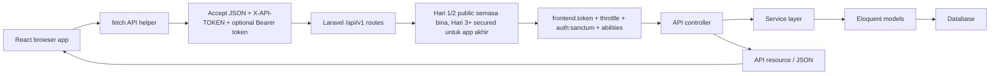

# Setup React Client Untuk Memanggil Laravel API

## Matlamat

Tutorial ini menunjukkan cara membina React/Vite client yang memanggil Laravel REST API daripada latihan 5 hari.

Selepas tutorial ini, peserta boleh:

- create React app menggunakan Vite.
- configure Laravel API base URL.
- faham bahawa list Hari 1 dan CRUD Hari 2 public hanya semasa lesson itu dibina.
- menghantar header frontend `X-API-TOKEN` apabila security Hari 3 ditambah.
- login dan menyimpan Sanctum bearer token, expiry, dan abilities untuk lab local pada Hari 3.
- call protected API routes selepas security Hari 3 ditambah.
- list, search, view, create, update, dan delete user profiles.
- memaparkan loading, success, `401`, `403`, `422`, dan API error umum.

## Kedudukan Dalam Kursus 5 Hari

| Hari | Fokus React | Dependency API |
| --- | --- | --- |
| Hari 1 | Create React/Vite shell dan configure `.env.local` | `GET /api/v1/users` |
| Hari 2 | List, view detail, create, update, dan delete profiles | REST CRUD dan validation |
| Hari 3 | Login, simpan token, call protected routes | Sanctum dan frontend token middleware |
| Hari 4 | Search, loading, pagination, error states | pagination, cache, JSON errors |
| Hari 5 | Integrasi penuh browser-to-API | service layer dan API resources |

## Architecture



## Prasyarat

- Laravel API sedang berjalan secara local.
- Node.js LTS dan npm.
- API endpoint tersedia di `http://127.0.0.1:8000/api/v1`.
- Test user tersedia:

```text
admin@example.com
password
```

## Step 1 - Create React App

Create client di luar projek Laravel:

```bash
npm create vite@latest abc-api-client
cd abc-api-client
npm install
```

Apabila Vite bertanya:

```text
Framework: React
Variant: JavaScript
```

Start app:

```bash
npm run dev
```

Vite biasanya dibuka di:

```text
http://localhost:5173
```

## Step 2 - Salin Contoh Latihan

Contoh siap ada di:

```text
examples/react-client-api-consumer
```

Salin fail ini ke dalam `abc-api-client`:

| Fail contoh | Destinasi React |
| --- | --- |
| `package.json` | `package.json` |
| `vite.config.js` | `vite.config.js` |
| `index.html` | `index.html` |
| `.env.example` | `.env.local` |
| `src/main.jsx` | `src/main.jsx` |
| `src/api.js` | `src/api.js` |
| `src/App.jsx` | `src/App.jsx` |
| `src/App.css` | `src/App.css` |

Kemudian install dependencies semula:

```bash
npm install
```

## Step 3 - Configure API Environment Values

Create `.env.local`:

```dotenv
VITE_API_BASE_URL=http://127.0.0.1:8000/api/v1
VITE_FRONTEND_API_TOKEN=abc-training-frontend-token
```

Restart Vite selepas ubah environment values:

```bash
npm run dev
```

## Step 4 - Create API Helper

`src/api.js` mengumpulkan semua browser-to-API calls.

```js
const API_BASE_URL = import.meta.env.VITE_API_BASE_URL;
const FRONTEND_API_TOKEN = import.meta.env.VITE_FRONTEND_API_TOKEN;

export async function apiRequest(path, { method = 'GET', token, body, query } = {}) {
  const url = new URL(`${API_BASE_URL}${path}`);
  const headers = {
    Accept: 'application/json',
    ...(body ? { 'Content-Type': 'application/json' } : {}),
    ...(FRONTEND_API_TOKEN ? { 'X-API-TOKEN': FRONTEND_API_TOKEN } : {}),
    ...(token ? { Authorization: `Bearer ${token}` } : {}),
  };

  Object.entries(query || {}).forEach(([key, value]) => {
    if (value !== '' && value !== null && value !== undefined) {
      url.searchParams.set(key, value);
    }
  });

  const response = await fetch(url, {
    method,
    headers,
    body: body ? JSON.stringify(body) : undefined,
  });

  const text = await response.text();
  const data = text ? JSON.parse(text) : null;

  if (!response.ok) {
    const error = new Error(data?.message || `Request failed with ${response.status}`);
    error.status = response.status;
    error.data = data;
    throw error;
  }

  return data;
}
```

Point pengajaran:

- `Accept: application/json` meminta Laravel memulangkan JSON errors dan bukan HTML redirects.
- `X-API-TOKEN` mengenal pasti frontend client selepas middleware Hari 3 ditambah.
- `Authorization: Bearer ...` mengenal pasti authenticated user selepas Sanctum ditambah.
- React tidak import Laravel controllers, models, services, atau kod Eloquent.
- React hanya tahu HTTP contract: method, URL, headers, body, status code, dan bentuk JSON.

## Step 5 - Login Daripada React

Jika peserta masih di Hari 1 atau Hari 2, route latihan sementara mungkin public. Selepas security Hari 3 diperkenalkan, gunakan login flow ini sebelum list, show, create, update, atau delete.

Request login belum mempunyai bearer token, tetapi ia menghantar frontend token apabila `VITE_FRONTEND_API_TOKEN` dikonfigurasi.

```js
const data = await apiRequest('/auth/login', {
  method: 'POST',
  body: {
    email: 'admin@example.com',
    password: 'password',
  },
});

const accessToken = data.data.access_token;
const expiresAt = data.data.expires_at;
const abilities = data.data.abilities || [];
localStorage.setItem('abc_api_token', accessToken);
localStorage.setItem('abc_api_token_expires_at', expiresAt);
localStorage.setItem('abc_api_token_abilities', JSON.stringify(abilities));
```

Jangkaan response API:

```json
{
  "message": "Login successful.",
  "data": {
    "token_type": "Bearer",
    "access_token": "1|plain-text-token",
    "expires_at": "2026-06-09T09:30:00.000000Z",
    "abilities": [
      "profiles:read",
      "profiles:create",
      "profiles:update",
      "profiles:delete"
    ],
    "user": {
      "id": 1,
      "name": "Training Admin",
      "email": "admin@example.com"
    }
  }
}
```

`localStorage` sesuai untuk lab latihan. Dalam production, token storage perlu keputusan security berdasarkan risk model app.

## Step 6 - Call Profiles Endpoint

Sebelum Hari 3, route latihan sementara boleh load profiles tanpa login:

```js
const profiles = await apiRequest('/users', {
  query: {
    page: 1,
    search: 'ali',
  },
});
```

Selepas security Hari 3 ditambah, pass token yang disimpan. List memerlukan `profiles:read`:

```js
const token = localStorage.getItem('abc_api_token');

const profiles = await apiRequest('/users', {
  token,
  query: {
    page: 1,
    search: 'ali',
  },
});
```

Selepas Hari 3, protected request menghantar:

```text
X-API-TOKEN: abc-training-frontend-token
Authorization: Bearer 1|plain-text-token
```

## Step 7 - Call CRUD Endpoints

Hari 2 menambah RESTful CRUD penuh melalui `Route::apiResource('users', UserProfileController::class)`.
Sebelum Hari 3, call latihan sementara ini boleh berfungsi tanpa bearer token. Selepas security Hari 3 ditambah, list, view, create, update, dan delete semuanya memerlukan header frontend `X-API-TOKEN`, Sanctum bearer token, dan token ability yang sepadan.

Field payload profile:

```js
const body = {
  full_name: 'Nur Iman',
  id_card_number: '920202-08-4567',
  phone: '+60112223333',
  address: 'Shah Alam',
  is_active: true,
};
```

Create:

```js
const created = await apiRequest('/users', {
  method: 'POST',
  token, // memerlukan profiles:create selepas Hari 3
  body,
});
```

View detail:

```js
const detail = await apiRequest(`/users/${created.data.id}`, { token }); // memerlukan profiles:read
```

Update:

```js
const updated = await apiRequest(`/users/${created.data.id}`, {
  method: 'PUT',
  token, // memerlukan profiles:update
  body: {
    ...body,
    phone: '+60119998888',
  },
});
```

Delete:

```js
await apiRequest(`/users/${updated.data.id}`, {
  method: 'DELETE',
  token, // memerlukan profiles:delete
});
```

Endpoint delete memulangkan `204 No Content`, jadi helper memulangkan `null` untuk delete yang berjaya.

Jika Laravel memulangkan `422`, paparkan validation errors dan jangan clear form.

## Step 8 - Handle API Errors

Contoh client mengendalikan kes ini:

| Status | Maksud | Behavior React |
| --- | --- | --- |
| `401` | frontend atau bearer token tiada/tidak sah selepas Hari 3 | papar error dan minta login |
| `403` | token authenticated tetapi tiada ability diperlukan | papar mesej backend dan kekalkan auth state |
| `422` | validation gagal | papar validation details |
| `404` | resource tidak dijumpai | papar resource error |
| `429` | terlalu banyak request | papar rate-limit message |
| `500` | server error | papar API failure umum |

Contoh display logic:

```js
const validation = err.data?.errors
  ? Object.values(err.data.errors).flat().join(' ')
  : '';

setError(`${err.status || 'Error'}: ${validation || err.message}`);
```

## Step 9 - Semak Laravel CORS

React biasanya berjalan pada:

```text
http://localhost:5173
```

Laravel berjalan pada:

```text
http://127.0.0.1:8000
```

Kerana origin berbeza, Laravel perlu membenarkan origin React semasa latihan local.

Rule CORS kelas:

```text
Benarkan http://localhost:5173 untuk local development sahaja.
```

Jangan gunakan unrestricted origins untuk private production APIs.

## Step 10 - Flow Test

Run Laravel:

```bash
php artisan serve
```

Run React:

```bash
npm run dev
```

Kemudian test:

1. Buka `http://localhost:5173`.
2. Confirm `.env.local` ada `VITE_API_BASE_URL` dan `VITE_FRONTEND_API_TOKEN` yang betul.
3. Login dengan `admin@example.com` dan `password`.
4. Confirm UI memaparkan token expiry dan abilities.
5. Load profiles dengan `profiles:read`.
6. Search by name.
7. View satu profile detail dengan `profiles:read`.
8. Create profile dengan `profiles:create`.
9. Edit profile baru dan submit update dengan `profiles:update`.
10. Delete profile dengan `profiles:delete` dan confirm list reload.
11. Test read-only token dan confirm write actions memulangkan `403`.
12. Logout dan confirm protected calls gagal selepas logout.

## Prompt GSD Claude Code

Gunakan prompt ini jika peserta mahu Claude Code membantu setup React client standalone.

```text
Goal:
Help me set up the React/Vite client so it can call the Laravel API safely.

Context:
The Laravel API runs at http://127.0.0.1:8000/api/v1 unless the local backend uses a different port. The latest backend is secured: React must send X-API-TOKEN when configured, login with Sanctum, store token expiry and abilities for the local lab, and call /users CRUD with Authorization: Bearer <token>. The login response returns data.access_token, data.expires_at, data.abilities, and data.user. Protected CRUD can return 401 for missing/expired tokens, 403 for missing abilities, 422 for validation errors, 404 for missing resources, and general API errors.

Relevant files:
- examples/react-client-api-consumer/package.json
- examples/react-client-api-consumer/vite.config.js
- examples/react-client-api-consumer/.env.example
- examples/react-client-api-consumer/src/api.js
- examples/react-client-api-consumer/src/App.jsx
- examples/react-client-api-consumer/src/App.css
- training/react-client-api-setup.md
- Laravel backend routes/api.php and AuthController if available

Constraints:
- Inspect the existing React example before editing.
- Inspect the latest Laravel backend API contract before assuming response shapes.
- Do not hard-code API tokens or bearer tokens in components.
- Keep API base URL and frontend token in Vite environment variables.
- Keep HTTP behavior centralized in src/api.js.
- Store access_token, expires_at, user, and optional abilities in React state after login.
- Store token and expires_at in localStorage only for this training lab.
- Clear local auth state before protected requests if expires_at is in the past.
- Clear local auth state when Laravel returns 401.
- Show a clear message when Laravel returns 403 for missing ability.
- Show 422 validation errors near the form.
- React may hide controls based on data.abilities, but Laravel remains the source of truth.
- Do not change unrelated Laravel backend files.

Done criteria:
- npm run dev starts the React client.
- login calls POST /api/v1/auth/login.
- protected calls send X-API-TOKEN and Authorization: Bearer token.
- list, show, create, update, dan delete controls respect data.abilities while Laravel remains the source of truth.
- list, search, view detail, create, update, delete, logout, token expiry handling, 401, 403, 422, and loading states work.
- CORS instructions are clear if the browser blocks requests.

Verification:
- Run or suggest npm run dev.
- Run or suggest npm run build.
- Explain the browser test flow.
- If an API call fails, identify whether the cause is env vars, CORS, auth headers, token expiry, token abilities, validation, or backend behavior.
```

## Kesilapan Biasa

- Lupa restart Vite selepas edit `.env.local`.
- Environment variable tiada prefix `VITE_`.
- Call `/api/v1` dua kali kerana base URL sudah mengandungi `/api/v1`.
- Mengekalkan andaian public Hari 1/2 lama selepas backend sudah bergerak ke security Hari 3+.
- Lupa `X-API-TOKEN` selepas Hari 3.
- Hantar bearer token tanpa prefix `Bearer ` selepas Hari 3.
- Hantar field profile yang tiada dalam contract Laravel API, contohnya `email`.
- Menganggap React yang enforce Laravel validation rules.
- Abaikan CORS apabila Laravel dan React berjalan pada port berbeza.

## Checklist Client Akhir

- `.env.local` menunjuk kepada Laravel API.
- `src/api.js` sentiasa menghantar `Accept: application/json`.
- `src/api.js` menghantar frontend token apabila dikonfigurasi.
- login menyimpan Sanctum token, expiry, dan abilities untuk lab local.
- protected routes menghantar `Authorization: Bearer ...`.
- UI controls digate berdasarkan `data.abilities`, dan backend tetap enforce ability middleware.
- list screen handle pagination response shape.
- create/update form kekalkan input apabila validation gagal.
- view, update, dan delete call `/users/{id}` dengan HTTP method yang betul.
- UI memaparkan loading, success, dan error states.
