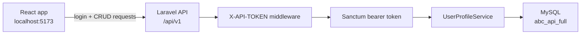

# Full Working Laravel + React App

This folder is a complete runnable project, not partial tutorial snippets.

- `backend/` is a real Laravel app with `artisan`, migrations, seeders, Sanctum auth with named abilities, API resources, middleware, and curl smoke-test scripts.
- `frontend/` is a real Vite React app that logs in, stores the Sanctum bearer token plus `expires_at`, lists profiles, searches, views detail, creates, updates, deletes, clears expired auth state, and logs out.

## What The App Builds

The sample domain is an ABC Company profile manager.

- Seeded admin user: `admin@example.com` / `password`
- Seeded profile data: 5 user profiles
- Related data: projects for each user profile
- Frontend API token: `abc-training-frontend-token`
- Token lifetime: 60 minutes by default

## Architecture



## Backend Setup

For Laragon or XAMPP, create a MySQL database named `abc_api_full` first.

```bash
cd examples/full-working-laravel-react-app/backend
composer install
cp .env.example .env
php artisan key:generate
php artisan migrate:fresh --seed
php artisan serve
```

You can also run the SQL helper in `backend/database/schema/create_database.sql` before running migrations.

If your MySQL port is different, update `DB_PORT` in `.env`. XAMPP commonly uses `3306` or `3307`.

The API will run at:

```text
http://127.0.0.1:8000/api/v1
```

## Frontend Setup

Open a second terminal.

```bash
cd examples/full-working-laravel-react-app/frontend
npm install
cp .env.example .env.local
npm run dev
```

Open:

```text
http://localhost:5173
```

## API Smoke Test

Start the Laravel server first, then run:

```bash
cd examples/full-working-laravel-react-app/backend
bash scripts/curl-login.sh
```

Copy the `access_token` value from the JSON response, note `expires_at` and `abilities`, then run:

```bash
TOKEN="paste-access-token-here" bash scripts/curl-crud.sh
```

The CRUD script lists seeded data, creates a profile, shows it, updates it, and deletes it.

## Main API Endpoints

| Method | Endpoint | Purpose |
| --- | --- | --- |
| POST | `/api/v1/auth/login` | Login and receive Sanctum bearer token with `expires_at` |
| POST | `/api/v1/auth/logout` | Revoke current token |
| GET | `/api/v1/users` | List profiles with pagination and search |
| POST | `/api/v1/users` | Create profile |
| GET | `/api/v1/users/{id}` | Show profile with projects |
| PUT | `/api/v1/users/{id}` | Update profile |
| DELETE | `/api/v1/users/{id}` | Delete profile |

Every endpoint requires the `X-API-TOKEN` header. CRUD and logout also require `Authorization: Bearer <token>`. CRUD actions also require the matching token ability: `profiles:read`, `profiles:create`, `profiles:update`, or `profiles:delete`. Expired bearer tokens return `401 Unauthenticated`; missing abilities return `403 Invalid ability provided.`

## Where To Look

- Laravel routes: `backend/routes/api.php`
- Middleware: `backend/app/Http/Middleware/VerifyFrontendToken.php`
- Controller: `backend/app/Http/Controllers/Api/V1/UserProfileController.php`
- Validation: `backend/app/Http/Requests`
- API resources: `backend/app/Http/Resources`
- Service layer: `backend/app/Services/UserProfileService.php`
- Seed data: `backend/database/seeders/DatabaseSeeder.php`
- React API helper: `frontend/src/api.js`
- React CRUD screen: `frontend/src/App.jsx`
