# Bonus - Get Shit Done (GSD) With Claude Code Prompts

## Bonus Goal

This bonus module teaches students how to use a GSD workflow with Claude Code or another coding assistant while building the ABC Company Profile API.

GSD means moving from unclear work to shipped, verified work:

1. Capture the task.
2. Clarify the expected behavior.
3. Inspect the existing code.
4. Plan the smallest useful change.
5. Implement.
6. Verify with tests or manual checks.
7. Document the result.

Use this module after Day 5, or as a short workflow session before the final project.

## Where This Fits In The Training

| Training point | How GSD helps |
| --- | --- |
| Day 1 | Ask Claude Code to inspect project setup and explain route flow |
| Day 2 | Convert CRUD requirements into endpoint contracts and validation tests |
| Day 3 | Review Sanctum, middleware, throttling, and token handling |
| Day 4 | Debug API errors, cache behavior, CORS, and frontend error states |
| Day 5 | Refactor controllers into services/resources with safer change control |
| Bonus modules | Generate test plans, Swagger checklist, Filament review notes, and handoff docs |

## Learning Objectives

By the end of this bonus, students should be able to:

- write clear prompts for Claude Code.
- give enough project context without pasting secrets.
- ask the assistant to inspect files before changing code.
- ask for an implementation plan before risky changes.
- use TDD-style prompts for API work.
- request verification steps and failure analysis.
- review AI-generated diffs before accepting changes.
- use Claude Code as a helper without outsourcing understanding.

## GSD Architecture

```mermaid
flowchart LR
    Task["Task or bug"] --> Clarify["Clarify behavior"]
    Clarify --> Inspect["Inspect repo files"]
    Inspect --> Plan["Plan small change"]
    Plan --> Build["Implement"]
    Build --> Verify["Run tests or manual checks"]
    Verify --> Review["Review diff"]
    Review --> Docs["Update docs or handoff"]
    Docs --> Done["Done"]
```



## Rules For AI-Assisted Coding

Use these rules every time Claude Code helps with the Laravel API project:

- Do not paste `.env`, API keys, database passwords, production tokens, or private customer data.
- Ask Claude Code to read the relevant files before suggesting edits.
- Tell it to follow the existing project style.
- Keep the requested change small and specific.
- Ask it not to edit unrelated files.
- Ask it to run or propose verification commands.
- Review every diff manually.
- Do not accept code you cannot explain.
- Use tests for behavior that should not regress.
- Keep the final answer focused on changed files, verification, and remaining risk.

## Prompt Template

Use this as the default prompt structure.

```text
Goal:
<Explain the specific outcome.>

Context:
<Explain the feature, bug, or training day.>

Relevant files:
<List files or ask Claude Code to find them.>

Constraints:
- Follow existing Laravel project patterns.
- Do not change unrelated files.
- Keep the change small.
- Do not expose secrets.
- Explain assumptions before editing.

Done criteria:
- <Behavior that must work.>
- <Expected API status codes or JSON shape.>
- <Tests or manual commands that must pass.>

Verification:
- Run or suggest the exact commands.
- If a command fails, explain the failure and fix only related issues.

Output:
- Summary of changes.
- Files changed.
- Verification result.
- Any remaining risks.
```

## Prompt 1 - Inspect The Laravel API Project

Use this before asking for changes.

```text
You are helping with a Laravel API training project.

Please inspect the repository before suggesting changes.

Focus on:
- routes/api.php
- app/Http/Controllers/Api/V1
- app/Http/Requests
- app/Models
- app/Services
- app/Http/Resources
- tests/Feature if present

Summarize:
1. the current API route structure,
2. the main models and relationships,
3. the authentication and middleware setup,
4. the response format patterns,
5. any missing pieces that matter for a REST API.

Do not edit files yet.
```

## Prompt 2 - Turn A Requirement Into A Small Plan

Use this when a participant receives a new task.

```text
I need to implement this Laravel API requirement:

<paste requirement>

Please inspect the relevant files and create a small implementation plan.

The plan must include:
- files that probably need changes,
- API contract: method, URL, request body, response JSON, status codes,
- validation rules,
- security/middleware impact,
- tests to add or update,
- request examples and expected JSON responses.

Do not edit files until the plan is clear.
```

## Prompt 3 - TDD For A New API Feature

Example feature: add an `active` filter to `GET /api/v1/users`.

```text
Use a TDD workflow for this Laravel API feature:

Feature:
GET /api/v1/users should support an optional active query parameter.

Expected behavior:
- ?active=1 returns only active user profiles.
- ?active=0 returns only inactive user profiles.
- no active parameter returns all profiles.
- response keeps the existing pagination/resource shape.

Instructions:
1. Inspect the current route, controller, service, model, resource, and feature tests.
2. Add or update the failing feature tests first.
3. Run the targeted test and show the failure.
4. Implement the smallest code change needed.
5. Run the targeted test again.
6. Refactor only if needed.

Constraints:
- Do not change unrelated endpoints.
- Preserve existing JSON response shape.
- Follow existing naming and style.
```

## Prompt 4 - Add A React API Call

Use this when the backend endpoint works and the React client needs to call it.

```text
The Laravel API endpoint is ready:

Endpoint:
GET /api/v1/users?search=&active=

Security:
- X-API-TOKEN is required.
- Authorization: Bearer <token> is required.

Please update the React/Vite client to call this endpoint.

Inspect:
- src/api.js
- src/App.jsx
- src/App.css if needed

Requirements:
- keep API URL and frontend token in Vite environment variables.
- reuse the existing apiRequest helper if present.
- support loading state.
- support 401 and 422 error messages.
- add search and active filter controls.
- do not hard-code the bearer token.

After editing, summarize changed files and how to test in the browser.
```

## Prompt 5 - Debug A Failing API Request

Use this when a request fails from an API client, Postman, or React.

```text
I have a failing Laravel API request.

Request:
<paste method, URL, headers, and JSON body>

Response:
<paste status code and JSON response>

Expected behavior:
<explain what should happen>

Please debug systematically:
1. identify whether the failure is route, middleware, auth, validation, controller, service, model, database, CORS, or frontend state.
2. inspect the relevant files.
3. explain the most likely cause.
4. propose the smallest fix.
5. only edit files after explaining the fix.
6. provide the verification request, expected JSON response, or test command.

Do not change unrelated code.
```

## Prompt 6 - Security Review

Use this after Day 3.

```text
Please review the Laravel API security setup.

Inspect:
- routes/api.php
- bootstrap/app.php
- app/Http/Middleware
- config/sanctum.php if relevant
- auth controller
- .env.example only, not .env

Check:
- protected routes use auth:sanctum.
- frontend client token middleware is applied where expected.
- throttling is applied to login and API route groups.
- unauthenticated requests return JSON.
- validation failures return JSON.
- secrets are not committed.
- debug settings are suitable for local training only.

Output:
- findings ordered by severity.
- file and line references where possible.
- suggested fixes.
- verification commands.

Do not edit files unless I explicitly ask.
```

## Prompt 7 - Refactor With Service Layer

Use this on Day 5.

```text
I want to refactor the user profile API to use a service layer and API resources.

Please inspect the existing controller, requests, model, resource classes, and tests.

Refactor goal:
- controller handles HTTP orchestration only.
- form requests handle validation.
- service handles list, create, update, delete, search/filter, and cache invalidation.
- API resource controls the JSON shape.
- route model binding is used where appropriate.

Constraints:
- Keep endpoint URLs unchanged.
- Keep response status codes unchanged.
- Keep existing tests passing.
- Do not change unrelated features.

Before editing:
- show the proposed file-level plan.
- identify which tests should be run after the refactor.
```

## Prompt 8 - Generate Swagger/OpenAPI Checklist

Use this before the Swagger bonus.

```text
Please inspect the Laravel API routes and generate an OpenAPI checklist.

For each endpoint, list:
- method and path,
- required headers,
- request body schema,
- response schema,
- possible status codes,
- authentication requirement,
- validation error shape.

Include:
- auth login/logout,
- user profile list/create/show/update/delete,
- search and active filters,
- pagination metadata,
- X-API-TOKEN security scheme,
- bearer token security scheme.

Do not edit files. Produce a checklist that can be converted into Swagger annotations.
```

## Prompt 9 - Write A Handoff Summary

Use this when finishing a lab or final project.

```text
Please create a short handoff summary for the Laravel API work completed.

Include:
- what changed,
- files changed,
- API endpoints affected,
- database changes,
- validation rules,
- auth/security impact,
- React client impact,
- tests or manual checks run,
- known limitations,
- next recommended task.

Keep it concise and accurate. Do not invent tests or commands that were not run.
```

## Prompt 10 - Final Verification Before Done

Use this before submitting the final project.

```text
Please verify whether this Laravel API project is ready for submission.

Check the final requirements:
- /api/v1 route versioning,
- user profile CRUD,
- request validation,
- Sanctum login/logout,
- frontend token middleware,
- throttling,
- pagination,
- search/filter,
- eager loading,
- caching and cache invalidation,
- JSON exception handling,
- route model binding,
- service layer,
- API resources,
- React client integration,
- TDD/Swagger/Filament bonus if implemented.

Run or recommend exact verification commands.

Output:
- pass/fail checklist,
- missing items,
- risky items,
- suggested next fixes in priority order.

Do not make changes until the checklist is reviewed.
```

## GSD Board Template

Use this Markdown checklist during labs.

```markdown
# GSD Board - Laravel API Task

## Task
- [ ] Requirement is clear
- [ ] Expected API contract is written
- [ ] Relevant files are identified

## Build
- [ ] Tests or manual checks are planned
- [ ] Small implementation plan is reviewed
- [ ] Code is changed only in relevant files

## Verify
- [ ] Tests pass
- [ ] Request returns the expected JSON response
- [ ] React client behavior works if affected
- [ ] Error cases checked

## Handoff
- [ ] Diff reviewed
- [ ] Docs updated if needed
- [ ] Summary written
```

## Classroom Lab

Ask students to use Claude Code prompts for one small feature:

Feature: Add `active` filter support to `GET /api/v1/users` and expose it in the React client.

Required steps:

1. Use Prompt 2 to create a plan.
2. Use Prompt 3 to add backend behavior with tests.
3. Use Prompt 4 to update the React client.
4. Use Prompt 5 if the request fails.
5. Use Prompt 9 to create a handoff summary.
6. Review the final diff manually.

## Assessment Rubric

| Area | Marks |
| --- | ---: |
| Clear requirement and API contract | 20 |
| Good use of repo inspection before edits | 15 |
| Prompt includes constraints and done criteria | 15 |
| Verification commands are used or documented | 20 |
| Diff is reviewed and explained | 15 |
| Handoff summary is accurate | 15 |
| Total | 100 |

## Instructor Notes

- Treat Claude Code as a pair programmer, not an autopilot.
- Require students to explain generated code before accepting it.
- Make students compare AI output with the training examples.
- Stop the lab if students paste secrets or production data into prompts.
- Reward small, verified changes over large unreviewed edits.
