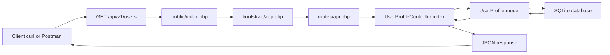

# Day 1 - Laravel API Foundations

## Class Goal

By the end of Day 1, students can set up a Laravel 12 API project, explain the API request lifecycle, create a model and migration, and return the first JSON response from a versioned API route.

## PDF Reference

This day is based on PDF pages 4-8, covering the Laravel API overview, Laravel 12 setup, MVC structure, request flow, and `routes/api.php` setup. The hands-on model, migration, controller, and SQLite workflow are course expansions beyond the PDF.

## Project Context

The training project is the ABC Company Profile API. ABC Company needs an internal API to manage user profile records such as full name, phone number, address, and ID card number.

The whole 5-day course builds this same API step by step.

## 6-Hour Class Plan

| Time | Topic | Activity |
| --- | --- | --- |
| 00:00-00:45 | API fundamentals | Explain what APIs do and why JSON APIs matter |
| 00:45-01:30 | Laravel 12 setup | Install or verify PHP, Composer, database, and Laravel |
| 01:30-02:15 | Laravel structure | Walk through routes, controllers, models, migrations, config, and bootstrap |
| 02:15-02:30 | Break | Short break |
| 02:30-03:30 | API route setup | Enable API routes and create the first route |
| 03:30-04:45 | Model and migration | Create `UserProfile`, migration, and database table |
| 04:45-05:30 | Controller response | Return JSON from a controller |
| 05:30-06:00 | Review lab | Run route list, test with curl or Postman, recap |

## Learning Objectives

- Understand Laravel as an API backend.
- Explain the route to controller to model to database flow.
- Enable Laravel 12 API routing.
- Create a database-backed API resource.
- Return consistent JSON responses.

## Architecture Diagram

Day 1 focuses on the basic Laravel API request lifecycle. Students should understand this flow before adding CRUD, security, caching, or service classes.



## Prerequisites

Students should have:

- PHP 8.2 or newer
- Composer
- SQLite, MySQL, or PostgreSQL
- Git
- A code editor
- Postman, Insomnia, or curl

For local training, SQLite is the simplest database choice.

## Important Laravel 12 Note

The PDF mentions `php artisan api:install`. Current Laravel 12 documentation uses:

```bash
php artisan install:api
```

Use `install:api` during this course.

## Step 1 - Create The Laravel Project

Create a fresh Laravel app:

```bash
composer create-project laravel/laravel abc-api
cd abc-api
```

Start the app:

```bash
php artisan serve
```

Open:

```text
http://127.0.0.1:8000
```

Verify Laravel:

```bash
php artisan --version
```

Expected result:

```text
Laravel Framework 12.x.x
```

## Step 2 - Configure SQLite For Class

Create the SQLite file:

```bash
touch database/database.sqlite
```

Update `.env`:

```env
APP_NAME="ABC API"
APP_ENV=local
APP_DEBUG=true
APP_URL=http://127.0.0.1:8000

DB_CONNECTION=sqlite
```

Clear cached configuration if needed:

```bash
php artisan config:clear
```

## Step 3 - Enable API Routes

Laravel 12 does not always include `routes/api.php` in a fresh project. Install API support:

```bash
php artisan install:api
```

This creates `routes/api.php` and installs Sanctum support for API authentication. We will use Sanctum on Day 3.

Check the API routes:

```bash
php artisan route:list --path=api
```

## Step 4 - Understand The API Request Flow

When a client calls an endpoint such as:

```text
GET /api/v1/users
```

Laravel handles it like this:

1. The request enters through `public/index.php`.
2. Laravel bootstraps the app from `bootstrap/app.php`.
3. The router matches the URL in `routes/api.php`.
4. Middleware checks the request.
5. The controller method runs.
6. The controller asks the model for data.
7. The model talks to the database.
8. Laravel returns a JSON response.

## Step 5 - Create The UserProfile Model And Migration

Run:

```bash
php artisan make:model UserProfile -m
```

Open the generated migration in `database/migrations`.

Use this table structure:

```php
<?php

use Illuminate\Database\Migrations\Migration;
use Illuminate\Database\Schema\Blueprint;
use Illuminate\Support\Facades\Schema;

return new class extends Migration
{
    public function up(): void
    {
        Schema::create('user_profiles', function (Blueprint $table) {
            $table->id();
            $table->string('full_name');
            $table->string('phone', 30);
            $table->string('id_card_number')->unique();
            $table->text('address')->nullable();
            $table->boolean('is_active')->default(true);
            $table->timestamps();
        });
    }

    public function down(): void
    {
        Schema::dropIfExists('user_profiles');
    }
};
```

Run the migration:

```bash
php artisan migrate
```

## Step 6 - Configure The Model

Update `app/Models/UserProfile.php`:

```php
<?php

namespace App\Models;

use Illuminate\Database\Eloquent\Factories\HasFactory;
use Illuminate\Database\Eloquent\Model;

class UserProfile extends Model
{
    use HasFactory;

    protected $fillable = [
        'full_name',
        'phone',
        'id_card_number',
        'address',
        'is_active',
    ];

    protected $casts = [
        'is_active' => 'boolean',
    ];
}
```

Trainer note:

- `$fillable` protects against unsafe mass assignment.
- `$casts` ensures `is_active` returns as a real boolean in JSON.

## Step 7 - Add Sample Data With Tinker

Open Tinker:

```bash
php artisan tinker
```

Create a profile:

```php
App\Models\UserProfile::create([
    'full_name' => 'Aina Rahman',
    'phone' => '+60123456789',
    'id_card_number' => '900101-14-1234',
    'address' => 'Kuala Lumpur',
]);
```

Create another profile:

```php
App\Models\UserProfile::create([
    'full_name' => 'Daniel Tan',
    'phone' => '+60198765432',
    'id_card_number' => '880505-10-7788',
    'address' => 'Petaling Jaya',
]);
```

Exit Tinker:

```php
exit
```

## Step 8 - Create The API Controller

Run:

```bash
php artisan make:controller Api/V1/UserProfileController
```

Update `app/Http/Controllers/Api/V1/UserProfileController.php`:

```php
<?php

namespace App\Http\Controllers\Api\V1;

use App\Http\Controllers\Controller;
use App\Models\UserProfile;
use Illuminate\Http\JsonResponse;

class UserProfileController extends Controller
{
    public function index(): JsonResponse
    {
        $profiles = UserProfile::query()
            ->latest()
            ->get();

        return response()->json([
            'message' => 'User profiles retrieved successfully.',
            'data' => $profiles,
        ]);
    }
}
```

## Step 9 - Register The Versioned API Route

Update `routes/api.php`:

```php
<?php

use App\Http\Controllers\Api\V1\UserProfileController;
use Illuminate\Support\Facades\Route;

Route::prefix('v1')->name('api.v1.')->group(function () {
    Route::get('/users', [UserProfileController::class, 'index'])
        ->name('users.index');
});
```

Important:

Laravel automatically applies the `/api` prefix to `routes/api.php`. Because of that, this route becomes:

```text
GET /api/v1/users
```

Do not write `/api/v1` inside `routes/api.php`.

## Step 10 - Test The Endpoint

Start the server:

```bash
php artisan serve
```

Call the API:

```bash
curl http://127.0.0.1:8000/api/v1/users
```

Expected shape:

```json
{
    "message": "User profiles retrieved successfully.",
    "data": [
        {
            "id": 1,
            "full_name": "Aina Rahman",
            "phone": "+60123456789",
            "id_card_number": "900101-14-1234",
            "address": "Kuala Lumpur",
            "is_active": true,
            "created_at": "2026-06-06T00:00:00.000000Z",
            "updated_at": "2026-06-06T00:00:00.000000Z"
        }
    ]
}
```

## Class Exercise

Students must add a third user profile and confirm it appears in:

```text
GET /api/v1/users
```

Then they must run:

```bash
php artisan route:list --path=api
```

Ask them to identify:

- HTTP method
- URI
- Controller
- Route name

## Common Mistakes

- Adding `/api` manually inside `routes/api.php`.
- Forgetting to run migrations.
- Forgetting `$fillable` in the model.
- Using `api:install` instead of `install:api`.
- Returning raw strings instead of JSON.

## Day 1 Review Questions

1. What file contains API routes?
2. Why should API routes be versioned?
3. What is the role of a controller?
4. What is the role of a model?
5. Why does Laravel return `/api/v1/users` even though the route only says `v1/users`?

## Homework

Add these fields to the `user_profiles` table:

- `email`
- `company_name`
- `job_title`

Then update:

- Migration
- Model `$fillable`
- Tinker sample data
- API response check

If the migration already ran, students can create a new migration:

```bash
php artisan make:migration add_company_fields_to_user_profiles_table
```
