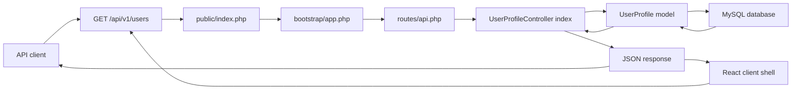

# Day 1 - Laravel API Foundations

## Class Goal

By the end of Day 1, students can set up a Laravel API project, explain the API request lifecycle, create a model and migration, return the first JSON response from a versioned API route, and prepare a React/Vite client shell for later API calls.

## PDF Reference

This day is based on PDF pages 4-8, covering the Laravel API overview, Laravel setup, MVC structure, request flow, and `routes/api.php` setup. The hands-on model, migration, controller, and MySQL workflow are course expansions beyond the PDF.

## Project Context

The training project is the ABC Company Profile API. ABC Company needs an internal API to manage user profile records such as full name, phone number, address, and ID card number.

The whole 5-day course builds this same API step by step.

## 6-Hour Class Plan

| Time | Topic | Activity |
| --- | --- | --- |
| 00:00-00:45 | API fundamentals | Explain what APIs do and why JSON APIs matter |
| 00:45-01:30 | Laravel setup | Install or verify PHP, Composer, database, and Laravel |
| 01:30-02:15 | Laravel structure | Walk through routes, controllers, models, migrations, config, and bootstrap |
| 02:15-02:30 | Break | Short break |
| 02:30-03:30 | API route setup | Enable API routes and create the first route |
| 03:30-04:45 | Model and migration | Create `UserProfile`, migration, and database table |
| 04:45-05:20 | Controller response | Return JSON from a controller |
| 05:20-05:45 | React client shell | Create or inspect the Vite app and configure API `.env` values |
| 05:45-06:00 | Review lab | Run route list, inspect JSON response, recap client/server roles |

## Learning Objectives

- Understand Laravel as an API backend.
- Explain the route to controller to model to database flow.
- Enable Laravel API routing.
- Create a database-backed API resource.
- Return consistent JSON responses.
- Explain that React consumes the API over HTTP and does not call Laravel classes directly.
- Configure the React client API base URL and frontend token.

## Architecture Diagram

Day 1 focuses on the basic Laravel API request lifecycle. Students should understand this flow before adding CRUD, security, caching, or service classes.



## Prerequisites

Students should have:

- PHP 8.2 or newer
- Composer
- MySQL 8.0 or newer
- Git
- A code editor
- Postman, Insomnia, or curl

For this training, MySQL is the default database so students practice the same relational database workflow commonly used in Laravel production projects.

## Important Laravel Note

The PDF mentions `php artisan api:install`. Current Laravel documentation uses:

```bash
php artisan install:api
```

Use `install:api` during this course.

## Step 1 - Create The Laravel Project

Create a fresh Laravel app:

```bash
composer create-project laravel/laravel abc-api
cd abc-api
```

Start the app:

```bash
php artisan serve
```

Open:

```text
http://127.0.0.1:8000
```

Verify Laravel:

```bash
php artisan --version
```

Expected result:

```text
Laravel Framework 12.x.x
```

## Step 2 - Configure MySQL For Class

Create the training database:

```sql
CREATE DATABASE abc_api CHARACTER SET utf8mb4 COLLATE utf8mb4_unicode_ci;
```

Update `.env`:

```env
APP_NAME="ABC API"
APP_ENV=local
APP_DEBUG=true
APP_URL=http://127.0.0.1:8000

DB_CONNECTION=mysql
DB_HOST=127.0.0.1
DB_PORT=3306
DB_DATABASE=abc_api
DB_USERNAME=root
DB_PASSWORD=
```

If your local MySQL user is not `root`, update `DB_USERNAME` and `DB_PASSWORD` to match your machine.

Clear cached configuration if needed:

```bash
php artisan config:clear
```

## Step 3 - Enable API Routes

Laravel does not always include `routes/api.php` in a fresh project. Install API support:

```bash
php artisan install:api
```

This creates `routes/api.php` and installs Sanctum support for API authentication. We will use Sanctum on Day 3.

Check the API routes:

```bash
php artisan route:list --path=api
```

## Step 4 - Understand The API Request Flow

When a client calls an endpoint such as:

```text
GET /api/v1/users
```

Laravel handles it like this:

1. The request enters through `public/index.php`.
2. Laravel bootstraps the app from `bootstrap/app.php`.
3. The router matches the URL in `routes/api.php`.
4. Middleware checks the request.
5. The controller method runs.
6. The controller asks the model for data.
7. The model talks to the database.
8. Laravel returns a JSON response.

## Step 5 - Create The UserProfile Model And Migration

Run:

```bash
php artisan make:model UserProfile -m
```

Open the generated migration in `database/migrations`.

Use this table structure:

```php
<?php

use Illuminate\Database\Migrations\Migration;
use Illuminate\Database\Schema\Blueprint;
use Illuminate\Support\Facades\Schema;

return new class extends Migration
{
    public function up(): void
    {
        Schema::create('user_profiles', function (Blueprint $table) {
            $table->id();
            $table->string('full_name');
            $table->string('phone', 30);
            $table->string('id_card_number')->unique();
            $table->text('address')->nullable();
            $table->boolean('is_active')->default(true);
            $table->timestamps();
        });
    }

    public function down(): void
    {
        Schema::dropIfExists('user_profiles');
    }
};
```

Run the migration:

```bash
php artisan migrate
```

## Step 6 - Configure The Model

Update `app/Models/UserProfile.php`:

```php
<?php

namespace App\Models;

use Illuminate\Database\Eloquent\Factories\HasFactory;
use Illuminate\Database\Eloquent\Model;

class UserProfile extends Model
{
    use HasFactory;

    protected $fillable = [
        'full_name',
        'phone',
        'id_card_number',
        'address',
        'is_active',
    ];

    protected $casts = [
        'is_active' => 'boolean',
    ];
}
```

Trainer note:

- `$fillable` protects against unsafe mass assignment.
- `$casts` ensures `is_active` returns as a real boolean in JSON.

## Step 7 - Add Sample Data With Tinker

Open Tinker:

```bash
php artisan tinker
```

Create a profile:

```php
App\Models\UserProfile::create([
    'full_name' => 'Aina Rahman',
    'phone' => '+60123456789',
    'id_card_number' => '900101-14-1234',
    'address' => 'Kuala Lumpur',
]);
```

Create another profile:

```php
App\Models\UserProfile::create([
    'full_name' => 'Daniel Tan',
    'phone' => '+60198765432',
    'id_card_number' => '880505-10-7788',
    'address' => 'Petaling Jaya',
]);
```

Exit Tinker:

```php
exit
```

## Step 8 - Create The API Controller

Run:

```bash
php artisan make:controller Api/V1/UserProfileController
```

Update `app/Http/Controllers/Api/V1/UserProfileController.php`:

```php
<?php

namespace App\Http\Controllers\Api\V1;

use App\Http\Controllers\Controller;
use App\Models\UserProfile;
use Illuminate\Http\JsonResponse;

class UserProfileController extends Controller
{
    public function index(): JsonResponse
    {
        $profiles = UserProfile::query()
            ->latest()
            ->get();

        return response()->json([
            'message' => 'User profiles retrieved successfully.',
            'data' => $profiles,
        ]);
    }
}
```

## Step 9 - Register The Versioned API Route

Update `routes/api.php`:

```php
<?php

use App\Http\Controllers\Api\V1\UserProfileController;
use Illuminate\Support\Facades\Route;

Route::prefix('v1')->name('api.v1.')->group(function () {
    Route::get('/users', [UserProfileController::class, 'index'])
        ->name('users.index');
});
```

Important:

Laravel automatically applies the `/api` prefix to `routes/api.php`. Because of that, this route becomes:

```text
GET /api/v1/users
```

Do not write `/api/v1` inside `routes/api.php`.

## Step 10 - Test The Endpoint

Start the server:

```bash
php artisan serve
```

Call the API:

```bash
curl http://127.0.0.1:8000/api/v1/users \
  -H "Accept: application/json"
```

Expected shape:

```json
{
    "message": "User profiles retrieved successfully.",
    "data": [
        {
            "id": 1,
            "full_name": "Aina Rahman",
            "phone": "+60123456789",
            "id_card_number": "900101-14-1234",
            "address": "Kuala Lumpur",
            "is_active": true,
            "created_at": "2026-06-06T00:00:00.000000Z",
            "updated_at": "2026-06-06T00:00:00.000000Z"
        }
    ]
}
```

## Step 11 - Prepare The React Client Shell

Participants requested a browser client, so the 5-day plan now includes React progressively. On Day 1, only prepare the client and explain the boundary:

```text
React browser client -> HTTP request -> Laravel API -> JSON response
```

Create a Vite React app:

```bash
npm create vite@latest abc-api-client -- --template react
cd abc-api-client
npm install
```

Copy the starter client from:

```text
examples/react-client-api-consumer
```

Create `.env.local`:

```dotenv
VITE_API_BASE_URL=http://127.0.0.1:8000/api/v1
VITE_FRONTEND_API_TOKEN=abc-training-frontend-token
```

Teaching point:

- Laravel runs on `http://127.0.0.1:8000`.
- React usually runs on `http://localhost:5173`.
- The browser client talks to Laravel using HTTP, JSON, and headers.
- If the browser blocks the request, check Laravel CORS settings.

### AI Prompt Checkpoint - React Calls Laravel REST API

Use this prompt after the Laravel endpoint returns JSON and before students move to Day 2 CRUD.

```text
Help me connect my Day 1 React/Vite client to my Laravel REST API.

Goal:
React should call the Laravel endpoint and display the JSON response from GET /api/v1/users.

Project mode:
- [Prepared tutorial project / Existing Laravel project]

Laravel API:
- Base URL: [example: http://127.0.0.1:8000/api/v1]
- Test endpoint: [example: GET /users]
- Expected JSON shape: { "message": "...", "data": [...] }

React context:
- Vite app folder: [paste path]
- Current VITE_API_BASE_URL: [paste value]
- Current files: [paste src/api.js and the component that should load users]

MCP context available:
- [none / filesystem / terminal / browser / git]

If this is an existing React or Laravel project:
- Inspect the current API helper, component structure, route prefix, and response shape first.
- Preserve the existing component style and naming conventions.
- Do not force the tutorial folder structure if the project already has one.

Please implement or review:
- a reusable apiRequest helper that builds URLs from VITE_API_BASE_URL.
- a React component that calls GET /users when the page loads.
- loading, success, and error states.
- JSON error handling for failed API requests.
- no imports from Laravel PHP files into React.

Headers:
- Send Accept: application/json.
- Do not add auth yet; Day 3 will cover Sanctum and protected routes.

Verification:
- Explain the expected browser behavior.
- If browser MCP is available, inspect the page and confirm the data appears.
- If terminal MCP is available, suggest the Laravel and Vite commands to run.
- Tell me the smallest fix if the call fails because of CORS, wrong base URL, or Laravel not running.
```

## GSD Claude Code Prompt

Use this prompt if students want Claude Code to help with the Day 1 tutorial. It keeps the assistant focused on inspection, planning, implementation, and verification.

```text
Goal:
Help me complete Day 1 of the Laravel API tutorial.

Context:
I am building the ABC Company Profile API in Laravel. Today I need a fresh API project, MySQL setup, api routes enabled, a UserProfile model and migration, a versioned GET /api/v1/users endpoint, and a React/Vite client shell that can call the Laravel REST API.

Relevant files:
- routes/api.php
- database/migrations
- app/Models/UserProfile.php
- app/Http/Controllers/Api/V1/UserProfileController.php
- examples/day-1-laravel-api-foundations
- examples/react-client-api-consumer

Constraints:
- Inspect the repo before suggesting edits.
- Do not change unrelated files.
- Keep the route versioned under /api/v1.
- Do not hard-code secrets or local machine paths.
- React must call Laravel through HTTP using VITE_API_BASE_URL.
- React must not import Laravel controllers, models, routes, or PHP files.
- Explain assumptions before editing.

Done criteria:
- php artisan route:list --path=api shows GET /api/v1/users.
- php artisan migrate runs successfully.
- GET /api/v1/users returns JSON.
- React has VITE_API_BASE_URL configured for the Laravel API.
- React can call GET /users through the API helper and display the response.

Verification:
- Run or suggest php artisan route:list --path=api.
- Provide the request and expected JSON response for GET /api/v1/users.
- Provide the React API helper call for GET /users.
- Explain how to verify the browser result in Vite.
- Explain any failure before fixing it.
```

## Class Exercise

Students must add a third user profile and confirm it appears in:

```text
GET /api/v1/users
```

Then they must run:

```bash
php artisan route:list --path=api
```

Ask them to identify:

- HTTP method
- URI
- Controller
- Route name

## Common Mistakes

- Adding `/api` manually inside `routes/api.php`.
- Forgetting to run migrations.
- Forgetting `$fillable` in the model.
- Using `api:install` instead of `install:api`.
- Returning raw strings instead of JSON.

## Day 1 Review Questions

1. What file contains API routes?
2. Why should API routes be versioned?
3. What is the role of a controller?
4. What is the role of a model?
5. Why does Laravel return `/api/v1/users` even though the route only says `v1/users`?
6. Why should React call the API over HTTP instead of importing Laravel code?

## Homework

Add these fields to the `user_profiles` table:

- `email`
- `company_name`
- `job_title`

Then update:

- Migration
- Model `$fillable`
- Tinker sample data
- API response check
- React `.env.local` API base URL

If the migration already ran, students can create a new migration:

```bash
php artisan make:migration add_company_fields_to_user_profiles_table
```
