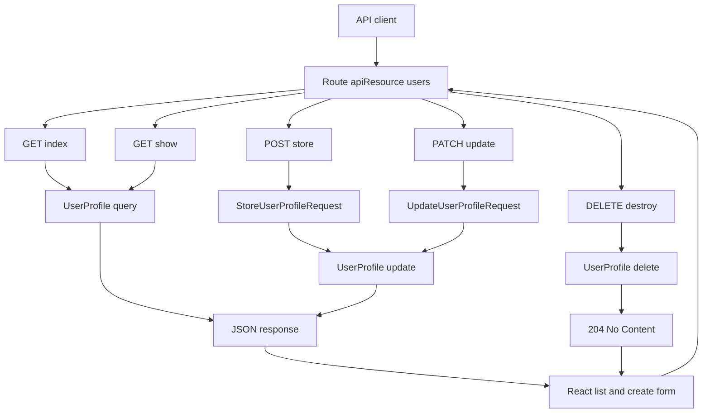

# Day 2 - RESTful Routes, CRUD, And Validation

## Class Goal

By the end of Day 2, students can build a complete RESTful CRUD API for user profiles, validate request data, return correct HTTP status codes, use route grouping for clean API structure, and call the CRUD endpoints from a React form.

## PDF Reference

This day is based on PDF pages 9-12, covering REST methods, route prefixes, versioning, `Route::apiResource`, named routes, and route caching notes. The full CRUD controller, form request validation, status-code handling, and JSON response labs are course expansions beyond the PDF.

## 6-Hour Class Plan

| Time | Topic | Activity |
| --- | --- | --- |
| 00:00-00:20 | Day 1 recap | Review project structure and first endpoint |
| 00:20-00:45 | Laragon/XAMPP checkpoint | Confirm MySQL, database, Laravel URL, and React API base URL |
| 00:45-01:20 | RESTful API design | Explain GET, POST, PUT, PATCH, DELETE |
| 01:20-02:00 | Resource routes | Convert manual route to `Route::apiResource` |
| 02:00-02:15 | Break | Short break |
| 02:15-03:30 | Store endpoint | Add request validation and create records |
| 03:30-04:30 | Show and update endpoints | Find records and update profile details |
| 04:30-05:00 | Delete endpoint | Delete records and return `204 No Content` |
| 05:00-05:35 | React CRUD form | Connect React list and create form to the REST API |
| 05:35-06:00 | Lab | Students verify CRUD request and response JSON with an API client and React |

## Learning Objectives

- Use RESTful route naming and HTTP methods.
- Create resourceful API routes.
- Validate request data.
- Return appropriate status codes.
- Keep route files organized with prefixes and names.
- Configure Day 2 consistently for Laragon or XAMPP users.
- Use AI prompts as review checkpoints during setup, routes, validation, controller work, API testing, and React integration.
- Build a React list screen and create form that call the REST API.
- Display validation errors returned by Laravel.

## Local Setup For Laragon And XAMPP Users

Most participants will use Laragon or XAMPP for local PHP and MySQL. For this class, use Laragon/XAMPP mainly to provide the MySQL database service. The Laravel API examples should still use one clear API base URL throughout the day.

Recommended training baseline:

| Item | Value |
| --- | --- |
| Laravel API base URL | `http://127.0.0.1:8000/api/v1` |
| Laravel server command | `php artisan serve` |
| Database engine | MySQL from Laragon or XAMPP |
| Database name | `abc_api` |
| React API env | `VITE_API_BASE_URL=http://127.0.0.1:8000/api/v1` |

This baseline avoids confusion between Laravel's built-in server, Laragon virtual hosts, XAMPP `htdocs`, and React's Vite server.

### Laragon Checklist

| Check | What To Do |
| --- | --- |
| Start services | Open Laragon and click `Start All` |
| Create database | Use Laragon database menu, HeidiSQL, Adminer, or phpMyAdmin to create `abc_api` |
| MySQL port | Usually `3306` |
| MySQL username | Usually `root` |
| MySQL password | Usually blank unless the machine was customized |
| Optional local host | Laragon may expose the app as `http://abc-api.test` |

If you use the Laragon virtual host instead of `php artisan serve`, update every client to the same base URL:

```text
http://abc-api.test/api/v1
```

That means the API client, browser tests, and React `.env` must all point to the Laragon URL.

### XAMPP Checklist

| Check | What To Do |
| --- | --- |
| Start services | Open XAMPP Control Panel and start `Apache` and `MySQL` |
| Create database | Go to `http://localhost/phpmyadmin` and create `abc_api` |
| MySQL port | Usually `3306`; some machines use `3307` when another MySQL is installed |
| MySQL username | Usually `root` |
| MySQL password | Usually blank on a default local install |
| Laravel URL | Prefer `php artisan serve` for this training instead of calling `/public` through `htdocs` |

If XAMPP MySQL uses port `3307`, update `DB_PORT=3307` in `.env`.

### Day 2 `.env` Baseline

Use this database block before running the CRUD lab:

```env
DB_CONNECTION=mysql
DB_HOST=127.0.0.1
DB_PORT=3306
DB_DATABASE=abc_api
DB_USERNAME=root
DB_PASSWORD=
```

After editing `.env`, run:

```bash
php artisan config:clear
php artisan migrate
php artisan route:list --path=api/v1/users
php artisan serve
```

Common setup rule:

Do not mix URLs. If Laravel is served at `http://127.0.0.1:8000`, React should call `http://127.0.0.1:8000/api/v1`. If Laravel is served at `http://abc-api.test`, React should call `http://abc-api.test/api/v1`.

### Existing Project Mode

Some students will use their own existing Laravel project instead of the prepared example folder. In that case, the AI prompt must start by mapping the existing project before asking for code changes.

Use these rules for every AI prompt:

- Tell AI whether the student uses the prepared `abc-api` project or an existing Laravel project.
- If it is an existing project, paste `php artisan route:list --path=api`, the relevant model name, controller name, migration/table name, and current route prefix.
- Ask AI to preserve existing namespaces, middleware, authentication, policies, naming style, and database conventions.
- Do not ask AI to overwrite existing project structure just to match the tutorial.
- Ask AI to map the Day 2 tutorial goal to the closest existing resource, then propose the smallest change.

### AI Prompt Checkpoint - Local Setup

Use this before writing CRUD code:

```text
I am preparing Day 2 of a Laravel API training project.

Please check my local setup before I build CRUD.

Project mode:
- [Prepared tutorial project / Existing Laravel project]

My setup:
- Local stack: [Laragon or XAMPP]
- Laravel API URL: [example: http://127.0.0.1:8000/api/v1]
- React VITE_API_BASE_URL: [paste value]
- DB_HOST: [paste value]
- DB_PORT: [paste value]
- DB_DATABASE: [paste value]
- DB_USERNAME: [paste value]

If this is an existing project:
- Existing API route prefix: [example: /api, /api/v1, /api/admin]
- Existing resource to use for the lab: [example: users, customers, members]
- Existing model/controller if known: [paste names]

Task:
Identify any mismatch that could break php artisan migrate, curl/API client requests, or React API calls.

Rules:
- Do not change code yet.
- Do not ask for database passwords.
- Do not assume the project uses the tutorial file names.
- Preserve existing project conventions and identify equivalent files first.
- Give me a short checklist of what to fix first.
```

## RESTful API Pattern

For the ABC Company Profile API, the user profile endpoints should look like this:

| Method | URI | Purpose |
| --- | --- | --- |
| GET | `/api/v1/users` | List user profiles |
| POST | `/api/v1/users` | Create a user profile |
| GET | `/api/v1/users/{id}` | Show one user profile |
| PUT/PATCH | `/api/v1/users/{id}` | Update one user profile |
| DELETE | `/api/v1/users/{id}` | Delete one user profile |

## Architecture Diagram

Day 2 turns the single endpoint from Day 1 into a RESTful resource. The route maps each HTTP method to a controller action, and validation happens before create or update writes to the database.



## Step 1 - Replace Manual Route With API Resource Route

Update `routes/api.php`:

```php
<?php

use App\Http\Controllers\Api\V1\UserProfileController;
use Illuminate\Support\Facades\Route;

Route::prefix('v1')->name('api.v1.')->group(function () {
    Route::apiResource('users', UserProfileController::class);
});
```

Check the generated routes:

```bash
php artisan route:list --path=api/v1/users
```

Expected route actions:

- `index`
- `store`
- `show`
- `update`
- `destroy`

Note:

`Route::apiResource` excludes web-only routes like `create` and `edit` because APIs do not return HTML forms.

### AI Prompt Checkpoint - Resource Routes

Use this after editing `routes/api.php`:

```text
Review my Laravel API route file for Day 2.

Goal:
I need RESTful CRUD routes for the Day 2 resource. In the prepared tutorial this is /api/v1/users using Route::apiResource. In an existing project, first map the tutorial goal to the current resource name and route prefix.

Project mode:
- [Prepared tutorial project / Existing Laravel project]

Existing project context if applicable:
- Current route prefix: [paste]
- Current resource URI: [paste]
- Controller used by this resource: [paste]
- Output of php artisan route:list --path=api: [paste relevant lines]

Code to review:
[paste routes/api.php]

Please check:
- the collection URI maps to index and store.
- the member URI maps to show, update, and destroy.
- create and edit web routes are not generated.
- route grouping keeps API versioning clear.
- existing middleware, route names, and prefixes are not accidentally removed.

Return:
- any issue found,
- the expected route-list output for my actual route prefix,
- one corrected routes/api.php example only if my code is wrong,
- no rewrite of unrelated routes.
```

## Step 2 - Create Form Request Classes

Form requests keep validation outside the controller.

Run:

```bash
php artisan make:request StoreUserProfileRequest
php artisan make:request UpdateUserProfileRequest
```

Update `app/Http/Requests/StoreUserProfileRequest.php`:

```php
<?php

namespace App\Http\Requests;

use Illuminate\Foundation\Http\FormRequest;

class StoreUserProfileRequest extends FormRequest
{
    public function authorize(): bool
    {
        return true;
    }

    public function rules(): array
    {
        return [
            'full_name' => ['required', 'string', 'max:255'],
            'phone' => ['required', 'string', 'max:30'],
            'id_card_number' => ['required', 'string', 'max:50', 'unique:user_profiles,id_card_number'],
            'address' => ['nullable', 'string', 'max:1000'],
            'is_active' => ['sometimes', 'boolean'],
        ];
    }
}
```

Update `app/Http/Requests/UpdateUserProfileRequest.php`:

```php
<?php

namespace App\Http\Requests;

use Illuminate\Foundation\Http\FormRequest;
use Illuminate\Validation\Rule;

class UpdateUserProfileRequest extends FormRequest
{
    public function authorize(): bool
    {
        return true;
    }

    public function rules(): array
    {
        $profileId = $this->route('user');

        return [
            'full_name' => ['sometimes', 'required', 'string', 'max:255'],
            'phone' => ['sometimes', 'required', 'string', 'max:30'],
            'id_card_number' => [
                'sometimes',
                'required',
                'string',
                'max:50',
                Rule::unique('user_profiles', 'id_card_number')->ignore($profileId),
            ],
            'address' => ['nullable', 'string', 'max:1000'],
            'is_active' => ['sometimes', 'boolean'],
        ];
    }
}
```

Trainer note:

- `required` means the field must be present.
- `sometimes` means validate only if the field is present.
- `unique` protects against duplicate ID card numbers.
- `ignore($profileId)` allows the current record to keep its own ID card number during update.

### AI Prompt Checkpoint - Validation Rules

Use this after creating both form request classes:

```text
Review my Laravel FormRequest validation for Day 2.

Project mode:
- [Prepared tutorial project / Existing Laravel project]

Files:
- StoreUserProfileRequest.php
- UpdateUserProfileRequest.php

Code to review:
[paste both files]

Existing project context if applicable:
- Current table columns or migration: [paste relevant columns]
- Current model fillable/casts: [paste relevant model section]
- Existing validation style used elsewhere: [paste example if any]

Please check:
- create requires full_name, phone, and id_card_number.
- update uses sometimes for partial PATCH requests.
- id_card_number is unique on create.
- update ignores the current user profile ID when checking uniqueness.
- nullable fields are safe and have reasonable max lengths.
- authorize() returns true for this training lab.
- if my existing project uses different field names, map the tutorial validation intent to my existing columns instead of renaming my schema.

Return:
- validation issues,
- corrected rules if needed,
- one invalid JSON payload I can use to confirm a 422 response.
```

## Step 3 - Build The Controller

Update `app/Http/Controllers/Api/V1/UserProfileController.php`:

```php
<?php

namespace App\Http\Controllers\Api\V1;

use App\Http\Controllers\Controller;
use App\Http\Requests\StoreUserProfileRequest;
use App\Http\Requests\UpdateUserProfileRequest;
use App\Models\UserProfile;
use Illuminate\Http\JsonResponse;

class UserProfileController extends Controller
{
    public function index(): JsonResponse
    {
        $profiles = UserProfile::query()
            ->latest()
            ->paginate(15);

        return response()->json([
            'message' => 'User profiles retrieved successfully.',
            'data' => $profiles,
        ]);
    }

    public function store(StoreUserProfileRequest $request): JsonResponse
    {
        $profile = UserProfile::create($request->validated());

        return response()->json([
            'message' => 'User profile created successfully.',
            'data' => $profile,
        ], 201);
    }

    public function show(string $id): JsonResponse
    {
        $profile = UserProfile::findOrFail($id);

        return response()->json([
            'message' => 'User profile retrieved successfully.',
            'data' => $profile,
        ]);
    }

    public function update(UpdateUserProfileRequest $request, string $id): JsonResponse
    {
        $profile = UserProfile::findOrFail($id);
        $profile->update($request->validated());

        return response()->json([
            'message' => 'User profile updated successfully.',
            'data' => $profile,
        ]);
    }

    public function destroy(string $id): JsonResponse
    {
        $profile = UserProfile::findOrFail($id);
        $profile->delete();

        return response()->json(null, 204);
    }
}
```

Why use `findOrFail` today?

On Day 5, we will replace manual lookup with route model binding. For now, students should see the basic lookup flow first.

### AI Prompt Checkpoint - Controller Review

Use this after implementing the CRUD controller:

```text
Review my Day 2 Laravel API controller.

Goal:
The controller must implement index, store, show, update, and destroy for the Day 2 resource. In the prepared tutorial this is /api/v1/users. In an existing project, use the current resource URI, model, and controller names.

Project mode:
- [Prepared tutorial project / Existing Laravel project]

Existing project context if applicable:
- Resource URI: [paste]
- Controller class: [paste]
- Model class: [paste]
- Existing response format used in this project: [paste one example]

Code to review:
[paste UserProfileController.php]

Please check:
- index returns a JSON list.
- store uses $request->validated() and returns 201.
- show uses findOrFail and returns JSON.
- update uses $request->validated().
- destroy returns 204 No Content.
- no unrelated authentication, service layer, or route model binding changes were introduced.
- existing middleware, policies, resources, services, and response format are preserved unless I explicitly ask to change them.

Return:
- bugs or missing status codes,
- any risky Laravel behavior,
- corrected code only for the broken methods.
```

## Step 4 - Test Create Endpoint

Run:

```bash
curl -X POST http://127.0.0.1:8000/api/v1/users \
  -H "Accept: application/json" \
  -H "Content-Type: application/json" \
  -d '{
    "full_name": "Nur Iman",
    "phone": "+60112223333",
    "id_card_number": "920202-08-4567",
    "address": "Shah Alam"
  }'
```

Expected status:

```text
201 Created
```

Expected shape:

```json
{
    "message": "User profile created successfully.",
    "data": {
        "full_name": "Nur Iman",
        "phone": "+60112223333",
        "id_card_number": "920202-08-4567",
        "address": "Shah Alam",
        "is_active": true
    }
}
```

## Step 5 - Test Validation Error

Send an invalid payload:

```bash
curl -X POST http://127.0.0.1:8000/api/v1/users \
  -H "Accept: application/json" \
  -H "Content-Type: application/json" \
  -d '{
    "full_name": "",
    "phone": ""
  }'
```

Expected status:

```text
422 Unprocessable Content
```

Expected JSON response:

```json
{
    "message": "The given data was invalid.",
    "errors": {
        "full_name": [
            "The full name field is required."
        ],
        "phone": [
            "The phone field is required."
        ],
        "id_card_number": [
            "The id card number field is required."
        ]
    }
}
```

Laravel returns validation errors as JSON because the request uses:

```text
Accept: application/json
```

## Step 6 - Test Show Endpoint

```bash
curl http://127.0.0.1:8000/api/v1/users/1 \
  -H "Accept: application/json"
```

Expected status:

```text
200 OK
```

Expected JSON response:

```json
{
    "message": "User profile retrieved successfully.",
    "data": {
        "id": 1,
        "full_name": "Nur Iman",
        "phone": "+60112223333",
        "id_card_number": "920202-08-4567",
        "address": "Shah Alam",
        "is_active": true
    }
}
```

## Step 7 - Test Update Endpoint

```bash
curl -X PATCH http://127.0.0.1:8000/api/v1/users/1 \
  -H "Accept: application/json" \
  -H "Content-Type: application/json" \
  -d '{
    "phone": "+60129998888",
    "address": "Cyberjaya"
  }'
```

Expected status:

```text
200 OK
```

Expected JSON response:

```json
{
    "message": "User profile updated successfully.",
    "data": {
        "id": 1,
        "phone": "+60129998888",
        "address": "Cyberjaya"
    }
}
```

## Step 8 - Test Delete Endpoint

```bash
curl -X DELETE http://127.0.0.1:8000/api/v1/users/1 \
  -H "Accept: application/json"
```

Expected status:

```text
204 No Content
```

Expected response body:

```text
empty
```

### AI Prompt Checkpoint - API Response Review

Use this after testing create, validation error, show, update, and delete:

```text
Review my Day 2 API test results.

Expected behavior:
- POST collection endpoint returns 201 JSON.
- invalid POST returns 422 JSON with errors.
- GET member endpoint returns 200 JSON or 404 JSON.
- PATCH member endpoint returns 200 JSON.
- DELETE member endpoint returns 204 with an empty body.

Project mode:
- [Prepared tutorial project / Existing Laravel project]

Actual endpoints used:
- Collection endpoint: [paste]
- Member endpoint: [paste]

My results:
[paste each request URL, status code, and response JSON]

Please identify:
- which endpoint is wrong,
- whether the issue is route, validation, controller, model fillable, database, or request headers,
- the next command or file I should check.
```

## Step 9 - Connect React To CRUD Endpoints

Use the React example folder:

```text
examples/react-client-api-consumer
```

For Day 2, focus only on these browser actions:

- load user profiles with `GET /api/v1/users`.
- submit the create form with `POST /api/v1/users`.
- show validation messages from `422` responses.

The React client calls the API with:

```js
apiRequest('/users', {
  method: 'POST',
  body: {
    full_name: 'Nur Iman',
    id_card_number: '920202-08-4567',
    phone: '+60112223333',
    address: 'Shah Alam',
  },
});
```

Teaching point:

The React form does not decide validation rules. Laravel validates the request and returns JSON errors. React displays those errors to the user.

### AI Prompt Checkpoint - React Integration

Use this after wiring the Day 2 React list and create form:

```text
Review my React client integration for Day 2.

Goal:
React should call the Laravel REST API to list records and create a record for the Day 2 resource.

Context:
- Laravel API base URL: [paste URL]
- VITE_API_BASE_URL: [paste value]
- Project mode: [Prepared tutorial project / Existing Laravel project]
- Tutorial endpoints: GET /users and POST /users
- Actual endpoints in this project if different: [paste]

Code to review:
[paste src/api.js and the relevant App.jsx form/list code]

Please check:
- React uses the same API base URL as Laravel.
- POST sends JSON and handles 201.
- validation errors from 422 are displayed near the correct fields.
- the form does not hard-code Laravel validation rules beyond basic UI hints.
- no Laravel controllers, models, or PHP files are imported into React.
- if this is an existing project, React follows the existing endpoint names and response shape instead of forcing the tutorial /users shape.

Return:
- integration issues,
- corrected JavaScript only where needed,
- one manual browser test checklist.
```

## GSD Claude Code Prompt

Use this prompt if students want Claude Code to help with Day 2 CRUD and validation.

```text
Goal:
Help me complete Day 2 of the Laravel API tutorial.

Context:
I have a Day 1 Laravel API endpoint. Today I need RESTful CRUD routes, form request validation, correct HTTP status codes, expected JSON response checks, and React create/list calls. Some students use the prepared tutorial project, while others use an existing Laravel project. Most participants use Laragon or XAMPP, so verify the MySQL service, `.env` database settings, and one consistent API base URL before editing CRUD code.

Project mode:
- [Prepared tutorial project / Existing Laravel project]

If this is an existing Laravel project:
- First inspect and summarize the current API routes, model, controller, migration/table, middleware, auth, response format, and naming conventions.
- Map the Day 2 tutorial resource to the closest existing resource.
- Do not rename existing domain concepts just to match the tutorial.
- Preserve current namespaces, middleware, policies, route names, services, API resources, tests, and database conventions unless I explicitly approve a change.

Relevant files:
- Tutorial example files: examples/day-2-restful-routes-validation and examples/react-client-api-consumer.
- Existing project files, if different: [paste route/controller/model/request/resource/test paths].
- Route-list output: [paste php artisan route:list --path=api relevant lines].
- Current table columns or migration: [paste relevant columns].
- Current React API helper/component files: [paste paths].

Constraints:
- Inspect the current files before editing.
- Preserve the existing route versioning or prefix; for the prepared tutorial project, use /api/v1.
- Use Route::apiResource unless the existing project has a better local pattern.
- Keep validation in FormRequest classes.
- Do not change unrelated endpoints.
- Keep the API base URL consistent between Laravel, curl/API client, and React.
- For existing projects, propose minimal patches that fit the current architecture instead of copying the tutorial structure blindly.

Done criteria:
- GET, POST, GET by ID, PATCH, and DELETE work for the selected Day 2 resource endpoint.
- POST returns 201.
- DELETE returns 204.
- invalid input returns 422 JSON with errors.
- React can create and list records through the same API contract.

Verification:
- Run or suggest php artisan route:list --path=api.
- Provide request examples and expected JSON responses for create, validation error, show, update, and delete.
- If tests exist, run or suggest the targeted API feature tests.
- If this is an existing project, explain what existing conventions were preserved.
```

## HTTP Status Code Guide

| Status | Use Case |
| --- | --- |
| 200 | Successful read or update |
| 201 | Resource created |
| 204 | Successful delete with no response body |
| 401 | Not authenticated |
| 403 | Authenticated but not allowed |
| 404 | Resource not found |
| 422 | Validation failed |
| 429 | Too many requests |
| 500 | Server error |

## Class Lab

Students must:

1. Create 3 user profiles.
2. List all user profiles.
3. Show one profile by ID.
4. Update the phone number.
5. Delete one profile.
6. Try creating a duplicate `id_card_number`.
7. Repeat create/list in React.
8. Record the HTTP status code for each request.

## Common Mistakes

- Not sending `Accept: application/json`.
- Returning `200 OK` for create instead of `201 Created`.
- Returning a response body with `204 No Content`.
- Forgetting `authorize()` in form request classes.
- Forgetting to import `Rule` for unique validation.
- Laragon/XAMPP MySQL is not running before `php artisan migrate`.
- `.env` uses the wrong MySQL port, especially when XAMPP was moved to `3307`.
- React points to `localhost:8000` while Laravel is being opened through `abc-api.test`.

## Day 2 Review Questions

1. Why does an API use `POST` for create?
2. What is the difference between `PUT` and `PATCH`?
3. Why should validation not be hidden inside the model?
4. What does `Route::apiResource` generate?
5. Why is `422` better than `500` for validation errors?
6. What should React do when Laravel returns validation errors?

## Homework

Add search support to the `index` endpoint:

```text
GET /api/v1/users?search=aina
```

Example implementation:

```php
public function index(): JsonResponse
{
    $profiles = UserProfile::query()
        ->when(request('search'), function ($query, string $search) {
            $query->where('full_name', 'like', "%{$search}%")
                ->orWhere('phone', 'like', "%{$search}%")
                ->orWhere('id_card_number', 'like', "%{$search}%");
        })
        ->latest()
        ->paginate(15);

    return response()->json([
        'message' => 'User profiles retrieved successfully.',
        'data' => $profiles,
    ]);
}
```

Then update the React search input so it sends the `search` query string and refreshes the list.
