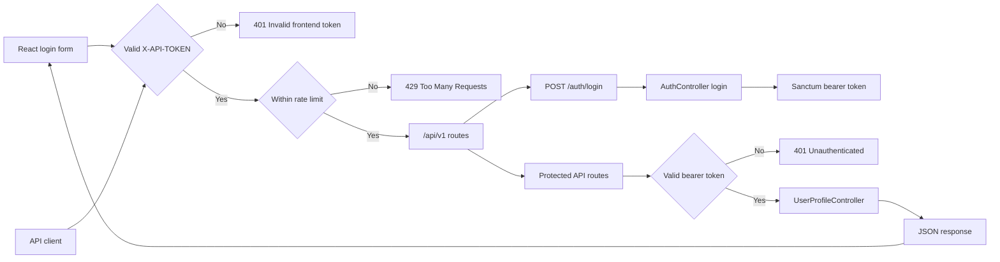

# Day 3 - API Security With Sanctum, Middleware, Tokens, And Throttling

## Class Goal

By the end of Day 3, students can secure Laravel API routes with Sanctum, issue personal access tokens, add a frontend token middleware, apply throttling to reduce abuse, and call protected routes from React.

## PDF Reference

This day is based on PDF pages 11-13, covering authenticated route middleware, `auth:sanctum`, throttling, frontend `X-API-TOKEN` middleware, and the API security checklist. The complete login/logout implementation and token testing flow are course expansions beyond the PDF.

## 6-Hour Class Plan

| Time | Topic | Activity |
| --- | --- | --- |
| 00:00-00:30 | Day 2 recap | Review CRUD API and validation |
| 00:30-01:15 | API security model | Explain authentication, authorization, API keys, and rate limits |
| 01:15-02:15 | Sanctum login | Create login endpoint and issue token |
| 02:15-02:30 | Break | Short break |
| 02:30-03:30 | Protected routes | Add `auth:sanctum` to profile routes |
| 03:30-04:30 | Frontend token middleware | Add `X-API-TOKEN` validation |
| 04:30-05:00 | Throttling | Add request limits and test `429 Too Many Requests` |
| 05:00-05:35 | React auth flow | Login from React, store token, call protected routes |
| 05:35-06:00 | Security lab | Students secure the API and verify JSON responses from an API client and React |

## Learning Objectives

- Understand token-based API authentication.
- Create login and logout endpoints.
- Protect routes with `auth:sanctum`.
- Register a custom middleware alias in `bootstrap/app.php`.
- Validate a frontend API token from a request header.
- Apply Laravel throttle middleware.
- Store the Sanctum bearer token in the React client during local training.
- Send both `X-API-TOKEN` and `Authorization: Bearer ...` headers from React.

## Security Layers For This API

The ABC Company Profile API will use three request checks:

1. `frontend.token` confirms the request came from the expected frontend client.
2. `auth:sanctum` confirms the user is logged in with a valid token.
3. `throttle` limits repeated requests.

This is layered security. One layer should not be treated as the whole security system.

## Architecture Diagram

Day 3 adds a security pipeline in front of the controllers. Public login still requires the frontend token and rate limit, while profile routes require all three layers.



## Step 1 - Confirm Sanctum Is Installed

Day 1 used:

```bash
php artisan install:api
```

That command installs API routing and Sanctum support.

Confirm Sanctum tables exist:

```bash
php artisan migrate
```

The database should include:

```text
personal_access_tokens
```

## Step 2 - Create A Test User

Before issuing API tokens, confirm `app/Models/User.php` uses Sanctum's `HasApiTokens` trait:

```php
<?php

namespace App\Models;

use Illuminate\Database\Eloquent\Factories\HasFactory;
use Illuminate\Foundation\Auth\User as Authenticatable;
use Illuminate\Notifications\Notifiable;
use Laravel\Sanctum\HasApiTokens;

class User extends Authenticatable
{
    use HasApiTokens, HasFactory, Notifiable;

    // Keep the rest of the generated model code.
}
```

Open Tinker:

```bash
php artisan tinker
```

Create a user:

```php
App\Models\User::create([
    'name' => 'Training Admin',
    'email' => 'admin@example.com',
    'password' => bcrypt('password'),
]);
```

Exit:

```php
exit
```

## Step 3 - Create Auth Controller

Run:

```bash
php artisan make:controller Api/V1/AuthController
```

Update `app/Http/Controllers/Api/V1/AuthController.php`:

```php
<?php

namespace App\Http\Controllers\Api\V1;

use App\Http\Controllers\Controller;
use App\Models\User;
use Illuminate\Http\JsonResponse;
use Illuminate\Http\Request;
use Illuminate\Support\Facades\Hash;
use Illuminate\Validation\ValidationException;

class AuthController extends Controller
{
    public function login(Request $request): JsonResponse
    {
        $credentials = $request->validate([
            'email' => ['required', 'email'],
            'password' => ['required', 'string'],
        ]);

        $user = User::where('email', $credentials['email'])->first();

        if (! $user || ! Hash::check($credentials['password'], $user->password)) {
            throw ValidationException::withMessages([
                'email' => ['The provided credentials are incorrect.'],
            ]);
        }

        $token = $user->createToken('training-token')->plainTextToken;

        return response()->json([
            'message' => 'Login successful.',
            'data' => [
                'token_type' => 'Bearer',
                'access_token' => $token,
                'user' => [
                    'id' => $user->id,
                    'name' => $user->name,
                    'email' => $user->email,
                ],
            ],
        ]);
    }

    public function logout(Request $request): JsonResponse
    {
        $request->user()->currentAccessToken()->delete();

        return response()->json([
            'message' => 'Logout successful.',
        ]);
    }
}
```

## Step 4 - Add Auth Routes

Update `routes/api.php`:

```php
<?php

use App\Http\Controllers\Api\V1\AuthController;
use App\Http\Controllers\Api\V1\UserProfileController;
use Illuminate\Support\Facades\Route;

Route::prefix('v1')->name('api.v1.')->group(function () {
    Route::post('/auth/login', [AuthController::class, 'login'])
        ->middleware('throttle:5,1')
        ->name('auth.login');

    Route::middleware(['auth:sanctum'])->group(function () {
        Route::post('/auth/logout', [AuthController::class, 'logout'])
            ->name('auth.logout');

        Route::apiResource('users', UserProfileController::class);
    });
});
```

The login route is public, but rate-limited.

The logout and user profile routes require Sanctum authentication.

## Step 5 - Test Login

```bash
curl -X POST http://127.0.0.1:8000/api/v1/auth/login \
  -H "Accept: application/json" \
  -H "Content-Type: application/json" \
  -d '{
    "email": "admin@example.com",
    "password": "password"
  }'
```

Copy the `access_token` value from the response.

Example response shape:

```json
{
    "message": "Login successful.",
    "data": {
        "token_type": "Bearer",
        "access_token": "1|example-token-value",
        "user": {
            "id": 1,
            "name": "Training Admin",
            "email": "admin@example.com"
        }
    }
}
```

## Step 6 - Test Protected Route Without Token

```bash
curl http://127.0.0.1:8000/api/v1/users \
  -H "Accept: application/json"
```

Expected status:

```text
401 Unauthorized
```

Expected JSON response:

```json
{
    "message": "Unauthenticated."
}
```

## Step 7 - Test Protected Route With Token

Replace `PASTE_TOKEN_HERE`:

```bash
curl http://127.0.0.1:8000/api/v1/users \
  -H "Accept: application/json" \
  -H "Authorization: Bearer PASTE_TOKEN_HERE"
```

Expected status:

```text
200 OK
```

Expected JSON response:

```json
{
    "message": "User profiles retrieved successfully.",
    "data": [
        {
            "id": 1,
            "full_name": "Aina Rahman"
        }
    ]
}
```

## Step 8 - Create Frontend Token Middleware

Run:

```bash
php artisan make:middleware VerifyFrontendToken
```

Update `app/Http/Middleware/VerifyFrontendToken.php`:

```php
<?php

namespace App\Http\Middleware;

use Closure;
use Illuminate\Http\Request;
use Symfony\Component\HttpFoundation\Response;

class VerifyFrontendToken
{
    public function handle(Request $request, Closure $next): Response
    {
        $frontendToken = $request->header('X-API-TOKEN');
        $expectedToken = config('services.frontend.api_token');

        if (! $frontendToken || ! hash_equals((string) $expectedToken, $frontendToken)) {
            return response()->json([
                'message' => 'Unauthorized: Invalid frontend API token.',
            ], 401);
        }

        return $next($request);
    }
}
```

Why use `config()` instead of `env()`?

Application code should read configuration through `config()`. The `.env` file should be loaded into config files, then the app reads config values.

## Step 9 - Add Frontend Token Config

Update `config/services.php`:

```php
return [
    // Other service config...

    'frontend' => [
        'api_token' => env('FRONTEND_API_TOKEN'),
    ],
];
```

Update `.env`:

```env
FRONTEND_API_TOKEN=abc-training-frontend-token
```

Clear config:

```bash
php artisan config:clear
```

## Step 10 - Register Middleware Alias

Update `bootstrap/app.php`:

```php
<?php

use App\Http\Middleware\VerifyFrontendToken;
use Illuminate\Foundation\Application;
use Illuminate\Foundation\Configuration\Exceptions;
use Illuminate\Foundation\Configuration\Middleware;

return Application::configure(basePath: dirname(__DIR__))
    ->withRouting(
        web: __DIR__.'/../routes/web.php',
        api: __DIR__.'/../routes/api.php',
        commands: __DIR__.'/../routes/console.php',
        health: '/up',
    )
    ->withMiddleware(function (Middleware $middleware): void {
        $middleware->alias([
            'frontend.token' => VerifyFrontendToken::class,
        ]);
    })
    ->withExceptions(function (Exceptions $exceptions): void {
        //
    })->create();
```

If your `bootstrap/app.php` already has code inside `withMiddleware`, add only the alias inside the existing closure.

## Step 11 - Apply Frontend Token Middleware

Update `routes/api.php`:

```php
<?php

use App\Http\Controllers\Api\V1\AuthController;
use App\Http\Controllers\Api\V1\UserProfileController;
use Illuminate\Support\Facades\Route;

Route::prefix('v1')
    ->name('api.v1.')
    ->middleware(['frontend.token', 'throttle:60,1'])
    ->group(function () {
        Route::post('/auth/login', [AuthController::class, 'login'])
            ->middleware('throttle:5,1')
            ->name('auth.login');

        Route::middleware(['auth:sanctum'])->group(function () {
            Route::post('/auth/logout', [AuthController::class, 'logout'])
                ->name('auth.logout');

            Route::apiResource('users', UserProfileController::class);
        });
    });
```

Now every route in `/api/v1` requires:

```text
X-API-TOKEN: abc-training-frontend-token
```

Protected routes also require:

```text
Authorization: Bearer <token>
```

## Step 12 - Test Login With Frontend Token

```bash
curl -X POST http://127.0.0.1:8000/api/v1/auth/login \
  -H "Accept: application/json" \
  -H "Content-Type: application/json" \
  -H "X-API-TOKEN: abc-training-frontend-token" \
  -d '{
    "email": "admin@example.com",
    "password": "password"
  }'
```

Expected JSON response:

```json
{
    "message": "Login successful.",
    "data": {
        "token_type": "Bearer",
        "access_token": "1|example-token-value",
        "user": {
            "id": 1,
            "name": "Training Admin",
            "email": "admin@example.com"
        }
    }
}
```

## Step 13 - Test Protected Route With Both Tokens

```bash
curl http://127.0.0.1:8000/api/v1/users \
  -H "Accept: application/json" \
  -H "X-API-TOKEN: abc-training-frontend-token" \
  -H "Authorization: Bearer PASTE_TOKEN_HERE"
```

Expected JSON response:

```json
{
    "message": "User profiles retrieved successfully.",
    "data": [
        {
            "id": 1,
            "full_name": "Aina Rahman"
        }
    ]
}
```

## Step 14 - Test Logout

```bash
curl -X POST http://127.0.0.1:8000/api/v1/auth/logout \
  -H "Accept: application/json" \
  -H "X-API-TOKEN: abc-training-frontend-token" \
  -H "Authorization: Bearer PASTE_TOKEN_HERE"
```

Expected JSON response:

```json
{
    "message": "Logout successful."
}
```

After logout, the same bearer token should no longer work.

## Step 15 - Test The Same Security Flow In React

Use:

```text
examples/react-client-api-consumer
```

For Day 3, focus on these files:

```text
src/api.js
src/App.jsx
```

The API helper always sends the frontend token:

```js
'X-API-TOKEN': FRONTEND_API_TOKEN
```

Protected requests also send the Sanctum token:

```js
Authorization: `Bearer ${token}`
```

React login flow:

1. submit email and password to `POST /api/v1/auth/login`.
2. store the returned token in state and `localStorage` for the class lab.
3. call `GET /api/v1/users` with both headers.
4. call logout and clear the stored token.

Teaching point:

Local storage is acceptable for a small class demo, but production token storage needs a deliberate security decision based on the app threat model.

## GSD Claude Code Prompt

Use this prompt if students want Claude Code to help with Day 3 security.

```text
Goal:
Help me complete Day 3 of the Laravel API tutorial.

Context:
The API already has user profile CRUD. Today I need Laravel Sanctum login/logout, protected routes, frontend X-API-TOKEN middleware, throttling, expected security JSON responses, and the same login/list/logout flow in React.

Relevant files:
- routes/api.php
- bootstrap/app.php
- app/Http/Controllers/Api/V1/AuthController.php
- app/Http/Middleware/VerifyFrontendToken.php
- app/Models/User.php
- config/services.php
- config/sanctum.php if relevant
- examples/day-3-api-security
- examples/react-client-api-consumer/src/api.js
- examples/react-client-api-consumer/src/App.jsx

Constraints:
- Inspect security-related files before editing.
- Do not read or print .env secrets.
- Read frontend token through config, not env() inside runtime code.
- Do not put auth:sanctum on the login route.
- Keep protected profile routes behind both frontend token and bearer token checks.
- Do not weaken existing validation or route versioning.

Done criteria:
- POST /api/v1/auth/login returns a Sanctum bearer token.
- protected /api/v1/users rejects requests without Authorization: Bearer token.
- requests without X-API-TOKEN return JSON 401.
- throttling is applied to login and protected API routes.
- React can login, store token for the lab, call protected routes, and logout.

Verification:
- Provide request examples and expected JSON responses for login, missing frontend token, missing bearer token, protected list, and logout.
- Run or suggest php artisan route:list --path=api.
- If tests exist, run or suggest auth and middleware tests.
```

## Security Checklist

Apply these rules in real APIs:

- Use HTTPS in production.
- Keep `APP_DEBUG=false` in production.
- Store secrets in `.env`, not source code.
- Read secrets through config files.
- Validate all input.
- Return only required fields.
- Use rate limits on login and sensitive endpoints.
- Log suspicious activity.
- Rotate leaked tokens immediately.

## Class Lab

Students must:

1. Login successfully with the frontend token.
2. Try login without `X-API-TOKEN`.
3. Call `/api/v1/users` without bearer token.
4. Call `/api/v1/users` with bearer token.
5. Logout.
6. Repeat login, list, and logout from React.
7. Confirm the old bearer token fails.

## Common Mistakes

- Forgetting `Accept: application/json`.
- Registering middleware alias in the wrong file.
- Using `env()` inside middleware.
- Forgetting `php artisan config:clear`.
- Forgetting `HasApiTokens` in the `User` model.
- Sending `Authorization: PASTE_TOKEN_HERE` instead of `Authorization: Bearer PASTE_TOKEN_HERE`.
- Putting `auth:sanctum` on login route.

## Day 3 Review Questions

1. What is the difference between a frontend API token and a user access token?
2. Why should the login route be throttled?
3. What does `auth:sanctum` check?
4. Why should API secrets not be hardcoded?
5. What status code should Laravel return when too many requests are sent?
6. Which two headers does React need for protected routes?

## Homework

Add a route that returns the authenticated user's profile:

```text
GET /api/v1/me
```

Example route:

```php
Route::get('/me', function (Request $request) {
    return response()->json([
        'message' => 'Authenticated user retrieved successfully.',
        'data' => $request->user(),
    ]);
})->middleware('auth:sanctum');
```

Then add a small React panel that calls `/auth/me` or `/me`, depending on the route name you choose, and displays the logged-in user's name and email.

Remember to import:

```php
use Illuminate\Http\Request;
```
