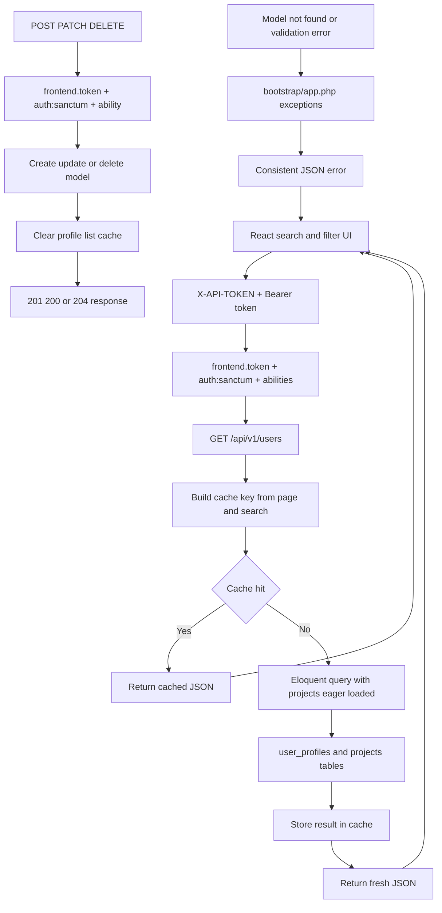

# Day 4 - Performance, Caching, Query Optimization, And Exception Handling

## Class Goal

By the end of Day 4, students can improve Laravel API performance with pagination, eager loading, caching, route/config cache commands, centralized JSON exception handling in Laravel, and React loading/search/error states.

## PDF Reference

This day is based on PDF pages 14-18, covering Redis caching, `Cache::remember`, eager loading, route/config caching, pagination, rate control, and centralized exception handling. The project relationship example, cache-key strategy, and cache clearing after writes are course expansions beyond the PDF.

## 6-Hour Class Plan

| Time | Topic | Activity |
| --- | --- | --- |
| 00:00-00:30 | Day 3 recap | Review protected routes and token security |
| 00:30-01:15 | API performance basics | Explain response size, database load, cache, and middleware cost |
| 01:15-02:15 | Pagination and query shape | Improve list endpoint and avoid large payloads |
| 02:15-02:30 | Break | Short break |
| 02:30-03:30 | Relationships and eager loading | Add projects and prevent N+1 queries |
| 03:30-04:30 | Cache API data | Cache list endpoint with Redis or file cache |
| 04:30-05:15 | Exception handling | Add consistent JSON errors in `bootstrap/app.php` |
| 05:15-05:45 | React API UX | Add search/filter, loading state, and JSON error display |
| 05:45-06:00 | Lab | Students test cache, 404 errors, route/config cache, and React error states |

## Learning Objectives

- Paginate API list responses.
- Use eager loading to reduce database queries.
- Cache frequently requested data.
- Clear stale cache after write operations.
- Configure Laravel exception rendering.
- Use production optimization commands correctly.
- Preserve Day 3 frontend token, Sanctum auth, token expiry, and ability checks while adding Day 4 performance work.
- Use React to send search/filter query strings.
- Display pagination totals, loading state, and API errors in the browser.

## Performance Principles

Fast APIs usually follow these rules:

- Return only the data the client needs.
- Paginate large lists.
- Avoid repeated database queries.
- Cache stable or expensive data.
- Use route and config cache in production.
- Keep exception responses small and consistent.

## Security Carry-Forward From Day 3

Day 4 adds performance and exception handling after Day 3 security. Do not copy an older public `Route::apiResource('users', ...)` back into the project.

The final Day 4 route state is still:

- `/api/v1` group requires `frontend.token` and throttling.
- `POST /auth/login` requires `X-API-TOKEN` but no bearer token.
- `POST /auth/logout` requires `auth:sanctum`.
- every `/users` CRUD action requires `auth:sanctum` and the matching ability.

```php
Route::apiResource('users', UserProfileController::class)
    ->middlewareFor(['index', 'show'], 'abilities:profiles:read')
    ->middlewareFor('store', 'abilities:profiles:create')
    ->middlewareFor('update', 'abilities:profiles:update')
    ->middlewareFor('destroy', 'abilities:profiles:delete');
```

Day 4 JSON exception handling should add `404` and `422` consistency without removing the Day 3 `403` ability response.

## Architecture Diagram

Day 4 adds performance and error handling around the same API. Read requests should prefer cached data when available, while write requests must clear stale cache. Exceptions are centralized in `bootstrap/app.php`.



## Step 1 - Confirm The Current Index Endpoint Uses Pagination

From Day 2, the index endpoint should use pagination. If your project already has `UserProfileResource`, return the resource collection directly so Laravel keeps pagination metadata at the top level:

If the resource does not exist yet, create it first:

```bash
php artisan make:resource UserProfileResource
```

File: `app/Http/Controllers/Api/V1/UserProfileController.php`


```php
// ... existing imports before
use App\Http\Resources\UserProfileResource;
use Illuminate\Http\Resources\Json\AnonymousResourceCollection;
// ... existing imports after
```

File: `app/Http/Controllers/Api/V1/UserProfileController.php`


```php
// ... existing controller class code before

public function index(): AnonymousResourceCollection
{
    $profiles = UserProfile::query()
        ->latest()
        ->paginate(15);

    return UserProfileResource::collection($profiles)
        ->additional([
            'message' => 'User profiles retrieved successfully.',
        ]);
}

// ... existing store/show/update/destroy methods after
```

Do not wrap the collection like this:

```php
// DO NOT COPY: this is the wrong nested resource response shape.
return response()->json([
    'message' => 'User profiles retrieved successfully.',
    'data' => UserProfileResource::collection($profiles),
]);
```

That nests the resource response inside `data` and makes pagination harder for React to read. The expected list response shape is `message`, `data`, `links`, and `meta` at the top level.

Test:

```bash
curl "http://127.0.0.1:8000/api/v1/users?page=1" \
  -H "Accept: application/json" \
  -H "X-API-TOKEN: abc-training-frontend-token" \
  -H "Authorization: Bearer PASTE_TOKEN_HERE"
```

Why pagination matters:

- It protects memory.
- It reduces response size.
- It makes mobile and frontend apps faster.
- It prevents accidental large table exports.

## Step 2 - Add A Project Model For Relationship Examples

Run:

```bash
php artisan make:model Project -m
```

Update the generated migration.

File: `database/migrations/YYYY_MM_DD_HHMMSS_create_projects_table.php`


```php
<?php

use Illuminate\Database\Migrations\Migration;
use Illuminate\Database\Schema\Blueprint;
use Illuminate\Support\Facades\Schema;

return new class extends Migration
{
    public function up(): void
    {
        Schema::create('projects', function (Blueprint $table) {
            $table->id();
            $table->foreignId('user_profile_id')
                ->constrained()
                ->cascadeOnDelete();
            $table->string('name');
            $table->string('status')->default('active');
            $table->date('starts_at')->nullable();
            $table->timestamps();

            $table->index(['user_profile_id', 'status']);
        });
    }

    public function down(): void
    {
        Schema::dropIfExists('projects');
    }
};
```

Run:

```bash
php artisan migrate
```

File: `app/Models/Project.php`


```php
<?php

namespace App\Models;

use Illuminate\Database\Eloquent\Factories\HasFactory;
use Illuminate\Database\Eloquent\Model;

class Project extends Model
{
    use HasFactory;

    protected $fillable = [
        'user_profile_id',
        'name',
        'status',
        'starts_at',
    ];

    protected $casts = [
        'starts_at' => 'date',
    ];
}
```

File: `app/Models/UserProfile.php`


```php
<?php

namespace App\Models;

use Illuminate\Database\Eloquent\Factories\HasFactory;
use Illuminate\Database\Eloquent\Model;
use Illuminate\Database\Eloquent\Relations\HasMany;

class UserProfile extends Model
{
    use HasFactory;

    protected $fillable = [
        'full_name',
        'phone',
        'id_card_number',
        'address',
        'is_active',
    ];

    protected $casts = [
        'is_active' => 'boolean',
    ];

    public function projects(): HasMany
    {
        return $this->hasMany(Project::class);
    }

    // ... existing methods after
}
```

### Resource Files Used By The Paginated Response

If these resources do not exist yet, create them:

```bash
php artisan make:resource ProjectResource
php artisan make:resource UserProfileResource
```

File: `app/Http/Resources/ProjectResource.php`


```php
<?php

namespace App\Http\Resources;

use Illuminate\Http\Request;
use Illuminate\Http\Resources\Json\JsonResource;

class ProjectResource extends JsonResource
{
    public function toArray(Request $request): array
    {
        return [
            'id' => $this->id,
            'name' => $this->name,
            'status' => $this->status,
            'starts_at' => $this->starts_at?->toDateString(),
        ];
    }
}
```

File: `app/Http/Resources/UserProfileResource.php`


```php
<?php

namespace App\Http\Resources;

use Illuminate\Http\Request;
use Illuminate\Http\Resources\Json\JsonResource;

class UserProfileResource extends JsonResource
{
    public function toArray(Request $request): array
    {
        return [
            'id' => $this->id,
            'full_name' => $this->full_name,
            'phone' => $this->phone,
            'id_card_number' => $this->id_card_number,
            'address' => $this->address,
            'is_active' => $this->is_active,
            'projects' => ProjectResource::collection($this->whenLoaded('projects')),
            'created_at' => $this->created_at?->toISOString(),
            'updated_at' => $this->updated_at?->toISOString(),
        ];
    }
}
```

## Step 3 - Add Sample Projects

Use Tinker:

```bash
php artisan tinker
```

Create projects:

```php
$profile = App\Models\UserProfile::first();

$profile->projects()->create([
    'name' => 'Mobile App API',
    'status' => 'active',
    'starts_at' => now(),
]);

$profile->projects()->create([
    'name' => 'Internal Dashboard API',
    'status' => 'planning',
    'starts_at' => now()->addMonth(),
]);
```

Exit:

```php
exit
```

## Step 4 - Avoid N+1 Queries With Eager Loading

Bad pattern:

```php
$profiles = UserProfile::all();

foreach ($profiles as $profile) {
    echo $profile->projects;
}
```

This can run one query for profiles and then one extra query per profile.

Better pattern:

```php
$profiles = UserProfile::with('projects')->paginate(15);
```

Update the controller.

File: `app/Http/Controllers/Api/V1/UserProfileController.php`


```php
// ... existing imports and controller class before

public function index(): AnonymousResourceCollection
{
    $profiles = UserProfile::query()
        ->with('projects')
        ->latest()
        ->paginate(15);

    return UserProfileResource::collection($profiles)
        ->additional([
            'message' => 'User profiles retrieved successfully.',
        ]);
}

// ... existing store/show/update/destroy methods after
```

## Step 5 - Add Search To The Index Endpoint

After pagination and eager loading work, add a simple search query parameter to the same `index()` endpoint.

The browser or React client will call:

```text
GET /api/v1/users?search=aina&page=1
```

File: `app/Http/Controllers/Api/V1/UserProfileController.php`


```php
// ... existing imports and controller class before

public function index(): AnonymousResourceCollection
{
    $search = trim((string) request()->query('search', ''));

    $profiles = UserProfile::query()
        ->with('projects')
        ->when($search !== '', function ($query) use ($search) {
            $query->where(function ($query) use ($search) {
                $query->where('full_name', 'like', "%{$search}%")
                    ->orWhere('phone', 'like', "%{$search}%")
                    ->orWhere('id_card_number', 'like', "%{$search}%");
            });
        })
        ->latest()
        ->paginate(15);

    return UserProfileResource::collection($profiles)
        ->additional([
            'message' => 'User profiles retrieved successfully.',
        ]);
}

// ... existing store/show/update/destroy methods after
```

Why the nested `where(function (...) { ... })` matters:

- It groups the `OR` search conditions together.
- It prevents future filters such as `is_active` from being broken by loose `orWhere()` conditions.
- It keeps the endpoint ready for more filters later.

Test search:

```bash
curl "http://127.0.0.1:8000/api/v1/users?search=aina&page=1" \
  -H "Accept: application/json" \
  -H "X-API-TOKEN: abc-training-frontend-token" \
  -H "Authorization: Bearer PASTE_TOKEN_HERE"
```

Expected response shape:

```json
{
  "message": "User profiles retrieved successfully.",
  "data": [
    {
      "id": 1,
      "full_name": "Aina Rahman"
    }
  ],
  "links": {},
  "meta": {
    "current_page": 1,
    "total": 1
  }
}
```

If no record matches, `data` should be an empty array and `meta.total` should be `0`.

## Step 6 - Add Cache To The Index Endpoint

Import cache.

File: `app/Http/Controllers/Api/V1/UserProfileController.php`


```php
// ... existing imports before
use Illuminate\Support\Facades\Cache;
// ... existing imports after
```

Update `index`.

File: `app/Http/Controllers/Api/V1/UserProfileController.php`


```php
// ... existing imports and controller class before

public function index(): AnonymousResourceCollection
{
    $page = request()->integer('page', 1);
    $search = trim((string) request()->query('search', ''));

    $cacheKey = "user_profiles.index.page.{$page}.search.".md5($search);

    $profiles = Cache::remember($cacheKey, now()->addMinutes(10), function () use ($search) {
        return UserProfile::query()
            ->with('projects')
            ->when($search !== '', function ($query) use ($search) {
                $query->where(function ($query) use ($search) {
                    $query->where('full_name', 'like', "%{$search}%")
                        ->orWhere('phone', 'like', "%{$search}%")
                        ->orWhere('id_card_number', 'like', "%{$search}%");
                });
            })
            ->latest()
            ->paginate(15);
    });

    return UserProfileResource::collection($profiles)
        ->additional([
            'message' => 'User profiles retrieved successfully.',
        ]);
}

// ... existing store/show/update/destroy methods after
```

This caches each page and search combination separately.

## Step 7 - Clear Cache After Writes

The simple class example is to clear all cache after create, update, or delete:

```php
// app/Http/Controllers/Api/V1/UserProfileController.php
// PARTIAL PATCH: add this import near the other use statements.
// ... existing imports before
use Illuminate\Support\Facades\Cache;
// ... existing imports after
```

In `store`:

```php
// app/Http/Controllers/Api/V1/UserProfileController.php
// PARTIAL PATCH: add Cache::flush() after successful create.
// ... existing store() code before
$profile = UserProfile::create($request->validated());
Cache::flush();
// ... existing store() response after
```

In `update`:

```php
// app/Http/Controllers/Api/V1/UserProfileController.php
// PARTIAL PATCH: add Cache::flush() after successful update.
// ... existing update() code before
$profile->update($request->validated());
Cache::flush();
// ... existing update() response after
```

In `destroy`:

```php
// app/Http/Controllers/Api/V1/UserProfileController.php
// PARTIAL PATCH: add Cache::flush() after successful delete.
// ... existing destroy() code before
$profile->delete();
Cache::flush();
// ... existing destroy() response after
```

Trainer note:

`Cache::flush()` is easy for class, but too broad for production. In production, prefer targeted keys, cache tags when supported, or events that clear only related cache.

## Step 8 - Configure Redis Cache

For class, file cache is acceptable. For Redis, install Predis:

```bash
composer require predis/predis
```

Update `.env`.

File: `.env`


```env
CACHE_STORE=redis
SESSION_DRIVER=redis
QUEUE_CONNECTION=redis
REDIS_CLIENT=predis
```

Clear config:

```bash
php artisan config:clear
```

If Redis is not installed locally, keep:

File: `.env`


```env
CACHE_STORE=file
```

The Laravel code remains the same because it uses the cache facade.

## Step 9 - Production Optimization Commands

Use these commands during deployment, not during active local editing:

```bash
php artisan route:cache
php artisan config:cache
php artisan view:cache
```

Clear them when changing routes or config:

```bash
php artisan route:clear
php artisan config:clear
php artisan view:clear
```

Important:

- Do not run `config:cache` and then expect `.env` edits to appear immediately.
- Do not run `route:cache` while debugging route changes.

## Step 10 - Add Laravel JSON Exception Handling

In Laravel, exception rendering is configured in `bootstrap/app.php`.

Update the `withExceptions` section.

File: `bootstrap/app.php`


```php
<?php

use App\Http\Middleware\VerifyFrontendToken;
use Illuminate\Auth\Access\AuthorizationException;
use Illuminate\Database\Eloquent\ModelNotFoundException;
use Illuminate\Foundation\Application;
use Illuminate\Foundation\Configuration\Exceptions;
use Illuminate\Foundation\Configuration\Middleware;
use Illuminate\Http\Request;
use Illuminate\Validation\ValidationException;
use Laravel\Sanctum\Http\Middleware\CheckAbilities;
use Laravel\Sanctum\Http\Middleware\CheckForAnyAbility;
use Symfony\Component\HttpKernel\Exception\AccessDeniedHttpException;
use Symfony\Component\HttpKernel\Exception\NotFoundHttpException;
use Throwable;

return Application::configure(basePath: dirname(__DIR__))
    ->withRouting(
        web: __DIR__.'/../routes/web.php',
        api: __DIR__.'/../routes/api.php',
        commands: __DIR__.'/../routes/console.php',
        health: '/up',
    )
    ->withMiddleware(function (Middleware $middleware): void {
        // ... existing middleware aliases before
        $middleware->alias([
            'abilities' => CheckAbilities::class,
            'ability' => CheckForAnyAbility::class,
            'frontend.token' => VerifyFrontendToken::class,
        ]);
        // ... existing middleware aliases after
    })
    ->withExceptions(function (Exceptions $exceptions): void {
        // ... existing exception configuration before
        $exceptions->shouldRenderJsonWhen(function (Request $request, Throwable $e) {
            return $request->is('api/*') || $request->expectsJson();
        });

        $exceptions->render(function (AuthorizationException $e, Request $request) {
            if ($request->is('api/*')) {
                return response()->json([
                    'message' => $e->getMessage(),
                ], 403);
            }
        });

        $exceptions->render(function (AccessDeniedHttpException $e, Request $request) {
            if ($request->is('api/*')) {
                return response()->json([
                    'message' => $e->getMessage(),
                ], 403);
            }
        });

        $exceptions->render(function (ModelNotFoundException $e, Request $request) {
            if ($request->is('api/*')) {
                return response()->json([
                    'message' => 'Resource not found.',
                ], 404);
            }
        });

        $exceptions->render(function (NotFoundHttpException $e, Request $request) {
            if ($request->is('api/*')) {
                return response()->json([
                    'message' => 'Resource not found.',
                ], 404);
            }
        });

        $exceptions->render(function (ValidationException $e, Request $request) {
            if ($request->is('api/*')) {
                return response()->json([
                    'message' => 'The given data was invalid.',
                    'errors' => $e->errors(),
                ], 422);
            }
        });
        // ... existing exception configuration after
    })->create();
```

Do not expose raw exception messages in production. Real exception messages may contain class names, table names, query details, or paths.

## Step 11 - Test 404 JSON Response

```bash
curl http://127.0.0.1:8000/api/v1/users/999999 \
  -H "Accept: application/json" \
  -H "X-API-TOKEN: abc-training-frontend-token" \
  -H "Authorization: Bearer PASTE_TOKEN_HERE"
```

Expected shape:

```json
{
    "message": "Resource not found."
}
```

## Step 12 - Test Validation JSON Response

```bash
curl -X POST http://127.0.0.1:8000/api/v1/users \
  -H "Accept: application/json" \
  -H "Content-Type: application/json" \
  -H "X-API-TOKEN: abc-training-frontend-token" \
  -H "Authorization: Bearer PASTE_TOKEN_HERE" \
  -d '{
    "full_name": "",
    "phone": ""
  }'
```

Expected shape:

```json
{
    "message": "The given data was invalid.",
    "errors": {
        "full_name": [
            "The full name field is required."
        ]
    }
}
```

## Step 13 - Reflect API State In React

Use:

```text
examples/react-client-api-consumer
```

For Day 4, focus on these UI behaviors:

- show `Loading...` while a request is in progress.
- send `search` and `active` query strings from the filter controls.
- display pagination totals from the API response metadata.
- display `401` errors when the token is missing or expired.
- display `403` errors when the token is missing the required ability.
- display `422` validation details when create fails.

Example query call:

File: `examples/react-client-api-consumer/src/App.jsx`


```js
// ... existing list-loading function before
apiRequest('/users', {
  token,
  query: {
    page: 1,
    search,
    active,
  },
});
// ... existing list-loading function after
```

Teaching point:

Backend performance choices affect frontend UX. Pagination, cache, and consistent error JSON make the React UI easier to build and debug.

### React Client Update Prompt

Use this prompt when students want Claude Code to update the React client after the Day 4 Laravel backend changes.

Target files:

- `examples/react-client-api-consumer/src/api.js`
- `examples/react-client-api-consumer/src/App.jsx`
- `examples/react-client-api-consumer/src/App.css`


```text
Goal:
Update my React client app so it works with the latest Day 4 Laravel API backend changes.

Context:
The Laravel API now has secured CRUD from Day 3 plus Day 4 pagination, eager-loaded projects, backend caching, cache clearing after writes, and centralized JSON exception handling. The list endpoint is GET /api/v1/users and returns a top-level response with message, data, links, and meta. The API still requires X-API-TOKEN and a Sanctum Bearer token with abilities.

Relevant frontend files:
- src/api.js
- src/App.jsx
- src/App.css

Backend response contract:
- GET /api/v1/users?page=1&search=abc returns:
  - message
  - data: array of user profiles
  - links
  - meta.total
  - meta.current_page
  - meta.last_page
  - meta.per_page
- 401 returns JSON with message "Unauthenticated."
- 403 returns JSON with a missing ability or forbidden message.
- 404 returns JSON with message "Resource not found."
- 422 returns JSON with message and errors object.

Tasks:
1. Inspect the current React API helper and profile list code before editing.
2. Keep existing login, logout, X-API-TOKEN, Bearer token, token expiry, and ability handling.
3. Update the list loader to send page and search query parameters.
4. Normalize the Laravel paginated response so records come from response.data and pagination comes from response.meta.
5. Render total records, current page, last page, previous button, and next button.
6. After create, update, or delete, reload the current list page so the UI reflects backend cache invalidation.
7. Parse JSON errors consistently:
   - 401: clear local token and show login-required message.
   - 403: show missing permission/ability message.
   - 404: show friendly not-found message.
   - 422: show validation field messages.
8. Add loading and disabled states while requests are running.
9. Do not fake cache behavior in React. Cache is handled by Laravel; React should refresh data after writes.

Done criteria:
- Search calls GET /api/v1/users with query string values.
- Pagination UI reads meta.total, meta.current_page, and meta.last_page.
- CRUD still works with the secured Laravel API.
- Validation, unauthorized, forbidden, and not-found errors display useful messages.
- No auth headers or frontend token behavior are removed.
```

## GSD Claude Code Prompt

Use this prompt if students want Claude Code to help with Day 4 performance and error handling.

```text
Goal:
Help me complete Day 4 of the Laravel API tutorial.

Context:
The API has CRUD and Day 3 security. Today I need pagination, Project relationship examples, eager loading, caching with safe cache keys, cache invalidation after writes, Laravel JSON exception handling, and React loading/search/filter/error states without removing frontend token, bearer token, token expiry, or Sanctum ability checks.

Relevant files:
- routes/api.php
- bootstrap/app.php
- app/Http/Controllers/Api/V1/UserProfileController.php
- app/Models/UserProfile.php
- app/Models/Project.php
- database/migrations
- config/cache.php
- examples/day-4-performance-exception-handling
- examples/react-client-api-consumer/src/api.js
- examples/react-client-api-consumer/src/App.jsx

Constraints:
- Inspect current controller/model/cache/error code before editing.
- Do not remove authentication, frontend token middleware, token expiry handling, or Sanctum ability middleware.
- Cache list responses with keys that include page/search/filter values.
- Clear stale cache after create, update, and delete.
- Do not expose raw exception messages in API JSON.
- If using `UserProfileResource`, return `UserProfileResource::collection($profiles)->additional(...)` so pagination metadata stays at the top level. Do not nest the resource collection under `data`.

Done criteria:
- GET /api/v1/users is paginated and returns `message`, `data`, `links`, and `meta` at the top level.
- projects are eager-loaded without N+1 queries.
- repeated list calls can use cache.
- write operations clear stale list cache.
- 404 and validation failures return predictable JSON.
- missing ability returns JSON 403.
- React can show loading, search/filter results, and useful 401/403/422/404 messages.

Verification:
- Provide request examples and expected JSON responses for paginated list, search/filter list, 404, and validation error.
- Run or suggest php artisan optimize:clear after config/cache changes.
- If tests exist, run or suggest feature tests for list filters and JSON errors.
```

## Class Lab

Students must:

1. Add the `Project` model and migration.
2. Add the `projects()` relationship to `UserProfile`.
3. Add sample projects.
4. Update the list endpoint to use eager loading.
5. Add search to the list endpoint and test `?search=...`.
6. Add cache to the list endpoint.
7. Clear cache after create, update, and delete.
8. Add JSON exception handling.
9. Test 404 and validation errors.
10. Test missing ability and confirm JSON `403`.
11. Confirm React displays loading, search/filter results, and error messages.

## Common Mistakes

- Caching all pages with the same cache key.
- Forgetting search parameters in the cache key.
- Running `config:cache` then wondering why `.env` changes do not work.
- Returning raw exception messages in production.
- Creating relationships but forgetting foreign keys.
- Ignoring pagination on list endpoints.
- Replacing the Day 3 protected route group with a public or bearer-only Day 4 route.

## Day 4 Review Questions

1. What is the N+1 query problem?
2. Why should API list endpoints be paginated?
3. What is the difference between `Cache::remember` and `Cache::put`?
4. Why should cache be cleared after writes?
5. Where does Laravel configure exception rendering?
6. Why does a React client benefit from consistent JSON error shapes?
7. Why must Day 4 keep Day 3 ability middleware when adding cache and exception handling?

## Homework

Add a lightweight endpoint that returns API health information:

```text
GET /api/v1/health
```

Example route:

File: `routes/api.php`


```php
// ... existing v1 route group before
Route::get('/health', function () {
    return response()->json([
        'message' => 'ABC API is healthy.',
        'data' => [
            'app' => config('app.name'),
            'environment' => app()->environment(),
            'time' => now()->toISOString(),
        ],
    ]);
})->name('health');
// ... existing v1 route group after
```

Then test it with and without cache enabled. Add a small React status panel that calls `/health` and displays the API time.
