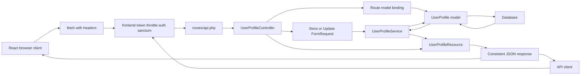

# Day 5 - Service Layer, Route Model Binding, API Resources, And Final Project

## Class Goal

By the end of Day 5, students can refactor Laravel API code into a cleaner architecture using route model binding, service classes, API resources, a final production-style API structure, and a React client that consumes the API contract.

## PDF Reference

This day is based on PDF pages 16-18, covering the service layer pattern, route model binding, API resource/serialization guidance, pagination, and optimization summary. The complete service class, API resources, route model binding refactor, and final project architecture are course expansions beyond the PDF.

## 6-Hour Class Plan

| Time | Topic | Activity |
| --- | --- | --- |
| 00:00-00:30 | Day 4 recap | Review cache, eager loading, and exception handling |
| 00:30-01:15 | Route model binding | Replace manual `findOrFail` lookups |
| 01:15-02:15 | Service layer pattern | Move business logic out of controllers |
| 02:15-02:30 | Break | Short break |
| 02:30-03:30 | API resources | Control JSON response shape |
| 03:30-04:45 | Final project build | Students complete secured, optimized API |
| 04:45-05:30 | React final integration | Connect login, list, search/filter, create, and errors to the final API |
| 05:30-05:50 | Review and refactor | Instructor reviews backend, client, and architecture |
| 05:50-06:00 | Wrap-up | Final checklist and next learning path |

## Learning Objectives

- Use Laravel route model binding.
- Keep controllers focused on HTTP concerns.
- Move business rules to service classes.
- Use API resources to control JSON output.
- Apply the full 5-day API pattern in one project.
- Explain the full browser-to-API flow.
- Verify the React client consumes the final API contract correctly.

## Target Architecture

By the end of the day, the API should have this structure:

```text
app/
  Http/
    Controllers/
      Api/
        V1/
          AuthController.php
          UserProfileController.php
    Middleware/
      VerifyFrontendToken.php
    Requests/
      StoreUserProfileRequest.php
      UpdateUserProfileRequest.php
    Resources/
      UserProfileResource.php
  Models/
    Project.php
    User.php
    UserProfile.php
  Services/
    UserProfileService.php
routes/
  api.php
bootstrap/
  app.php
react-client/
  src/
    api.js
    App.jsx
```

## Architecture Diagram

Day 5 is the final architecture. Controllers handle HTTP concerns, form requests validate input, services hold business logic and cache behavior, models talk to the database, and API resources control the JSON shape.



## Step 1 - Use Route Model Binding

Day 2 used manual lookup:

```php
$profile = UserProfile::findOrFail($id);
```

Laravel can do this automatically if the route parameter and controller argument match.

Update `routes/api.php`:

```php
<?php

use App\Http\Controllers\Api\V1\AuthController;
use App\Http\Controllers\Api\V1\UserProfileController;
use Illuminate\Support\Facades\Route;

Route::prefix('v1')
    ->name('api.v1.')
    ->middleware(['frontend.token', 'throttle:60,1'])
    ->group(function () {
        Route::post('/auth/login', [AuthController::class, 'login'])
            ->middleware('throttle:5,1')
            ->name('auth.login');

        Route::middleware(['auth:sanctum'])->group(function () {
            Route::post('/auth/logout', [AuthController::class, 'logout'])
                ->name('auth.logout');

            Route::apiResource('users', UserProfileController::class)
                ->parameters([
                    'users' => 'userProfile',
                ]);
        });
    });
```

The parameter mapping means:

```text
/api/v1/users/{userProfile}
```

Laravel will inject a `UserProfile $userProfile` into the controller.

## Step 2 - Create An API Resource

Run:

```bash
php artisan make:resource UserProfileResource
```

Update `app/Http/Resources/UserProfileResource.php`:

```php
<?php

namespace App\Http\Resources;

use Illuminate\Http\Request;
use Illuminate\Http\Resources\Json\JsonResource;

class UserProfileResource extends JsonResource
{
    public function toArray(Request $request): array
    {
        return [
            'id' => $this->id,
            'full_name' => $this->full_name,
            'phone' => $this->phone,
            'id_card_number' => $this->id_card_number,
            'address' => $this->address,
            'is_active' => $this->is_active,
            'projects' => ProjectResource::collection($this->whenLoaded('projects')),
            'created_at' => $this->created_at?->toISOString(),
            'updated_at' => $this->updated_at?->toISOString(),
        ];
    }
}
```

Create a project resource:

```bash
php artisan make:resource ProjectResource
```

Update `app/Http/Resources/ProjectResource.php`:

```php
<?php

namespace App\Http\Resources;

use Illuminate\Http\Request;
use Illuminate\Http\Resources\Json\JsonResource;

class ProjectResource extends JsonResource
{
    public function toArray(Request $request): array
    {
        return [
            'id' => $this->id,
            'name' => $this->name,
            'status' => $this->status,
            'starts_at' => $this->starts_at?->toDateString(),
        ];
    }
}
```

Why use API resources?

- They control which fields are returned.
- They avoid leaking internal columns.
- They make response shape consistent.
- They keep controller code cleaner.

## Step 3 - Create The Service Class

Laravel does not need a special Artisan command for simple service classes.

Create:

```text
app/Services/UserProfileService.php
```

Add:

```php
<?php

namespace App\Services;

use App\Models\UserProfile;
use Illuminate\Contracts\Pagination\LengthAwarePaginator;
use Illuminate\Support\Facades\Cache;

class UserProfileService
{
    public function paginate(?string $search = null, int $perPage = 15, int $page = 1): LengthAwarePaginator
    {
        $safeSearch = $search ?? '';
        $cacheKey = "user_profiles.index.page.{$page}.per_page.{$perPage}.search.".md5($safeSearch);

        return Cache::remember($cacheKey, now()->addMinutes(10), function () use ($safeSearch, $perPage, $page) {
            return UserProfile::query()
                ->with('projects')
                ->when($safeSearch !== '', function ($query) use ($safeSearch) {
                    $query->where('full_name', 'like', "%{$safeSearch}%")
                        ->orWhere('phone', 'like', "%{$safeSearch}%")
                        ->orWhere('id_card_number', 'like', "%{$safeSearch}%");
                })
                ->latest()
                ->paginate($perPage, ['*'], 'page', $page);
        });
    }

    public function create(array $data): UserProfile
    {
        $profile = UserProfile::create($data);
        $this->clearListCache();

        return $profile;
    }

    public function update(UserProfile $profile, array $data): UserProfile
    {
        $profile->update($data);
        $this->clearListCache();

        return $profile->refresh();
    }

    public function delete(UserProfile $profile): void
    {
        $profile->delete();
        $this->clearListCache();
    }

    private function clearListCache(): void
    {
        Cache::flush();
    }
}
```

Trainer note:

`Cache::flush()` is intentionally simple for class. In a production system, replace it with targeted cache invalidation.

## Step 4 - Refactor The Controller

Update `app/Http/Controllers/Api/V1/UserProfileController.php`:

```php
<?php

namespace App\Http\Controllers\Api\V1;

use App\Http\Controllers\Controller;
use App\Http\Requests\StoreUserProfileRequest;
use App\Http\Requests\UpdateUserProfileRequest;
use App\Http\Resources\UserProfileResource;
use App\Models\UserProfile;
use App\Services\UserProfileService;
use Illuminate\Http\JsonResponse;
use Illuminate\Http\Request;
use Illuminate\Http\Resources\Json\AnonymousResourceCollection;

class UserProfileController extends Controller
{
    public function __construct(
        private readonly UserProfileService $userProfileService
    ) {
    }

    public function index(Request $request): AnonymousResourceCollection
    {
        $profiles = $this->userProfileService->paginate(
            search: $request->query('search'),
            perPage: 15,
            page: $request->integer('page', 1),
        );

        return UserProfileResource::collection($profiles)
            ->additional([
                'message' => 'User profiles retrieved successfully.',
            ]);
    }

    public function store(StoreUserProfileRequest $request): JsonResponse
    {
        $profile = $this->userProfileService->create($request->validated());

        return response()->json([
            'message' => 'User profile created successfully.',
            'data' => new UserProfileResource($profile),
        ], 201);
    }

    public function show(UserProfile $userProfile): JsonResponse
    {
        $userProfile->load('projects');

        return response()->json([
            'message' => 'User profile retrieved successfully.',
            'data' => new UserProfileResource($userProfile),
        ]);
    }

    public function update(UpdateUserProfileRequest $request, UserProfile $userProfile): JsonResponse
    {
        $profile = $this->userProfileService->update($userProfile, $request->validated());

        return response()->json([
            'message' => 'User profile updated successfully.',
            'data' => new UserProfileResource($profile),
        ]);
    }

    public function destroy(UserProfile $userProfile): JsonResponse
    {
        $this->userProfileService->delete($userProfile);

        return response()->json(null, 204);
    }
}
```

Controller responsibility after refactor:

- Read HTTP request.
- Call validation.
- Call service.
- Return HTTP response.

Service responsibility:

- Build query.
- Cache data.
- Create records.
- Update records.
- Delete records.
- Clear cache.

## Step 5 - Fix Update Request Route Parameter

Day 2 used:

```php
$profileId = $this->route('user');
```

After route model binding, the parameter is now `userProfile`.

Update `app/Http/Requests/UpdateUserProfileRequest.php`:

```php
<?php

namespace App\Http\Requests;

use App\Models\UserProfile;
use Illuminate\Foundation\Http\FormRequest;
use Illuminate\Validation\Rule;

class UpdateUserProfileRequest extends FormRequest
{
    public function authorize(): bool
    {
        return true;
    }

    public function rules(): array
    {
        $profile = $this->route('userProfile');
        $profileId = $profile instanceof UserProfile ? $profile->id : $profile;

        return [
            'full_name' => ['sometimes', 'required', 'string', 'max:255'],
            'phone' => ['sometimes', 'required', 'string', 'max:30'],
            'id_card_number' => [
                'sometimes',
                'required',
                'string',
                'max:50',
                Rule::unique('user_profiles', 'id_card_number')->ignore($profileId),
            ],
            'address' => ['nullable', 'string', 'max:1000'],
            'is_active' => ['sometimes', 'boolean'],
        ];
    }
}
```

## Step 6 - Test Final CRUD Flow

Login:

```bash
curl -X POST http://127.0.0.1:8000/api/v1/auth/login \
  -H "Accept: application/json" \
  -H "Content-Type: application/json" \
  -H "X-API-TOKEN: abc-training-frontend-token" \
  -d '{
    "email": "admin@example.com",
    "password": "password"
  }'
```

Expected JSON response:

```json
{
    "message": "Login successful.",
    "data": {
        "token_type": "Bearer",
        "access_token": "1|example-token-value"
    }
}
```

List:

```bash
curl http://127.0.0.1:8000/api/v1/users \
  -H "Accept: application/json" \
  -H "X-API-TOKEN: abc-training-frontend-token" \
  -H "Authorization: Bearer PASTE_TOKEN_HERE"
```

Expected JSON response:

```json
{
    "message": "User profiles retrieved successfully.",
    "data": [
        {
            "id": 1,
            "full_name": "Aina Rahman",
            "projects": []
        }
    ],
    "meta": {
        "current_page": 1,
        "total": 1
    }
}
```

Show:

```bash
curl http://127.0.0.1:8000/api/v1/users/1 \
  -H "Accept: application/json" \
  -H "X-API-TOKEN: abc-training-frontend-token" \
  -H "Authorization: Bearer PASTE_TOKEN_HERE"
```

Expected JSON response:

```json
{
    "data": {
        "id": 1,
        "full_name": "Aina Rahman",
        "phone": "+60123456789",
        "projects": []
    }
}
```

Create:

```bash
curl -X POST http://127.0.0.1:8000/api/v1/users \
  -H "Accept: application/json" \
  -H "Content-Type: application/json" \
  -H "X-API-TOKEN: abc-training-frontend-token" \
  -H "Authorization: Bearer PASTE_TOKEN_HERE" \
  -d '{
    "full_name": "Sofia Lim",
    "phone": "+60135556666",
    "id_card_number": "950303-10-3333",
    "address": "Bangsar",
    "is_active": true
  }'
```

Expected JSON response:

```json
{
    "message": "User profile created successfully.",
    "data": {
        "id": 2,
        "full_name": "Sofia Lim",
        "phone": "+60135556666",
        "id_card_number": "950303-10-3333",
        "address": "Bangsar",
        "is_active": true
    }
}
```

Update:

```bash
curl -X PATCH http://127.0.0.1:8000/api/v1/users/1 \
  -H "Accept: application/json" \
  -H "Content-Type: application/json" \
  -H "X-API-TOKEN: abc-training-frontend-token" \
  -H "Authorization: Bearer PASTE_TOKEN_HERE" \
  -d '{
    "address": "Mont Kiara"
  }'
```

Expected JSON response:

```json
{
    "message": "User profile updated successfully.",
    "data": {
        "id": 1,
        "address": "Mont Kiara"
    }
}
```

Delete:

```bash
curl -X DELETE http://127.0.0.1:8000/api/v1/users/1 \
  -H "Accept: application/json" \
  -H "X-API-TOKEN: abc-training-frontend-token" \
  -H "Authorization: Bearer PASTE_TOKEN_HERE"
```

Expected response body:

```text
204 No Content, empty body
```

## Step 7 - Verify The Final API From React

Use:

```text
examples/react-client-api-consumer
```

The final React client must demonstrate:

- login through `POST /api/v1/auth/login`.
- storing and clearing the Sanctum token during the local lab.
- listing profiles through `GET /api/v1/users`.
- filtering by `search` and `active`.
- creating a profile through `POST /api/v1/users`.
- showing loading, success, `401`, and `422` states.

Final integration checklist:

| Client action | API endpoint | Required headers |
| --- | --- | --- |
| Login | `POST /api/v1/auth/login` | `X-API-TOKEN` |
| List profiles | `GET /api/v1/users` | `X-API-TOKEN`, `Authorization` |
| Create profile | `POST /api/v1/users` | `X-API-TOKEN`, `Authorization` |
| Logout | `POST /api/v1/auth/logout` | `X-API-TOKEN`, `Authorization` |

Teaching point:

The final architecture is not only backend folders. It is the full contract between the browser and Laravel: URL, method, headers, body, status code, and JSON shape.

## GSD Claude Code Prompt

Use this prompt if students want Claude Code to help with the Day 5 refactor and final project verification.

```text
Goal:
Help me complete Day 5 of the Laravel API tutorial and verify the final project.

Context:
The API has CRUD, validation, security, pagination, cache, and JSON errors. Today I need route model binding, API resources, a service layer, a clean controller, final React integration, and final project verification.

Relevant files:
- routes/api.php
- bootstrap/app.php
- app/Http/Controllers/Api/V1/UserProfileController.php
- app/Http/Requests/StoreUserProfileRequest.php
- app/Http/Requests/UpdateUserProfileRequest.php
- app/Http/Resources/UserProfileResource.php
- app/Http/Resources/ProjectResource.php
- app/Services/UserProfileService.php
- app/Models/UserProfile.php
- app/Models/Project.php
- examples/day-5-service-layer-final-project
- examples/react-client-api-consumer/src/api.js
- examples/react-client-api-consumer/src/App.jsx

Constraints:
- Inspect existing files before planning edits.
- Keep endpoint URLs and status codes unchanged.
- Keep validation in FormRequest classes.
- Keep business workflow in the service class.
- Keep JSON shape controlled by API resources.
- Do not edit unrelated files.
- Do not accept the refactor unless verification still passes.

Done criteria:
- route model binding works for show/update/delete.
- controller is thin and delegates business logic.
- service handles list, create, update, delete, search/filter, and cache invalidation.
- API resources control the final JSON response.
- React can login, list, search/filter, create, handle errors, and logout.
- final project checklist is pass/fail reviewed.

Verification:
- Run or suggest php artisan route:list --path=api.
- Provide request examples and expected JSON responses for login, list, create, show, update, delete, and logout.
- If tests exist, run the API feature test suite.
- Produce a concise handoff summary with changed files, verification, and remaining risks.
```

## Final Project Requirements

Students must complete a working API with:

- Laravel project setup.
- `routes/api.php` enabled.
- API version prefix: `/api/v1`.
- User profile CRUD.
- Request validation.
- JSON responses.
- Sanctum login and logout.
- Protected profile routes.
- Frontend token middleware using `X-API-TOKEN`.
- Throttling on API and login routes.
- Pagination on list endpoint.
- Search on list endpoint.
- Project relationship with eager loading.
- Cached list endpoint.
- Cache clearing after writes.
- Central JSON exception handling in `bootstrap/app.php`.
- Route model binding.
- Service layer.
- API resources.
- React/Vite client.
- React API environment variables.
- React login, list, search/filter, create, loading, and error states.

## Suggested Final Marking Rubric

| Area | Marks |
| --- | ---: |
| Project setup and migrations work | 10 |
| CRUD routes and controllers work | 15 |
| Validation is correct | 10 |
| Sanctum authentication works | 15 |
| Frontend token middleware works | 10 |
| Throttling is applied | 5 |
| Pagination, search, and eager loading work | 10 |
| Caching and cache clearing work | 5 |
| Exception handling returns JSON | 5 |
| Service layer and API resources are clean | 5 |
| React client consumes the API correctly | 10 |
| Total | 100 |

## Instructor Review Checklist

Check these files:

- `routes/api.php`
- `bootstrap/app.php`
- `app/Http/Controllers/Api/V1/AuthController.php`
- `app/Http/Controllers/Api/V1/UserProfileController.php`
- `app/Http/Middleware/VerifyFrontendToken.php`
- `app/Http/Requests/StoreUserProfileRequest.php`
- `app/Http/Requests/UpdateUserProfileRequest.php`
- `app/Http/Resources/UserProfileResource.php`
- `app/Http/Resources/ProjectResource.php`
- `examples/react-client-api-consumer/src/api.js`
- `examples/react-client-api-consumer/src/App.jsx`
- `app/Models/UserProfile.php`
- `app/Models/Project.php`
- `app/Services/UserProfileService.php`

## Common Mistakes

- Service class becomes a copy of the controller without improving structure.
- API resource returns every database field.
- Route parameter name does not match controller argument.
- Update validation ignores the wrong route parameter.
- Cache is added but never cleared.
- Controller still contains large business logic after service refactor.

## Day 5 Review Questions

1. What problem does route model binding solve?
2. What logic belongs in a controller?
3. What logic belongs in a service class?
4. Why are API resources useful?
5. What should be checked before deploying the API?

## Next Learning Topics

After this 5-day course, the next topics should be:

- Feature testing APIs.
- Policies and authorization.
- API documentation with OpenAPI.
- Queues and background jobs.
- Events and listeners.
- Laravel Horizon.
- Laravel Telescope for local debugging.
- Production deployment and monitoring.
