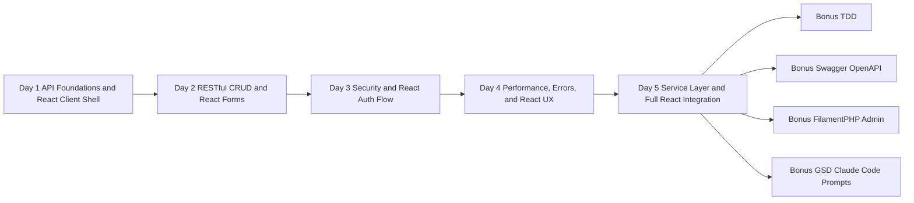
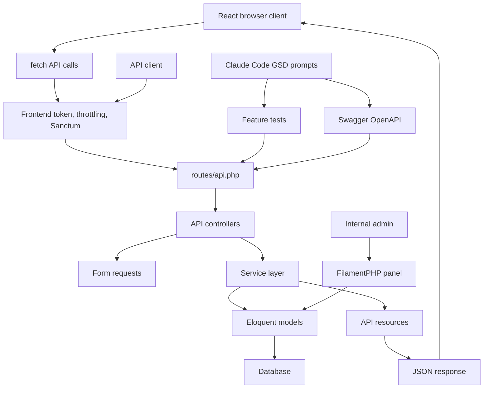

# Laravel API Training Overview

## Program Summary

This is a 5-day, hands-on Laravel API training program based on the concepts from `Building Better APIs with Laravel`. The course teaches students how to build a secure, maintainable, documented, and production-aware Laravel API, then consume it from a browser client.

The main project is the ABC Company Profile API. Students build the same API across all 5 days, starting with a simple JSON endpoint and ending with a structured API that includes authentication, validation, throttling, caching, exception handling, route model binding, service classes, API resources, and a React/Vite client that calls the REST API.

## PDF Source Mapping

The core 5-day course is based on the PDF, but the training expands the PDF into a fuller classroom project with complete code, labs, examples, and bonus topics.

Page numbers below use the physical PDF page number shown by most PDF viewers. The printed book page number is included where useful.

| Training part | Related PDF pages | PDF content used | Course expansion beyond PDF |
| --- | --- | --- | --- |
| Day 1 - Laravel API Foundations | PDF pages 4-8, book pages 1-5 | Laravel API overview, Laravel setup, MVC structure, request flow, `routes/api.php` setup | Full project setup, MySQL workflow, first model, migration, controller, and JSON endpoint |
| Day 2 - RESTful Routes, CRUD, And Validation | PDF pages 9-12, book pages 6-9 | REST methods, route prefixes, versioning, `Route::apiResource`, named routes, route caching notes | Full CRUD controller, form request validation, status codes, and JSON response labs |
| Day 3 - API Security | PDF pages 11-13, book pages 8-10 | `auth:sanctum`, middleware registration, throttling, frontend `X-API-TOKEN`, API security checklist | Complete Sanctum login/logout flow, token testing, middleware alias implementation |
| Day 4 - Performance And Exception Handling | PDF pages 14-18, book pages 11-15 | Redis caching, `Cache::remember`, eager loading, route/config cache, centralized exception handling, pagination | Project relationship example, cache keys, cache clearing after writes, detailed JSON exception responses |
| Day 5 - Service Layer And Final Project | PDF pages 16-18, book pages 13-15 | service layer pattern, route model binding, API resources/serialization, optimization summary | Full service class, API resources, final architecture, route model binding refactor |
| React client integration across Days 1-5 | Not directly covered in PDF | Not covered | Added after participant request so students can call the REST API from a browser UI |
| Bonus - TDD | Not directly covered in PDF | Not covered | Added as an advanced practice for feature testing the API |
| Bonus - Swagger/OpenAPI | PDF page 12 briefly mentions documenting routes; pages 19-20 list learning resources | Route documentation is mentioned only briefly | Added full OpenAPI/Swagger documentation workflow |
| Bonus - FilamentPHP | Not directly covered in PDF | Not covered | Added as an admin panel extension for managing API data |
| Bonus - GSD Claude Code Prompts | Not directly covered in PDF | Not covered | Added as an AI-assisted workflow module for planning, implementing, testing, reviewing, and documenting API changes |

## Duration

| Item | Details |
| --- | --- |
| Core training | 5 days |
| Daily class duration | 6 hours |
| Total core hours | 30 hours |
| Bonus modules | TDD, Swagger/OpenAPI, FilamentPHP, GSD Claude Code prompts |
| Recommended audience | Junior to intermediate Laravel/PHP developers |

## Course Objectives

By the end of the training, students should be able to:

- Set up a Laravel API project.
- Explain the Laravel API request lifecycle.
- Build versioned RESTful API routes.
- Create models, migrations, controllers, and form requests.
- Build CRUD endpoints with correct HTTP methods and status codes.
- Validate API requests and return JSON validation errors.
- Secure APIs with Laravel Sanctum.
- Add custom middleware for frontend API token validation.
- Apply throttling to reduce abuse.
- Use pagination, eager loading, and caching for better performance.
- Configure centralized JSON exception handling in Laravel.
- Use route model binding to simplify controllers.
- Refactor business logic into service classes.
- Use API resources to control JSON response shape.
- Create a small React/Vite client for the API.
- Call public and protected API endpoints from React with `fetch`.
- Send `X-API-TOKEN` and Sanctum bearer tokens from the browser client.
- Handle loading, validation errors, authentication errors, pagination, search, and create forms in React.
- Understand how TDD, Swagger/OpenAPI, FilamentPHP, and GSD Claude Code prompting fit into a Laravel API workflow.

## Expected Outcomes

After completing the core 5-day training, students should be able to build an API with:

- `/api/v1` route versioning.
- user profile CRUD endpoints.
- request validation.
- consistent JSON responses.
- Sanctum login and logout.
- protected authenticated routes.
- `X-API-TOKEN` frontend token middleware.
- rate limiting.
- paginated list responses.
- searchable list responses.
- project relationship with eager loading.
- cached list endpoint.
- cache clearing after create, update, and delete.
- centralized JSON exception responses.
- route model binding.
- service layer architecture.
- API resource response formatting.
- React client setup with Vite.
- React login flow that stores the Sanctum token.
- React list, search, filter, and create screens that call the REST API.
- browser-side error handling for `401`, `422`, and general API failures.

By the end of the bonus modules, students should also understand:

- how to write Laravel feature tests for APIs.
- how to document APIs with Swagger/OpenAPI.
- how to add a FilamentPHP admin panel for managing API data.
- how to use GSD prompts with Claude Code safely and effectively.

## Course Roadmap

## Final Architecture

## Daily Breakdown

| Day | Focus | Main Deliverable |
| --- | --- | --- |
| Day 1 | Laravel setup, API routes, MVC flow, React/Vite shell | First versioned JSON endpoint plus React client setup |
| Day 2 | RESTful CRUD, validation, React list/create form | Complete user profile CRUD API plus browser CRUD calls |
| Day 3 | API security and React auth flow | Sanctum auth, frontend token middleware, throttling, React login |
| Day 4 | Performance, errors, React loading/search/error UX | Cached, eager-loaded API with JSON exception handling and React filters |
| Day 5 | Architecture refactor and client integration | Final API plus React client consuming the production-style contract |

## Bonus Modules

| Bonus | Purpose | Deliverable |
| --- | --- | --- |
| TDD | Teach test-first API development | Feature tests for auth, middleware, CRUD, validation, and filters |
| Swagger/OpenAPI | Teach API documentation | Generated Swagger UI and OpenAPI JSON |
| FilamentPHP | Teach back-office data management | Admin panel for user profiles and projects |
| GSD Claude Code Prompts | Teach safe AI-assisted delivery workflow | Copyable prompts for planning, TDD, debugging, security review, React integration, documentation, and handoff |

## Student Prerequisites

Students should know or have basic exposure to:

- PHP syntax.
- basic Laravel routing and controllers.
- Composer.
- relational databases.
- HTTP methods and status codes.
- JSON.
- terminal commands.
- basic JavaScript and React concepts.

Recommended local tools:

- PHP 8.2 or newer.
- Composer.
- MySQL 8.0 or newer.
- Git.
- Node.js LTS and npm.
- Postman, Insomnia, or another API client.
- Code editor.

## Instructor Preparation

Before training starts, prepare:

- a clean Laravel project.
- working PHP and Composer environment.
- MySQL database and a dedicated `abc_api` schema for class setup.
- Postman collection or JSON response examples.
- React/Vite client starter in `examples/react-client-api-consumer`.
- local CORS setting that allows `http://localhost:5173`.
- local copy of all `training/*.md` files.
- local copy of all `examples/*` folders.

Recommended teaching flow:

1. Explain the concept.
2. Show the diagram.
3. Write or copy the code.
4. Run the endpoint.
5. Inspect the JSON response.
6. Ask students to repeat with a small change.

## Final Project Requirements

The final project must include:

- Laravel project setup.
- API route file enabled.
- `/api/v1` route prefix.
- `UserProfile` model and migration.
- `Project` model and migration.
- CRUD endpoints for user profiles.
- request validation classes.
- Sanctum authentication.
- login and logout endpoints.
- frontend token middleware.
- throttling.
- pagination.
- search.
- eager loading.
- caching.
- JSON exception handling.
- route model binding.
- service class.
- API resources.
- React/Vite client app.
- API environment variables for the React client.
- frontend login, list, search/filter, and create profile screens.
- browser-side handling for loading, `401`, `422`, and general API errors.

## Assessment Rubric

| Area | Marks |
| --- | ---: |
| Project setup and migrations | 10 |
| RESTful CRUD API | 15 |
| Validation and status codes | 10 |
| Sanctum authentication | 15 |
| Middleware and throttling | 10 |
| Performance improvements | 10 |
| Exception handling | 5 |
| Service layer and resources | 10 |
| React client integration | 10 |
| Code clarity and consistency | 5 |
| Total | 100 |

## Training Files

Core modules:

- `training/day-1-laravel-api-foundations.md`
- `training/day-2-restful-routes-validation.md`
- `training/day-3-api-security.md`
- `training/day-4-performance-exception-handling.md`
- `training/day-5-service-layer-final-project.md`
- `training/react-client-api-setup.md`

Bonus modules:

- `training/bonus-tdd-laravel-api.md`
- `training/bonus-swagger-openapi.md`
- `training/bonus-filamentphp-admin-api.md`
- `training/bonus-gsd-claude-code-prompts.md`

Example folders:

- `examples/day-1-laravel-api-foundations`
- `examples/day-2-restful-routes-validation`
- `examples/day-3-api-security`
- `examples/day-4-performance-exception-handling`
- `examples/day-5-service-layer-final-project`
- `examples/react-client-api-consumer`
- `examples/bonus-tdd-laravel-api`
- `examples/bonus-swagger-openapi`
- `examples/bonus-filamentphp-admin-api`
