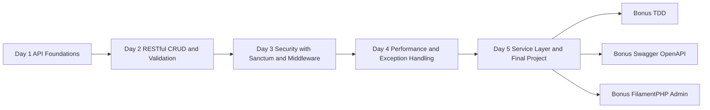
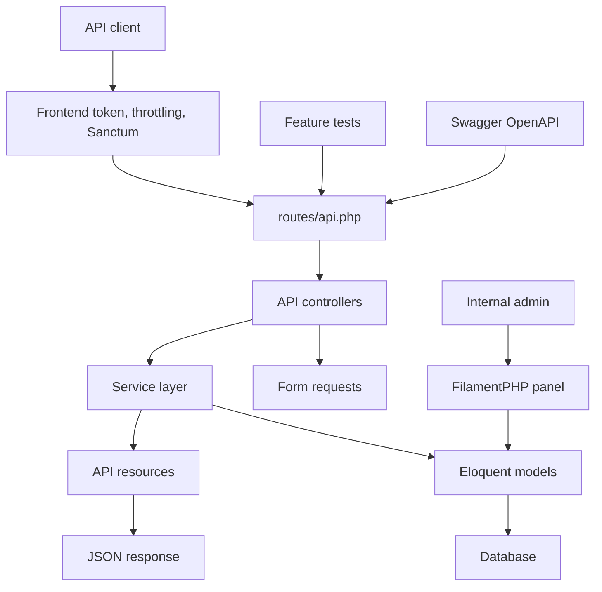

# Laravel API Training Overview

## Program Summary

This is a 5-day, hands-on Laravel API training program based on the concepts from `Building Better APIs with Laravel`. The course teaches students how to build a secure, maintainable, documented, and production-aware Laravel 12 API.

The main project is the ABC Company Profile API. Students build the same API across all 5 days, starting with a simple JSON endpoint and ending with a structured API that includes authentication, validation, throttling, caching, exception handling, route model binding, service classes, and API resources.

## PDF Source Mapping

The core 5-day course is based on the PDF, but the training expands the PDF into a fuller classroom project with complete code, labs, examples, and bonus topics.

Page numbers below use the physical PDF page number shown by most PDF viewers. The printed book page number is included where useful.

| Training part | Related PDF pages | PDF content used | Course expansion beyond PDF |
| --- | --- | --- | --- |
| Day 1 - Laravel API Foundations | PDF pages 4-8, book pages 1-5 | Laravel API overview, Laravel 12 setup, MVC structure, request flow, `routes/api.php` setup | Full project setup, SQLite workflow, first model, migration, controller, and JSON endpoint |
| Day 2 - RESTful Routes, CRUD, And Validation | PDF pages 9-12, book pages 6-9 | REST methods, route prefixes, versioning, `Route::apiResource`, named routes, route caching notes | Full CRUD controller, form request validation, status codes, curl labs |
| Day 3 - API Security | PDF pages 11-13, book pages 8-10 | `auth:sanctum`, middleware registration, throttling, frontend `X-API-TOKEN`, API security checklist | Complete Sanctum login/logout flow, token testing, middleware alias implementation |
| Day 4 - Performance And Exception Handling | PDF pages 14-18, book pages 11-15 | Redis caching, `Cache::remember`, eager loading, route/config cache, centralized exception handling, pagination | Project relationship example, cache keys, cache clearing after writes, detailed JSON exception responses |
| Day 5 - Service Layer And Final Project | PDF pages 16-18, book pages 13-15 | service layer pattern, route model binding, API resources/serialization, optimization summary | Full service class, API resources, final architecture, route model binding refactor |
| Bonus - TDD | Not directly covered in PDF | Not covered | Added as an advanced practice for feature testing the API |
| Bonus - Swagger/OpenAPI | PDF page 12 briefly mentions documenting routes; pages 19-20 list learning resources | Route documentation is mentioned only briefly | Added full OpenAPI/Swagger documentation workflow |
| Bonus - FilamentPHP | Not directly covered in PDF | Not covered | Added as an admin panel extension for managing API data |

## Duration

| Item | Details |
| --- | --- |
| Core training | 5 days |
| Daily class duration | 6 hours |
| Total core hours | 30 hours |
| Bonus modules | TDD, Swagger/OpenAPI, FilamentPHP |
| Recommended audience | Junior to intermediate Laravel/PHP developers |

## Course Objectives

By the end of the training, students should be able to:

- Set up a Laravel 12 API project.
- Explain the Laravel API request lifecycle.
- Build versioned RESTful API routes.
- Create models, migrations, controllers, and form requests.
- Build CRUD endpoints with correct HTTP methods and status codes.
- Validate API requests and return JSON validation errors.
- Secure APIs with Laravel Sanctum.
- Add custom middleware for frontend API token validation.
- Apply throttling to reduce abuse.
- Use pagination, eager loading, and caching for better performance.
- Configure centralized JSON exception handling in Laravel 12.
- Use route model binding to simplify controllers.
- Refactor business logic into service classes.
- Use API resources to control JSON response shape.
- Understand how TDD, Swagger/OpenAPI, and FilamentPHP fit into a Laravel API workflow.

## Expected Outcomes

After completing the core 5-day training, students should be able to build an API with:

- `/api/v1` route versioning.
- user profile CRUD endpoints.
- request validation.
- consistent JSON responses.
- Sanctum login and logout.
- protected authenticated routes.
- `X-API-TOKEN` frontend token middleware.
- rate limiting.
- paginated list responses.
- searchable list responses.
- project relationship with eager loading.
- cached list endpoint.
- cache clearing after create, update, and delete.
- centralized JSON exception responses.
- route model binding.
- service layer architecture.
- API resource response formatting.

By the end of the bonus modules, students should also understand:

- how to write Laravel feature tests for APIs.
- how to document APIs with Swagger/OpenAPI.
- how to add a FilamentPHP admin panel for managing API data.

## Course Roadmap

## Final Architecture

## Daily Breakdown

| Day | Focus | Main Deliverable |
| --- | --- | --- |
| Day 1 | Laravel setup, API routes, MVC flow | First versioned JSON endpoint |
| Day 2 | RESTful CRUD and validation | Complete user profile CRUD API |
| Day 3 | API security | Sanctum auth, frontend token middleware, throttling |
| Day 4 | Performance and errors | Cached, eager-loaded API with JSON exception handling |
| Day 5 | Architecture refactor | Final API with service layer, route model binding, and resources |

## Bonus Modules

| Bonus | Purpose | Deliverable |
| --- | --- | --- |
| TDD | Teach test-first API development | Feature tests for auth, middleware, CRUD, validation, and filters |
| Swagger/OpenAPI | Teach API documentation | Generated Swagger UI and OpenAPI JSON |
| FilamentPHP | Teach back-office data management | Admin panel for user profiles and projects |

## Student Prerequisites

Students should know or have basic exposure to:

- PHP syntax.
- basic Laravel routing and controllers.
- Composer.
- relational databases.
- HTTP methods and status codes.
- JSON.
- terminal commands.

Recommended local tools:

- PHP 8.2 or newer.
- Composer.
- SQLite, MySQL, or PostgreSQL.
- Git.
- Postman, Insomnia, or curl.
- Code editor.

## Instructor Preparation

Before training starts, prepare:

- a clean Laravel 12 project.
- working PHP and Composer environment.
- SQLite database option for fast setup.
- Postman collection or curl examples.
- local copy of all `training/*.md` files.
- local copy of all `examples/*` folders.

Recommended teaching flow:

1. Explain the concept.
2. Show the diagram.
3. Write or copy the code.
4. Run the endpoint.
5. Inspect the JSON response.
6. Ask students to repeat with a small change.

## Final Project Requirements

The final project must include:

- Laravel 12 project setup.
- API route file enabled.
- `/api/v1` route prefix.
- `UserProfile` model and migration.
- `Project` model and migration.
- CRUD endpoints for user profiles.
- request validation classes.
- Sanctum authentication.
- login and logout endpoints.
- frontend token middleware.
- throttling.
- pagination.
- search.
- eager loading.
- caching.
- JSON exception handling.
- route model binding.
- service class.
- API resources.

## Assessment Rubric

| Area | Marks |
| --- | ---: |
| Project setup and migrations | 10 |
| RESTful CRUD API | 15 |
| Validation and status codes | 10 |
| Sanctum authentication | 15 |
| Middleware and throttling | 10 |
| Performance improvements | 10 |
| Exception handling | 5 |
| Service layer and resources | 15 |
| Code clarity and consistency | 10 |
| Total | 100 |

## Training Files

Core modules:

- `training/day-1-laravel-api-foundations.md`
- `training/day-2-restful-routes-validation.md`
- `training/day-3-api-security.md`
- `training/day-4-performance-exception-handling.md`
- `training/day-5-service-layer-final-project.md`

Bonus modules:

- `training/bonus-tdd-laravel-api.md`
- `training/bonus-swagger-openapi.md`
- `training/bonus-filamentphp-admin-api.md`

Example folders:

- `examples/day-1-laravel-api-foundations`
- `examples/day-2-restful-routes-validation`
- `examples/day-3-api-security`
- `examples/day-4-performance-exception-handling`
- `examples/day-5-service-layer-final-project`
- `examples/bonus-tdd-laravel-api`
- `examples/bonus-swagger-openapi`
- `examples/bonus-filamentphp-admin-api`
