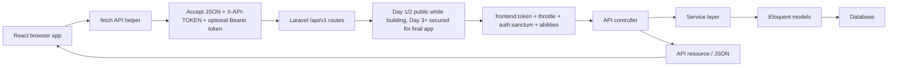

# React Client Setup For Calling The Laravel API

## Goal

This tutorial shows how to create a React/Vite client that calls the Laravel REST API built during the 5-day training.

By the end, students can:

- create a React app with Vite.
- configure the Laravel API base URL.
- understand that Day 1 list and Day 2 CRUD are public only while those lessons are being built.
- send the frontend `X-API-TOKEN` header when Day 3 security is added.
- login and store a Sanctum bearer token, expiry, and abilities for the local lab on Day 3.
- call protected API routes after Day 3 security is added.
- list, search, view, create, update, and delete user profiles.
- show loading, success, `401`, `403`, `422`, and general API errors.

## Where This Fits In The 5-Day Course

| Day | React focus | API dependency |
| --- | --- | --- |
| Day 1 | Create React/Vite shell and configure `.env.local` | `GET /api/v1/users` |
| Day 2 | List, view detail, create, update, and delete profiles | REST CRUD and validation |
| Day 3 | Login, store token, call protected routes | Sanctum and frontend token middleware |
| Day 4 | Search, loading, pagination, error states | pagination, cache, JSON errors |
| Day 5 | Final browser-to-API integration | service layer and API resources |

## Architecture



## Prerequisites

- Laravel API running locally.
- Node.js LTS and npm.
- API endpoint available at `http://127.0.0.1:8000/api/v1`.
- Test user available:

```text
admin@example.com
password
```

## Step 1 - Create The React App

Create the client outside the Laravel project:

```bash
npm create vite@latest abc-api-client
cd abc-api-client
npm install
```

When prompted by Vite:

```text
Framework: React
Variant: JavaScript
```

Start it:

```bash
npm run dev
```

Vite usually opens at:

```text
http://localhost:5173
```

## Step 2 - Copy The Training Example

The ready-made example is here:

```text
examples/react-client-api-consumer
```

Copy these files into `abc-api-client`:

| Example file | React destination |
| --- | --- |
| `package.json` | `package.json` |
| `vite.config.js` | `vite.config.js` |
| `index.html` | `index.html` |
| `.env.example` | `.env.local` |
| `src/main.jsx` | `src/main.jsx` |
| `src/api.js` | `src/api.js` |
| `src/App.jsx` | `src/App.jsx` |
| `src/App.css` | `src/App.css` |

Then install dependencies again:

```bash
npm install
```

## Step 3 - Configure API Environment Values

Create `.env.local`:

```dotenv
VITE_API_BASE_URL=http://127.0.0.1:8000/api/v1
VITE_FRONTEND_API_TOKEN=abc-training-frontend-token
```

Restart Vite after changing environment values:

```bash
npm run dev
```

## Step 4 - Create The API Helper

`src/api.js` centralizes all browser-to-API calls.

```js
const API_BASE_URL = import.meta.env.VITE_API_BASE_URL;
const FRONTEND_API_TOKEN = import.meta.env.VITE_FRONTEND_API_TOKEN;

export async function apiRequest(path, { method = 'GET', token, body, query } = {}) {
  const url = new URL(`${API_BASE_URL}${path}`);
  const headers = {
    Accept: 'application/json',
    ...(body ? { 'Content-Type': 'application/json' } : {}),
    ...(FRONTEND_API_TOKEN ? { 'X-API-TOKEN': FRONTEND_API_TOKEN } : {}),
    ...(token ? { Authorization: `Bearer ${token}` } : {}),
  };

  Object.entries(query || {}).forEach(([key, value]) => {
    if (value !== '' && value !== null && value !== undefined) {
      url.searchParams.set(key, value);
    }
  });

  const response = await fetch(url, {
    method,
    headers,
    body: body ? JSON.stringify(body) : undefined,
  });

  const text = await response.text();
  const data = text ? JSON.parse(text) : null;

  if (!response.ok) {
    const error = new Error(data?.message || `Request failed with ${response.status}`);
    error.status = response.status;
    error.data = data;
    throw error;
  }

  return data;
}
```

Teaching points:

- `Accept: application/json` asks Laravel to return JSON errors instead of HTML redirects.
- `X-API-TOKEN` identifies the frontend client after the Day 3 middleware is added.
- `Authorization: Bearer ...` identifies the authenticated user after Sanctum is added.
- React does not import Laravel controllers, models, services, or Eloquent code.
- React only knows the HTTP contract: method, URL, headers, body, status code, and JSON shape.

## Step 5 - Login From React

If students are still on Day 1 or Day 2, the temporary training routes may be public. After Day 3 security is introduced, use this login flow before list, show, create, update, or delete.

The login request does not have a bearer token yet, but it sends the frontend token when `VITE_FRONTEND_API_TOKEN` is configured.

```js
const data = await apiRequest('/auth/login', {
  method: 'POST',
  body: {
    email: 'admin@example.com',
    password: 'password',
  },
});

const accessToken = data.data.access_token;
const expiresAt = data.data.expires_at;
const abilities = data.data.abilities || [];
localStorage.setItem('abc_api_token', accessToken);
localStorage.setItem('abc_api_token_expires_at', expiresAt);
localStorage.setItem('abc_api_token_abilities', JSON.stringify(abilities));
```

Expected API response:

```json
{
  "message": "Login successful.",
  "data": {
    "token_type": "Bearer",
    "access_token": "1|plain-text-token",
    "expires_at": "2026-06-09T09:30:00.000000Z",
    "abilities": [
      "profiles:read",
      "profiles:create",
      "profiles:update",
      "profiles:delete"
    ],
    "user": {
      "id": 1,
      "name": "Training Admin",
      "email": "admin@example.com"
    }
  }
}
```

Local storage is acceptable for this training lab. In production, token storage should be decided deliberately based on the app's risk model.

## Step 6 - Call The Profiles Endpoint

Before Day 3, the temporary training route can load profiles without login:

```js
const profiles = await apiRequest('/users', {
  query: {
    page: 1,
    search: 'ali',
  },
});
```

After Day 3 security is added, pass the stored token. Listing requires `profiles:read`:

```js
const token = localStorage.getItem('abc_api_token');

const profiles = await apiRequest('/users', {
  token,
  query: {
    page: 1,
    search: 'ali',
  },
});
```

After Day 3, the protected request sends:

```text
X-API-TOKEN: abc-training-frontend-token
Authorization: Bearer 1|plain-text-token
```

## Step 7 - Call The CRUD Endpoints

Day 2 adds full RESTful CRUD through `Route::apiResource('users', UserProfileController::class)`.
Before Day 3, those temporary training calls can work without a bearer token. After Day 3 security is added, list, view, create, update, and delete all require the frontend `X-API-TOKEN` header, the Sanctum bearer token, and the matching token ability.

Profile payload fields:

```js
const body = {
  full_name: 'Nur Iman',
  id_card_number: '920202-08-4567',
  phone: '+60112223333',
  address: 'Shah Alam',
  is_active: true,
};
```

Create:

```js
const created = await apiRequest('/users', {
  method: 'POST',
  token, // requires profiles:create after Day 3
  body,
});
```

View detail:

```js
const detail = await apiRequest(`/users/${created.data.id}`, { token }); // requires profiles:read
```

Update:

```js
const updated = await apiRequest(`/users/${created.data.id}`, {
  method: 'PUT',
  token, // requires profiles:update
  body: {
    ...body,
    phone: '+60119998888',
  },
});
```

Delete:

```js
await apiRequest(`/users/${updated.data.id}`, {
  method: 'DELETE',
  token, // requires profiles:delete
});
```

The delete endpoint returns `204 No Content`, so the helper returns `null` for a successful delete.

If Laravel returns `422`, display the validation errors instead of clearing the form.

## Step 8 - Handle API Errors

The example client handles these cases:

| Status | Meaning | React behavior |
| --- | --- | --- |
| `401` | Missing/invalid frontend or bearer token after Day 3 | show error and require login |
| `403` | token is authenticated but missing the required ability | show backend message and keep auth state |
| `422` | validation failed | show validation details |
| `404` | resource not found | show resource error |
| `429` | too many requests | show rate-limit message |
| `500` | server error | show general API failure |

Example display logic:

```js
const validation = err.data?.errors
  ? Object.values(err.data.errors).flat().join(' ')
  : '';

setError(`${err.status || 'Error'}: ${validation || err.message}`);
```

## Step 9 - Laravel CORS Check

React usually runs on:

```text
http://localhost:5173
```

Laravel runs on:

```text
http://127.0.0.1:8000
```

Because these are different origins, Laravel must allow the React origin during local training.

Classroom CORS rule:

```text
Allow http://localhost:5173 during local development only.
```

Do not use unrestricted origins for private production APIs.

## Step 10 - Test Flow

Run Laravel:

```bash
php artisan serve
```

Run React:

```bash
npm run dev
```

Then test:

1. Open `http://localhost:5173`.
2. Confirm `.env.local` has the correct `VITE_API_BASE_URL` and `VITE_FRONTEND_API_TOKEN`.
3. Login with `admin@example.com` and `password`.
4. Confirm the UI shows token expiry and abilities.
5. Load profiles with `profiles:read`.
6. Search by name.
7. View one profile detail with `profiles:read`.
8. Create a profile with `profiles:create`.
9. Edit the new profile and submit an update with `profiles:update`.
10. Delete the profile with `profiles:delete` and confirm the list reloads.
11. Test a read-only token and confirm write actions return `403`.
12. Logout and confirm protected calls fail after logout.

## GSD Claude Code Prompt

Use this prompt if students want Claude Code to help with the standalone React client setup.

```text
Goal:
Help me set up the React/Vite client so it can call the Laravel API safely.

Context:
The Laravel API runs at http://127.0.0.1:8000/api/v1 unless the local backend uses a different port. The latest backend is secured: React must send X-API-TOKEN when configured, login with Sanctum, store token expiry and abilities for the local lab, and call /users CRUD with Authorization: Bearer <token>. The login response returns data.access_token, data.expires_at, data.abilities, and data.user. Protected CRUD can return 401 for missing/expired tokens, 403 for missing abilities, 422 for validation errors, 404 for missing resources, and general API errors.

Relevant files:
- examples/react-client-api-consumer/package.json
- examples/react-client-api-consumer/vite.config.js
- examples/react-client-api-consumer/.env.example
- examples/react-client-api-consumer/src/api.js
- examples/react-client-api-consumer/src/App.jsx
- examples/react-client-api-consumer/src/App.css
- training/react-client-api-setup.md
- Laravel backend routes/api.php and AuthController if available

Constraints:
- Inspect the existing React example before editing.
- Inspect the latest Laravel backend API contract before assuming response shapes.
- Do not hard-code API tokens or bearer tokens in components.
- Keep API base URL and frontend token in Vite environment variables.
- Keep HTTP behavior centralized in src/api.js.
- Store access_token, expires_at, user, and optional abilities in React state after login.
- Store token and expires_at in localStorage only for this training lab.
- Clear local auth state before protected requests if expires_at is in the past.
- Clear local auth state when Laravel returns 401.
- Show a clear message when Laravel returns 403 for missing ability.
- Show 422 validation errors near the form.
- React may hide controls based on data.abilities, but Laravel remains the source of truth.
- Do not change unrelated Laravel backend files.

Done criteria:
- npm run dev starts the React client.
- login calls POST /api/v1/auth/login.
- protected calls send X-API-TOKEN and Authorization: Bearer token.
- list, show, create, update, and delete controls respect data.abilities while Laravel remains the source of truth.
- list, search, view detail, create, update, delete, logout, token expiry handling, 401, 403, 422, and loading states work.
- CORS instructions are clear if the browser blocks requests.

Verification:
- Run or suggest npm run dev.
- Run or suggest npm run build.
- Explain the browser test flow.
- If an API call fails, identify whether the cause is env vars, CORS, auth headers, token expiry, token abilities, validation, or backend behavior.
```

## Common Mistakes

- Forgetting to restart Vite after editing `.env.local`.
- Missing `VITE_` prefix on environment variables.
- Calling `/api/v1` twice because the base URL already includes it.
- Keeping the old public Day 1/2 assumptions after the backend has moved to Day 3+ security.
- Forgetting `X-API-TOKEN` after Day 3.
- Sending bearer token without the `Bearer ` prefix after Day 3.
- Sending profile fields not in the Laravel API contract, such as `email`.
- Expecting React to enforce Laravel validation rules.
- Ignoring CORS when Laravel and React run on different ports.

## Final Client Checklist

- `.env.local` points to the Laravel API.
- `src/api.js` always sends `Accept: application/json`.
- `src/api.js` sends the frontend token when configured.
- login stores the Sanctum token, expiry, and abilities for the local lab.
- protected routes send `Authorization: Bearer ...`.
- UI controls are gated by `data.abilities`, and backend still enforces ability middleware.
- list screen handles pagination response shape.
- create/update form preserves input on validation failure.
- view, update, and delete call `/users/{id}` with the correct HTTP methods.
- UI shows loading, success, and error states.
